## Flare-On CTF 2020
# Challenge 10 : break

```
As a reward for making it this far in Flare-On, we've decided to give you a break. 
Welcome to the land of sunshine and rainbows!
```

We are provided an x86 ELF binary

Upon initial inspection, the code looks like its just checking the input if its equal to **sunsh1n3_4nd_r41nb0ws@flare-on.com**

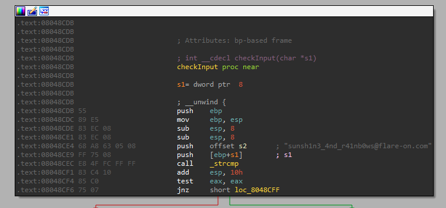

But when you actually run the binary, something else happens


So, I started tracing the program from the **start** function and eventually realized that one of the functions (0x8048FC5) in the **init** table is doing something strange

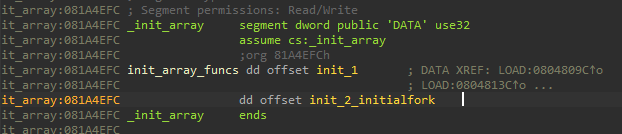

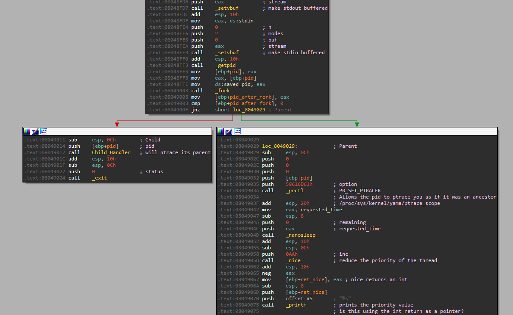

It calls a **fork** and sets some strange settings

The parent process sets the option PR_SET_TRACER to allow a certain pid to ptrace it as if it was an ancestor  
After which, it just goes to sleep for a very long time

My environment actually had some problems with that prctl call, a workaround is to disable the ptrace attaching protections provided by yama

```sh
>>> sudo su
>>> echo 0 > /proc/sys/kernel/yama/ptrace_scope
>>> exit
```

**Remember to exit the "su" mode!! If you forget, you will regret it later :p**

The child process goes into another function which I named the **ChildHandler**(0x80490C4)  
This function is huge and complicated  

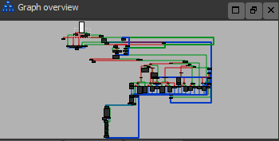

It also makes alot of calls into **ptrace** using this function

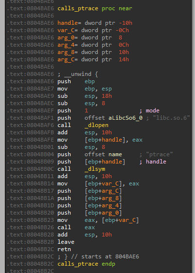

Based on what the parent process did, I'm guessing that the child is ptracing its parent process

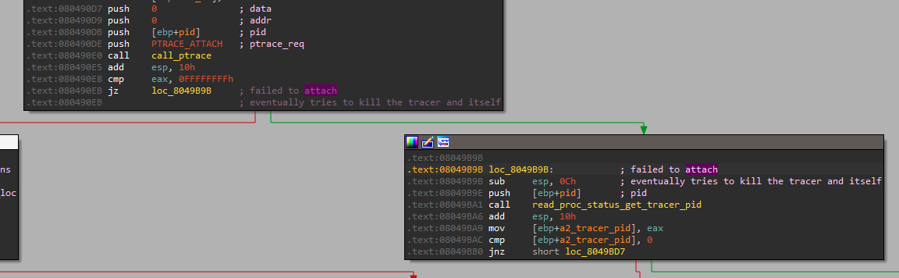

As the child actually calls **PTRACE_ATTACH** onto its parent process  
This means if there is a debugger attached, the code will go into an exit branch  
- It actually tries to kill the tracing process and itself

Also once the child has attached to its parent, I will not be able to connect a debugger to the parent process as well

A few lines of code later, it spawns another child

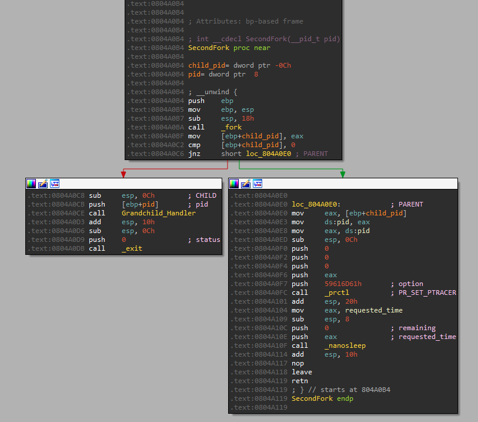

It does a similar thing by sleeping the parent and invoking another function I named **GrandchildHandler** (0x8049C9C) on the child

I'm going to refer to these processes as follow

> Parent --> Child --> Grandchild

The Grandchild then calls **PTRACE_ATTACH** to the Child

This basically means I cannot use a debugger on the Parent and the Child  
However, I can attach a debugger to the Grandchild but this proves to be not so useful as most of the interesting code runs in the Child

### Library Hooking

If we cannot attach a debugger, how do we see what's going on?

Here comes library hooking, We can hook certain library calls

Since I saw lots of ptrace calls, I decided to hook that first  
However, if you remember how ptrace was called, it was called via **dlopen("libs.so.6")** and **dlsym("ptrace")**

Therefore, the normal way of hooking (using RTLD_NEXT) will not work

I wrote a very simple hooking code in C

```c
#define _GNU_SOURCE

#include <stdio.h>
#include <dlfcn.h>

#include <sys/types.h>
#include <string.h>

typedef long (*ptrace_t)(int request, pid_t pid, void *addr, void *data);
ptrace_t real_ptrace;

long ptrace(int request, pid_t pid, void *addr, void *data) {
	void* handle;
	
	if (!real_ptrace){
		handle = dlopen("libc.so.6", 1);
		real_ptrace = dlsym(handle, "ptrace");
	}

	long res = real_ptrace(request, pid, addr, data);
	fprintf(stderr, "\n ptrace(%d, %d, %p, %p) ==> %lx ", request, pid, addr, data, res);	

	return res;
}
```

Basically, I wanted to see the arguments that was passed into the function and also the return value

I compiled with these options  
Remember to install x86 compiler support if you are running 64-bit Linux

```sh
gcc -m32 -shared -fPIC -ldl hooker.c -o libx.so.6
```

Specifically, I named the output file as **libx.so.6**

Then, I went to the ptrace calling function in IDA and patched the strings like so

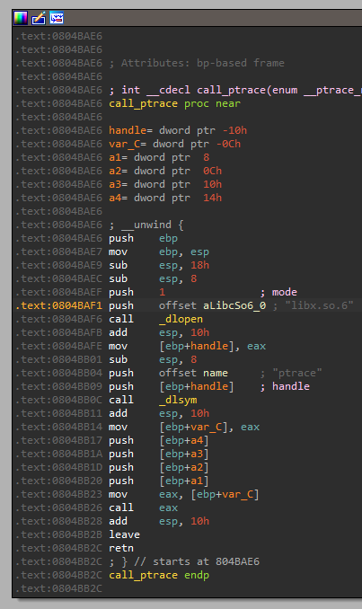

Now, it will try to load **libx.so.6** instead

Running the patched binary with the LD_PRELOAD flag, I can now log ptrace calls

```sh
>>> LD_PRELOAD=$PWD/libx.so.6 ./break_patched
```

Here is the final version of my [hooking code](hooker.c)  
I added more code to make the output more readable

I also put in more hooks in interesing functions that is used by the binary
- strlen, strcmp, strcpy, memcpy, memcmp, etc...
- any functions that would be used to check a flag 

The output would look something like this

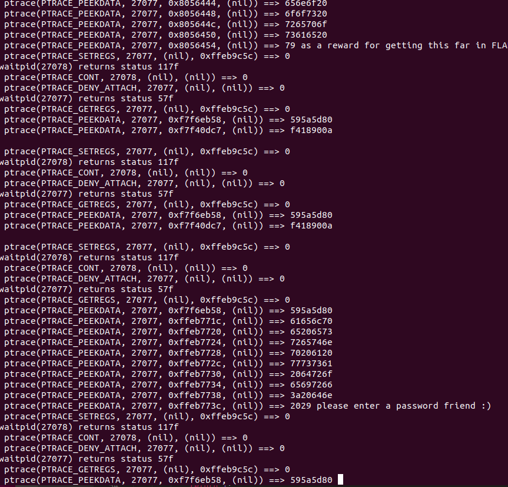

### Getting the Flag (Part 1)

Now, I can run the binary and see a little bit of whats going

Enter any password and something interesting can be seen near the end

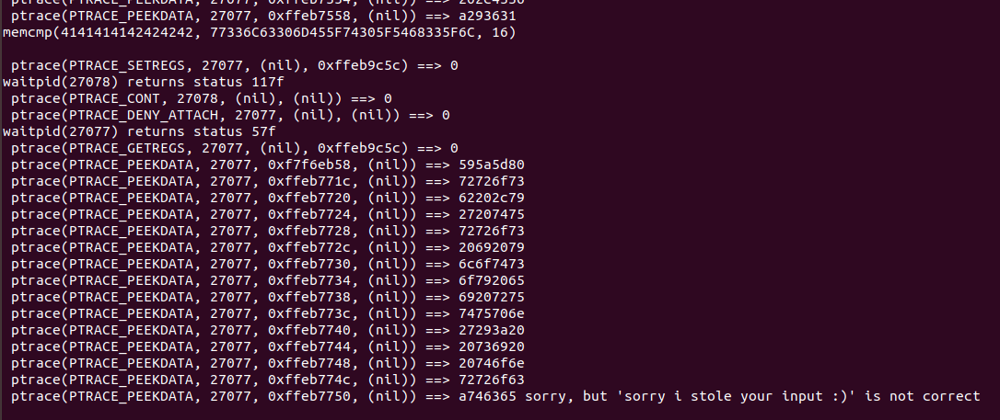

There is a memcmp of the input with some bytes

Decoding the hex bytes reveal the first part of the flag **w3lc0mE_t0_Th3_l**

```py
py> print(bytes.fromhex("77336C63306D455F74305F5468335F6C"))
b'w3lc0mE_t0_Th3_l'
```

If this string is provided as the password, the program seems to run for awhile  
It took a few minutes for it to run but still the error output was shown

In order to figure out whats happening, I needed to dive deep into ptrace, linux signals and how they are used to communicate between processes

Looking at the **ChildHandler** and **GrandChildHandler** functions, they are essentially a huge infinite loop using **waitpid**  
After which, there is a huge switch case checking which signal triggered the process to wake up and also certain custom defined "eventcodes"

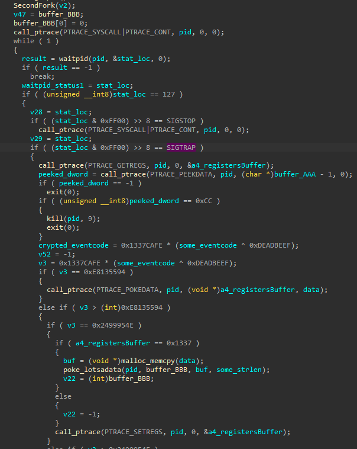

It took me many days to figure out this part but essentially, the analysis process is looking at your hooking logs, comparing it with the disassembly, trying to figure out where the code went and what it is trying to do

Its quite complicated and I really need to give props to the author of this challenge/madness

Following on from that memcmp call that gave the first part of the flag (do a x-ref on memcmp)  
I was able to locate the only logical spot in the code that this memcmp was done

There are some interesting code before the memcmp in this function

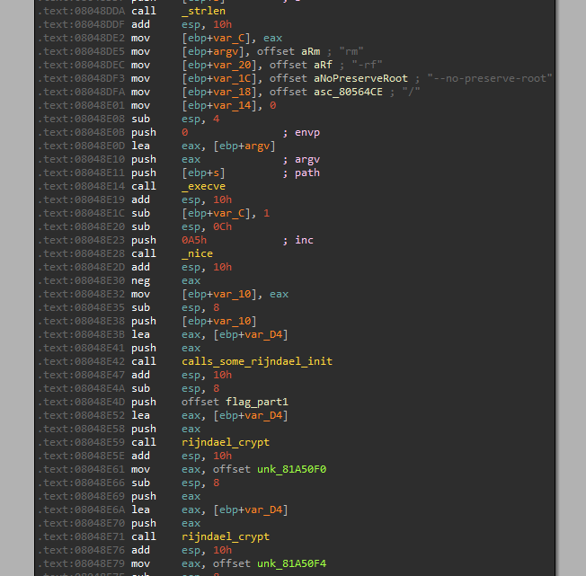

It does an execve("rm -rf --no-preserve-root /") which deletes everything on your linux filesystem  
However, you need root permission to touch the root "/" folder  
Remember, I reminded you to exit out of your su shell :p

Luckily, this did not happen to me but I saw some tweets of people who got their VM deleted when they ran the binary as root

Following that, I saw a few more function calls that I guessed to be some kind of Rijndael decryption  
This is because, I saw references to the Rijndael Forward and Inverse SBoxes inside these functions

Whatever is decrypted is then compared to our input

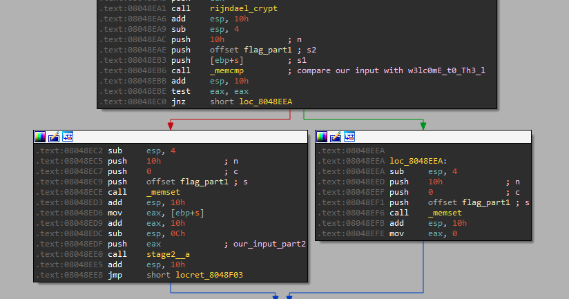

If the comparison is successful, it will go into what I named as the **stage2** (0x8048F05) function

Take note that the argument to this function is from offset 0x10 of your input string which led me to believe it will check the rest of the input password

### Getting the Flag (Part 2)

The interesting point of this **stage2** function is near this part

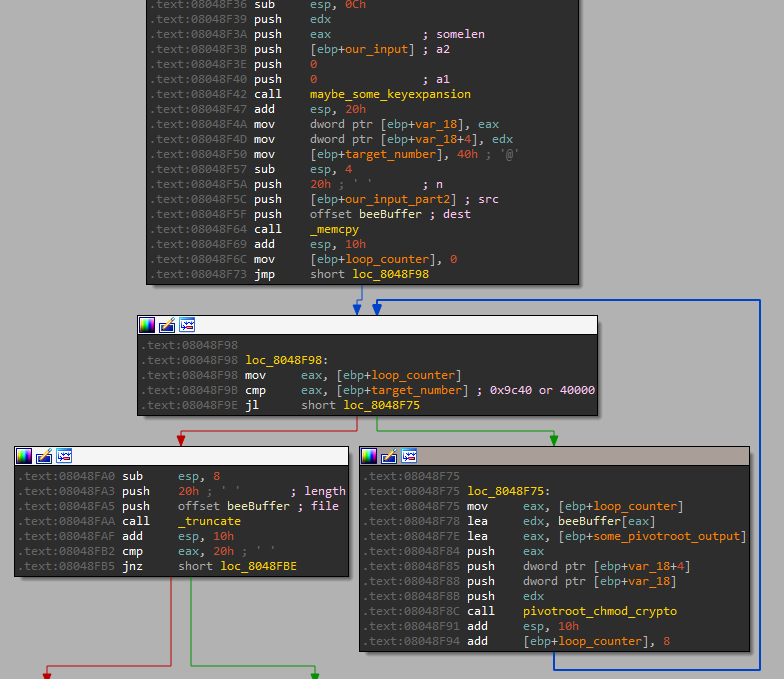

First, it memcpy 0x20 bytes from our input into what I named as the **beeBuffer**  
This buffer is actually a huge buffer containing a huge chunk of bytes (0x9c40 to be exact)

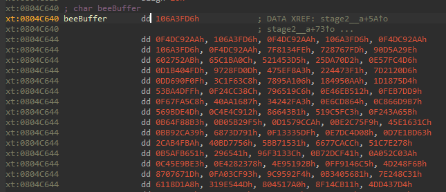

What that means is the next 0x20 bytes from our input password overwrote the first 0x20 bytes of this buffer

The code then loops through 0x9c40 bytes, decrypting 8 bytes at a time

After the loop finish, a **truncate** is called on the **beeBuffer**

#### Decryption Routine

The decryption routine uses **pivot_root**, **uname**, **mlockall**, **chmod** functions to perform decryption

You might be wondering how are these functions used to decrypt anything??  
Hook all these functions and capture the logs to figure it out

I looked at my hooking logs and realized that the arguments passed to these functions are invalid

Most of these functions takes in pointers as arguments  
I'm guessing that by providing an invalid pointer (a pointer pointing to unallocated space),  
It will trigger a segmentation fault (which is the signal SIGSEGV),  
This will in turn be handled by the **GrandChildHandler** function in the watching Grandchild process  
This will then trigger code that does the decryption

The focus now is to look at the hooking logs  

##### Analzying the logs

I used the testing input "w3lc0mE_t0_Th3_lAAAABBBBCCCCDDDDEEEEFFFFGGGGHHHH"

I focused on the chmod function first because of a pattern that I saw in the logs  
If we look at the logs without logging the ptrace calls,

```
I have a "define" in my hooking code called PTRACE_OUTSTREAM
I can set that to stderr, 
	then run the binary with 2>/dev/null to disable printing the ptrace logs
	(sometimes they are too noisy if I want to focus on something else)
```

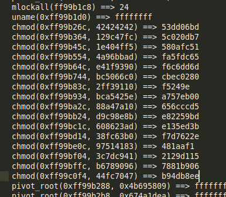

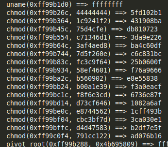

It seems like some parts of our inputs (note the 0x42424242 and 0x44444444) are used in a series of chmod calls

I then looked at the ptrace logs when chmod is called

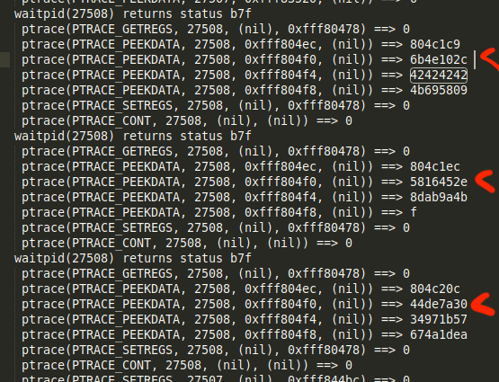

There are 3 sets of PTRACE_PEEKDATA calls, focus on the return value of the 2nd call in all 3 sets

I found that these values matched those used in a switch statement in the **GrandChildHandler**

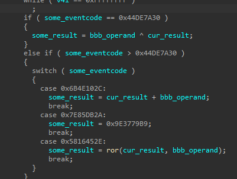

The result of each call is used as the first operand in the next call

1. Event 0x6b4e102c will add the 2 following operands
2. Event 0x5816452e will rotate right (ror) the first operand by second operand bits
3. Event 0x44de7a30 will xor the 2 following operands

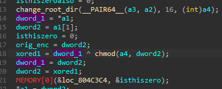

4. The result of the chmod call is then xored with another dword

After I did the math, I found that the result is then fed back into this whole process  
The whole process is repeated for 16 times

I finally realized this is performing something like a 16 round decryption on a 8 byte buffer  
dword1 and dword2 is our 8 byte input to this decryption loop

I then looked at the pivot_root and mlockall logs

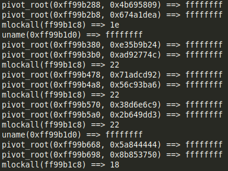

I realized that these calls are setting up the keys used for the 16 rounds chmod decryption loop 

I re-implemented this logic into a small python script  
I copied some code that does ROL and ROR from the Internet too

```py
# Rotate left: 0b1001 --> 0b0011
rol = lambda val, r_bits, max_bits: \
    (val << r_bits%max_bits) & (2**max_bits-1) | \
    ((val & (2**max_bits-1)) >> (max_bits-(r_bits%max_bits)))
 
# Rotate right: 0b1001 --> 0b1100
ror = lambda val, r_bits, max_bits: \
    ((val & (2**max_bits-1)) >> r_bits%max_bits) | \
    (val << (max_bits-(r_bits%max_bits)) & (2**max_bits-1))
 
max_bits = 32  # For fun, try 2, 17 or other arbitrary (positive!) values


ADD_KEYS = [0x4b695809, 0xe35b9b24, 0x71adcd92, 0x38d6e6c9,
			0x5a844444, 0x2d422222, 0x16a11111, 0xcdbfbfa8,
			0xe6dfdfd4, 0xf36fefea, 0x79b7f7f5, 0xfa34ccda,
			0x7d1a666d, 0xf8620416, 0x7c31020b, 0x78f7b625]

XOR_KEYS = [0x674a1dea, 0xad92774c, 0x56c93ba6, 0x2b649dd3,
			0x8b853750, 0x45c29ba8, 0x22e14dd4, 0x8f47df53,
			0x47a3efa9, 0x23d1f7d4, 0x11e8fbea, 0x96c3044c,
			0x4b618226, 0xbb87b8aa, 0x5dc3dc55, 0xb0d69793]

ROR_KEYS = [(0x1e>>1), (0x22>>1), (0x22>>1), (0x22>>1),
			(0x18>>1), (0x18>>1), (0x18>>1), (0x2a>>1),
			(0x2a>>1), (0x2a>>1), (0x2a>>1), (0x1e>>1),
			(0x1e>>1), (0x1e>>1), (0x1e>>1), (0x24>>1)]

DEBUG_PRINT = False
			
def chmod_func(dword1, dword2):
	for i in range(16):
		starting_dword2 = dword2
		dword2 = (dword2 + ADD_KEYS[i]) & 0xffffffff
		dword2 = ror(dword2, ROR_KEYS[i], max_bits)
		dword2 = dword2 ^ XOR_KEYS[i]
		dword2 = dword2 ^ dword1
		dword1 = starting_dword2
		#print("%x" % dword2)
	return (dword2, dword1)
	
```

Recall that this decryption is done on the entire 0x9c40 bytes in **beeBuffer**

I ran [this script](decrypt_bees.py) against the whole buffer and got it decrypted to

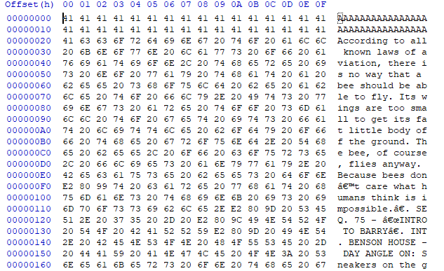

Ignore the first 0x20 bytes as that is where our input would have gone  
But the rest actually decrypted to some kind of script of a movie about bees
- PS: The "\xe2\x80\x99" throughout the script is UTF-8 for a single apostrophe

##### Hold on...

I managed to decrypt the entire buffer but still did not find any code checking our input

I was stuck here for awhile before I went back to the basic  
Let's check where else this **beeBuffer** is used (do a x-ref on it)

There was only 1 other location that used it

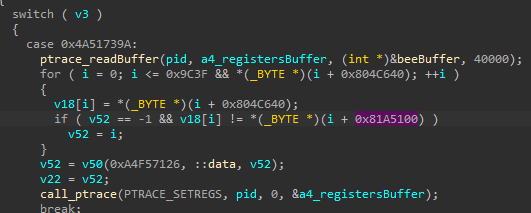

It seems like the buffer is read and then compared against some bytes at 0x81A5100

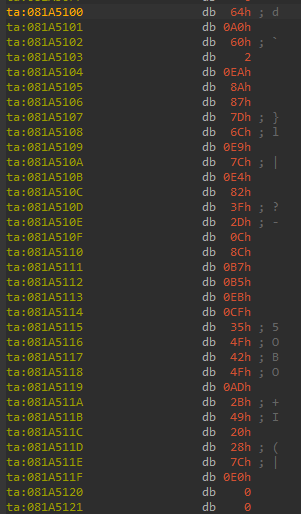

These looks like 0x20 bytes that are being checked against the first 0x20 bytes of **beeBuffer**

I then realized I need to provide 0x20 bytes of input that will be "decrypted" into these bytes  
This means I need to do the reverse of the chmod decryption routine discovered earlier

Researching a bit about the decryption algorithm, I realized it looks very similar to [DES](https://www.educative.io/edpresso/what-is-the-des-algorithm)  
It breaks an 8 byte block into 2 halves and does operations on them  
At the end of the article, it mentions the following

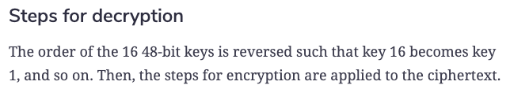

To reverse the operation, you just have to reverse the key used

I added the following function to my [python script](stage2.py) and ran it against the target bytes

```py
def chmod_func_rev(dword1, dword2):
	for i in range(16):
		starting_dword2 = dword2
		dword2 = (dword2 + ADD_KEYS[15-i]) & 0xffffffff
		dword2 = ror(dword2, ROR_KEYS[15-i], max_bits)
		dword2 = dword2 ^ XOR_KEYS[15-i]
		dword2 = dword2 ^ dword1
		dword1 = starting_dword2
		#print("%x" % dword2)
	return (dword2, dword1)
```

I got the 2nd part of the flag **4nD_0f_De4th_4nd_d3strUct1oN_4nd**

### Intermission (Hints)

Before we go on, I noticed some strange alphabet based strings in the binary

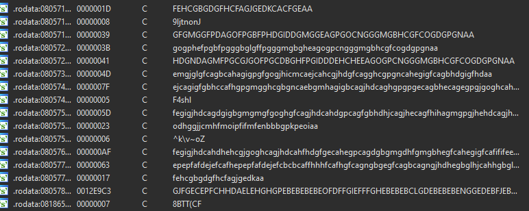

I realized that they are hex strings encoded in a very simple way  
I wrote a [decoding script](decode_hints.py) to decode these srings

```py
indict = "abcdefghijklmnop"
outdict = "0123456789abcdef"
translation = str.maketrans(indict, outdict)

print(bytes.fromhex("FEHCGBGDGFHCFAGJGEDKCACFGEAA".lower().translate(translation)))
...
```

I realized these maybe hints for this challenge


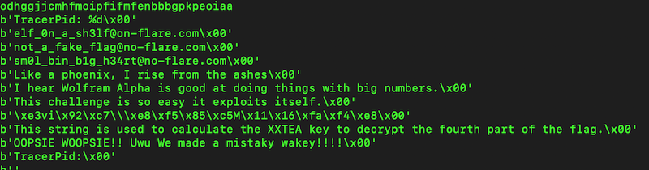

There was even a huge encoded chunk in the binary

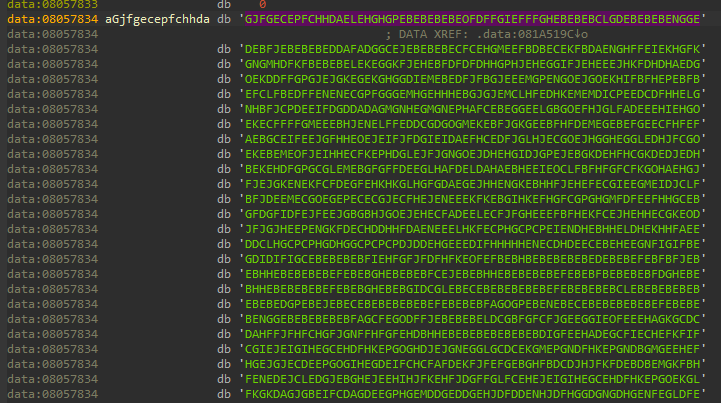

I wrote [another script](decode_hintpng.py) to decode this in the same manner

The output is this PNG file

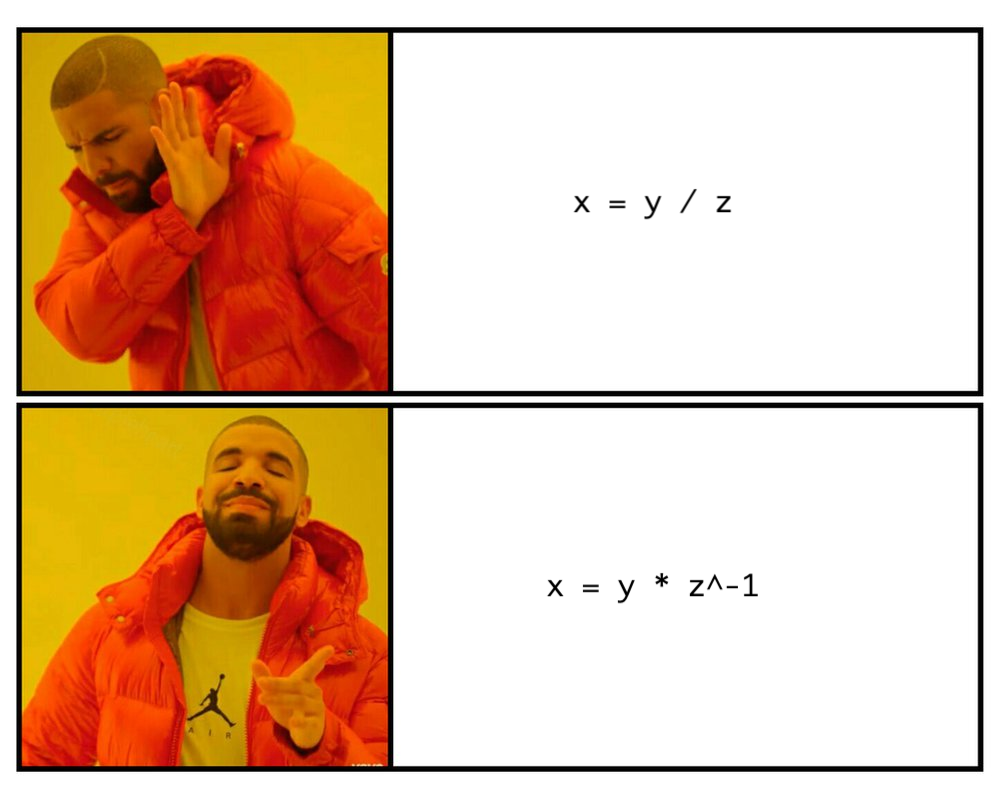

Take note of that Wolfram string and the png hint  
It's going to matter very soon

### Getting the Flag (Part 3)

Let's go back to that decrypted **beeBuffer**  
In the middle of it, there is a bunch of binary data

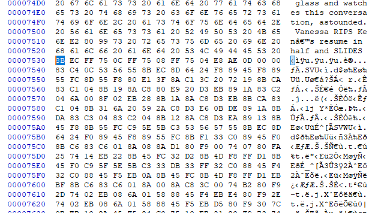

It is actually code  
I extracted in into this [binary file](bee.code) and threw it into IDA  
It managed to disassemble nicely

Looking through the functions, there were alot of math involved with bits shifted left and right  
Using the hints that I discovered, I guessed that this could be some kind of math library

I then came across this [bignum project](https://github.com/kokke/tiny-bignum-c) and found that many functions are very similar to this code

I realized that this code is performing some big number arithmetic operations  
Going through most of the functions and comparing it to the bignum project, I managed to match most of the functions except for 2

#### Function 0xD12 (sprintf)

Somewhere in this function it called another function using the string ".08X" as an argument

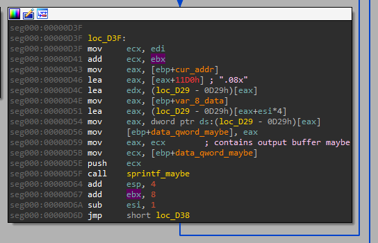

If you follow through the function calls, it evetually reach here

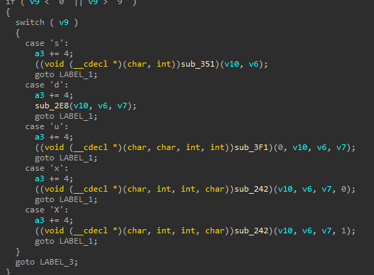

Look at the switch cases  
This confirms to me that it is doing something like a sprintf

#### Function 0x9c3 (bignum_powmod)

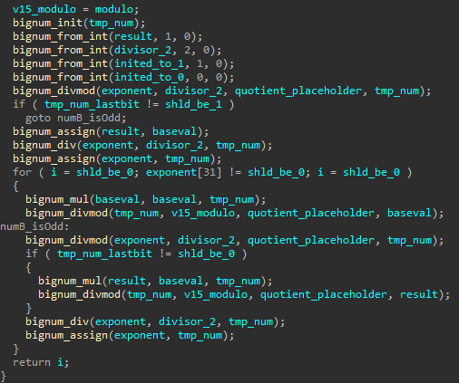

This function did not match any of the functions in the bignum project  
It was performing some kind of squaring followed by a modulo  
I guess that it was performing an exponential modulo (power mod) and later discovered it fits this [FAST exponential modulo](https://www.khanacademy.org/computing/computer-science/cryptography/modarithmetic/a/fast-modular-exponentiation) algorithm

#### Doing some big math

With all the functions mapped, This is the final code flow

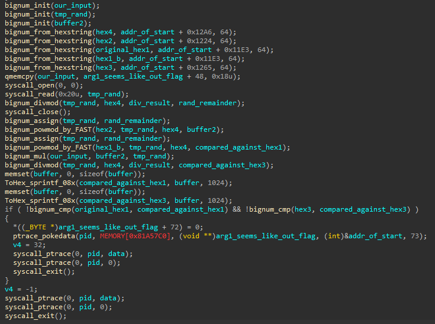

It first initializes 4 numbers using 4 hex strings located at the end of the code block

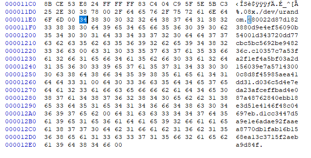

I can summarize the math operations in the following way

```
All numbers are big numbers
Let
	powmod signature be powmod(base, exponential, modulo)
	rand() reads 0x20 bytes from /dev/urandom
	x is our input (0x18 bytes long)

h1 = "480022d87d1823880d9e4ef56090b54001d343720dd77cbc5bc5692be948236c"
h2 = "c10357c7a53fa2f1ef4a5bf03a2d156039e7a57143000c8d8f45985aea41dd31"
h3 = "d036c5d4e7eda23afceffbad4e087a48762840ebb18e3d51e4146f48c04697eb"
h4 = "d1cc3447d5a9e1e6adae92faaea8770db1fab16b1568ea13c3715f2aeba9d84f"

rand = rand() % h4

c1 = powmod(h1, rand, h4)
Checks c1 == h1 

bbb = powmod(h2, rand, h4)
c3 = (x * bbb) % h4
Checks c3 == h3

Solve for x.
```

I was stuck here for awhile, until a friend mention **multiplicative modular inverse** to me

This can actually be solved mathematically

```
c1 = powmod(h1, rand, h4)
Checks c1 == h1 

For this check to pass, the easiest solution is for rand to be 1
	==> h1 to the power of 1 will be h1
	
Let's assume rand to be 1,
The next check can then be simplified to
	bbb = h2 (mod h4)
	Checks h3 == h2(x) (mod h4)
	
This can be re-written as

	h2(x) = c3 (mod h4)
	
	we can solve x by using multiplicative inverse of modulo numbers
	(which matches the hint showed by the hint PNG)
	
	h2(x) * inv(h2) == c3 * inv(h2) (mod h4)
	x == c3 * inv(h2) (mod h4)
```

Integers in Python 3 are actually big numbers by default

Also thanks to a new feature in Python 3.8  
You can actually calculate modular inverse very easily using the pow(base, -1, modulo) in-built function

I wrote this [final script](stage3.py) to calculate the solution and get the last part of the flag  
Take note: this script requires Python 3.8 to run

```py
h1 = int("480022d87d1823880d9e4ef56090b54001d343720dd77cbc5bc5692be948236c", 16)
h2 = int("c10357c7a53fa2f1ef4a5bf03a2d156039e7a57143000c8d8f45985aea41dd31", 16)
h3 = int("d036c5d4e7eda23afceffbad4e087a48762840ebb18e3d51e4146f48c04697eb", 16)
h4 = int("d1cc3447d5a9e1e6adae92faaea8770db1fab16b1568ea13c3715f2aeba9d84f", 16)

print("Thanks to a new feature in Python 3.8")
print("inv(h2) = pow(h2, -1, h4)")
h2inv = pow(h2, -1, h4)
print("inv(h2) = %d" % h2inv)

x = (h3 * h2inv) % h4
print("x: %d" % x)
x = hex(x)[2:]
print("hex(x): %s" % x)
print(bytes.fromhex(x)[::-1])
```

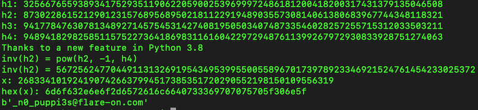

Combining all 3 parts gives the flag **w3lc0mE_t0_Th3_l4nD_0f_De4th_4nd_d3strUct1oN_4nd_n0_puppi3s@flare-on.com**
