## Flare-On CTF 2020
# Challenge 11 : rabbithole

```
One of our endpoints was infected with a very dangerous, 
yet unknown malware strain that operates in a fileless manner. 
The malware is - without doubt - an APT that is the ingenious work of the Cyber Army of the Republic of Kazohinia.

One of our experts said that it looks like they took an existing banking malware family, 
and modified it in a way that it can be used to collect and exfiltrate files from the hard drive.

The malware started destroying the disk, 
but our forensic investigators were able to salvage ones of the files. 
Your task is to find out as much as you can about the behavior of this malware, 
and try to find out what was the data that it tried to steal before it started wiping all evidence from the computer.

Good luck!
```

We are provided with a partial registry dump

I used [Registry Explorer](https://ericzimmerman.github.io/) to open and look through this hive

After exploring a little, one of the registry keys jumps out as weird

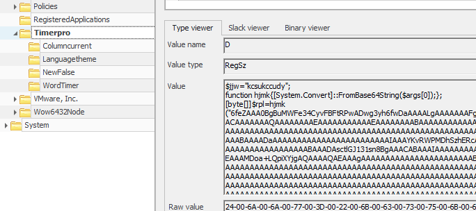

The **Software\\Timerpro** key contains a value **D** that has what looks like powershell code

Base64 decoding this code reveals a powershell script that is like the following  
Take note specifically of the **$rpl** variable

```ps
$jjw="kcsukccudy";
function hjmk{[System.Convert]::FromBase64String($args[0]);};
[byte[]]$rpl = <HUGE BINARY BLOB == SHELLCODE >
function geapmkxsiw{$kjurpkot=hjmk($args[0]);

.........

$kwhk=$tselcfxhwo::OpenThread(16,0,$tselcfxhwo::GetCurrentThreadId());
if($yhibbqw=$ywqphsrw::VirtualAllocEx($ywqphsrw::GetCurrentProcess(),0,$rpl.Length,12288,64))
{
 [System.Runtime.InteropServices.Marshal]::Copy($rpl,0,$yhibbqw,$rpl.length);
 if($tselcfxhwo::QueueUserAPC($yhibbqw,$kwhk,$yhibbqw))
 {
  $tselcfxhwo::SleepEx(5,3);
 }
}
```

The main point to note from this script there is a huge binary blob that is decoded by base64  
After which, a combination of QueueUserAPC and SleepEx is used to call into this **shellcode** binary

Some gooling about these 2 functions revealed that it is a technique used by malware to execute their shellcode

In order to run and debug this shellcode, I had to write a [small stub](ShellcodeTester.cpp) that calls it in the exact same manner  
A normal shellcodetesting stub did not work in my case as there was some pointers missing

```c
#include "stdafx.h"
#include <stdio.h>
#include <Windows.h>
#include "processthreadsapi.h"

#define CHUNK_SIZE 0x1000

unsigned char b[21][CHUNK_SIZE+1] = {
  ////////////
  //I had to break up the hex strings as they were too long to fit in 1 string
  //Look in the actual file linked above to see the actual hex strings
  ////////////
}

int main()
{
	size_t total_size = CHUNK_SIZE * 21;
	void *exec = VirtualAlloc(0, total_size, MEM_COMMIT, PAGE_EXECUTE_READWRITE);
	for (long i = 0; i < 21; i++) {
		memcpy((void *)((unsigned long long)exec + (i * CHUNK_SIZE)), b[i], CHUNK_SIZE);
	}

	//((void(*)())exec)();

	HANDLE curThread = OpenThread(16, 0, GetCurrentThreadId());
	QueueUserAPC((PAPCFUNC)exec, curThread, (ULONG_PTR) exec);
	SleepEx(5, 3);
}
```

Also, after some testing, I realized that his is **64-bit shellcode**  
Therefore, take note to compile in 64-bit

In order to reach the shellcode in the debugger, follow these steps
- Breakpoint at the VirtualAlloc call
- Step over and a pointer to the allocated memory should be in rax
- Put a **hardware execute** breakpoint on the first byte of this buffer
  - A software breakpoint will not work as it will be overwritten by the memcpy
- Continue execution and it should hit the breakpoint

At this point, I started tracing some code in the debugger but soon realized that this is a HUGE shellcode and just blind tracing would not be efficient

### Background research

I looked back at the question and realized that it says that this is a modification of a known banking malware

Googling about banking malware and "QueueUserAPC" eventually led me to the **Gozi/ISFB/Ursnif** malware family

Interestingly, a version of this malware family had its source code leaked a few years ago  
It is available on this [github page](https://github.com/t3rabyt3-zz/Gozi)

Also, Fireeye wrote a [blog post](https://www.fireeye.com/blog/threat-research/2020/01/saigon-mysterious-ursnif-fork.html) about a specific variant of this malware family (what a coincidence *wink)

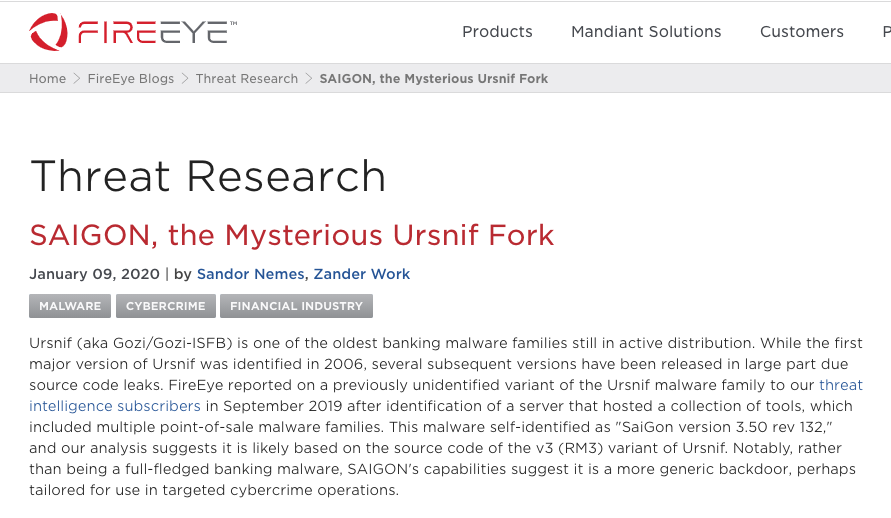

I read through many of these articles to have a better understanding of the main points of this malware  
I also realized that this is a huge malware and there is no way that I could trace the entire program  
I had to work smarter

### Fixing the magic

Basically, the shellcode binary blob is actually the client DLL or stage 2 payload of this malware  
It would connect back to the C2 server, get commands, execute them and send back any results

At the end of the Fireeye's blog post, there was a small python script that could "re-construct" the MZ and/or PE headers of the client dll file

The re-constructed file cannot be run but would be more IDA-Pro friendly and allow it to resolve the imports and functions properly

I tried to run the [script](2_saigon_reconstruct.py) against this sample but it could not work  
It was exiting at these 2 locations

```py
if data[5] == 0x01:
      struct.pack_into('=H', data, 4, 0x14c)
  elif data[5] == 0x86:
      struct.pack_into('=H', data, 4, 0x8664)
  else:
      print('Unknown architecture.')
      return
```

The magic byte denoting the bitness of the program does not match either

```py
optional_header_size, _ = struct.unpack_from('=HH', data, 0x14)
magic, _, _, size_of_code = struct.unpack_from('=HBBI', data, 0x18)

.....

if magic == 0x20b:
      # base of data, does not exist in PE32+
      if size_of_code & 0x0fff:
          tmp = (size_of_code & 0xfffff000) + 0x1000
      else:
          tmp = size_of_code
      base_of_data = base_of_code + tmp
```

The magic bytes here also did not match

By changing the magic bytes of this sample to match what the script is looking for, the script ran successfully
- Byte 6 is changed to 0x86 as we know this is 64-bit
- 2 bytes from offset 0x18 is changed to 0x020B

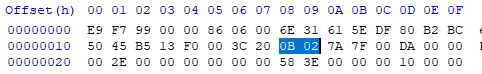

Now, I have a disassembly in IDA Pro that is much easier to read than before

PS: Many data pointers in the disassembly seems to be off by a few bytes (around 0x40 bytes)  
Its not that big of a deal as the function calls and program flows are the more important parts

### Tracing the program

We now have a readable IDA disassembly and a binary that we can debug  
It is now time to trace some of this program

By looking at the function calls and program flow in IDA, I can actually match some of the code against the leaked source code  
By referring to the source code, I could skip analyzing some parts which I feel was not that important  
Of course, there have been modifications since the leaked source code and it will not match up 100%
- The **DLLEntryPoint** in IDA kind of matches the **DllMain** function in **client/client.c**

I started tracing from there, switching back and forth between disassembly, source code and debugger  
I managed to trace much of the beginning of the code where it initialize and sets up the environment for the malware  
I will not detail the steps I did when debugging as this was a long tedious process

A summary of what is important for the challenge is as follow:
1. Unpacks 2 configuration files from its "WD" section (read the fireeye article about what is the WD section) 
  - APLib is used as a decompresser
  - 1 is a RSA public key (will be used for decryption later)
    - This key is still encrypted at this stage
  - 2 is a dictionary of words
    - A Random Word generator is seeded using your SID and this dictionary of words

  
2. Creates 2 Registry keys based on the random word generator
  - Generates 3 random words (R1, R2, R3)
  - Creates 2 keys using these words
    - \\Registry\\User\\[SID]\\Software\\R1\\R2
    - \\Registry\\User\\[SID]\\Software\\R1\\R3
  - For example, these are the keys generated on my testing system
    - R1 is "LanguageScale", R2 is "Solutsystem", R3 is "Rowid"
    - \\Registry\\User\\S-1-5-21-xxxxxxxx-yyyyyyyy-zzzzzzzz-uuuu\\Software\\LanguageScale\\Solutsystem
    - \\Registry\\User\\S-1-5-21-xxxxxxxx-yyyyyyyy-zzzzzzzz-uuuu\\Software\\LanguageScale\\Rowid
  - Based on the provided NTUser.dat
    - The first random word, R1 should be Timerpro

    
3. Generates a couple more GUID strings (did not figure out what they are used for) 


4. Calculate and store the CRC32 hash of the binary name 
  - Specifically its using JAMCRC32 (Bitwise NOT of the CRC32 hash)
  - According to other research, this hash is used by the malware as a kind of ID to identify components


5. Looks for a value inside both of the created Registry keys (Name of this value is random as well)
  - Example in my case: SoftwaresolutionGuidsystem
  - The data in this value is then sent through some kind of decryption routine


6. After which, I believe the malware starts to set up its library injection and hooking mechanisms
  - I stopped tracing at this point and started to focus on the above decryption step

### Decrypting Registry Values

At this point, I knew that the data in the registry keys are important and I focused on decrypting them

The provided NTUser.dat file also contained many binary values in the Timerpro Registry key

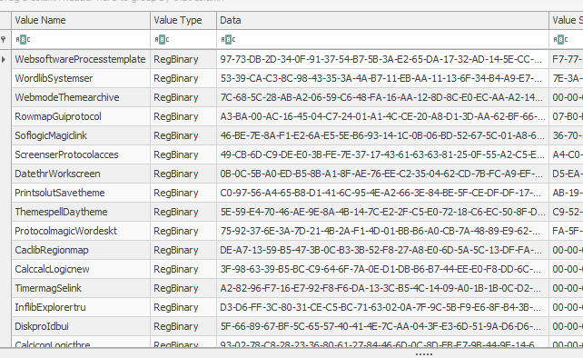

Tracing and examining the decryption routine, I found that it was very similar to the **DsUnsign** function in the [source code](https://github.com/t3rabyt3-zz/Gozi/blob/494e9f1bc1b57e1f3aee0e3682134ee6483e9ff3/crypto/sign.c#L118)

The code in our sample is quite close to the one in the Source Code

1. Decrypt the public key using Serpent-CBC with the key "90982d21090ef347"
2. It then calls into what I guessed to be the **DsUnsign** function
  - Decrypt the last block (block size is 128 bytes) with RSA using the public key
    - This will retrieve the key for Serpent decryption
  - Serpent-CBC decryption with the recovered key from the last step
    - The source code actually supports both RC6 or Serpent algorithm at this stage
    - It is most likely Serpent in our sample because of the Magic constants that was in or not in the code
3. APlib decompression

I found this [Packet_Decryption tool](https://github.com/0ver-fl0w/ISFB_Tools) that is suppose to decrypt the network traffic sent by the ISFB malware  
The decryption process was very similar and I tried to modify it to work for this sample  
However I was not successful and it was using too much time  
Therefore, I tried a lazy and more manual approach

I copied the binary values from the Timerpro keys into my own registry key so that the binary can decrypt them for me  
I then placed a breakpoint at the call into the **DsUnsign** function (0xd901)

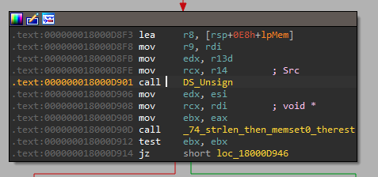

From debugging and the source code, I knew that the output buffer is the 3rd argument  
I watched the memory there and step over the function  
I then dumped the memory contents of that buffer into a file

These files are still APLib compressed, therefore I wrote a small script that decompressed them

After decompression, I noticed all but one of them starts with the characters "PX"

This non-PX file contains some interesting strings  

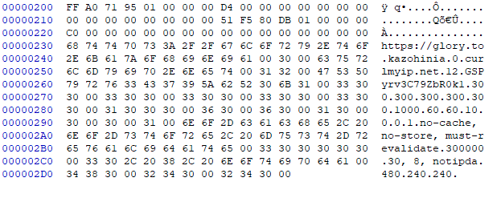

One line looks like some kind of C2 URL that matches the story given in the challenge question  
Take note of this, we will come back to this later

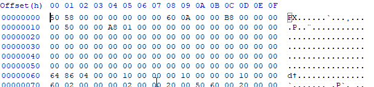

According to the research that I read, the PX format is a custom PE format used by this malware family
 
They normally contain plugins that are downloaded and executed by the malware  
Luckily for us, hasherezade wrote a [parser/converter](https://github.com/hasherezade/funky_malware_formats/tree/master/isfb_parser) that can convert this format back into the normal PE format

I incorporated this tool into my [decompression script](3_aplib_px.py) to decompress and convert them into PE files
- Put the compressed files in "regkeys" folder and create the "decomp" and "convpe" folders

Now, I have an entire folder of 30+ DLLs

PS: I now realized that 1 Registry key is for 64-bit binaries and the other was for 32-bit binaries  
Therefore, some of this DLLs are actually the same except for bitness

### Focusing on files

At this stage, I started getting lost  
There were 30+ DLLs and I was getting lost in them

This was when a friend told me to focus on the files which is what the challenge question was asking about  
I looked through the source code for code related to exfiltrating files and eventually found the [EnumAndSendFiles](https://github.com/t3rabyt3-zz/Gozi/blob/494e9f1bc1b57e1f3aee0e3682134ee6483e9ff3/client/conf.c#L1324) function

It basically enumerates the values of a registry key, decrypts them and try to send the contents back to the C2 server

I looked through the 30+ DLLs to find this function and eventually found it in the binary from the **Columncurrent.WordlibSystemser** key
  - I looked at the import table for functions used in this code
  - The telltale sign for this particular case is the RegEnumValue function which is not used by many of the DLLs

The specific funtion is at offset 0x2968 (or ordinal 79 in the export table)
  
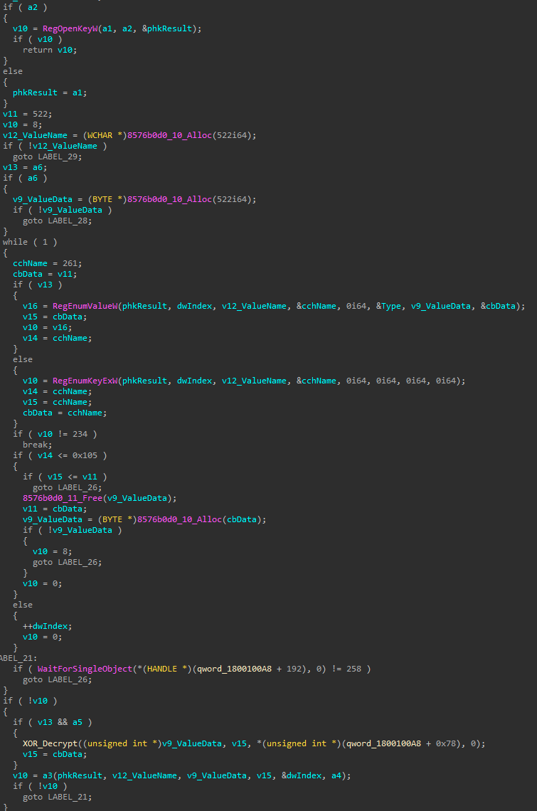

It matches the source code quite nicely

Let's focus on the last part of this function  
The data is passed into the **XorDecryptBuffer** function and subsequently into the **a3** function
  - I do not know what the **a3** function is. It is passed as an argument to this function

Comparing the source code and the disassembly of **XorDecryptBuffer**, there is actually some minor differences  
It was modified in our sample (specifically how the "Count" is propagated between loops)

I reimplmented this in this short python function

```py
def XorDecryptBuffer(enc, key):
    count = 0
    prev = 0
    out = b""
    for i in range(0, len(enc), 4):
        cur = struct.unpack("<I", enc[i:i+4])[0]
        tmp = cur ^ prev ^ key
        tmp = rol(tmp, count << 2, max_bits)
        count ^= 1
        prev = cur
        out += struct.pack("<I", tmp)
        
    return out
```

### The light at the end of the tunnel

The question now is what am i supposed to be decrypting?

Looking back at the provided registry file, I was thinking about where the flag could be hidden  
There was not really a lot of places left in the Timerpro key except the main key


There was only 1 value that has data long enough and scambled enough to be an encrypted flag  
That is the **DiMap** value  
Therefore, I tried to decrypt that using this new function

However, if we look back at the **XorDecryptBuffer** function

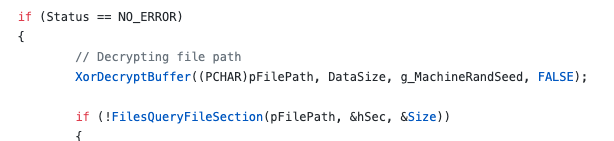

The key is something called **g_MachineRandSeed**

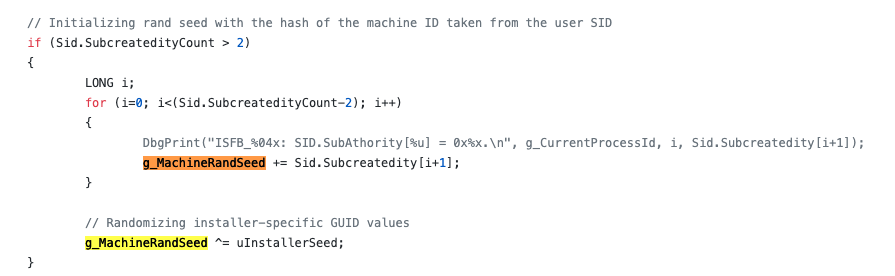

It is initalized using the SID according to the [source code here](https://github.com/t3rabyt3-zz/Gozi/blob/494e9f1bc1b57e1f3aee0e3682134ee6483e9ff3/client/startup.c#L684)

But what is the SID of the compromised user?  
This can actually be found in the metadata of the provided registry file

I used Registry Explorer (Right-click on Timerpro and click "Technical Details") to see this

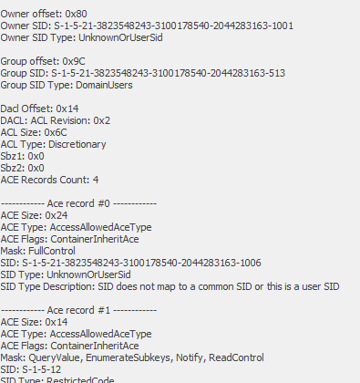

There are multiple SIDs listed here

I put a breakpoint at 0x5b93 which is where the SID is first retrieved

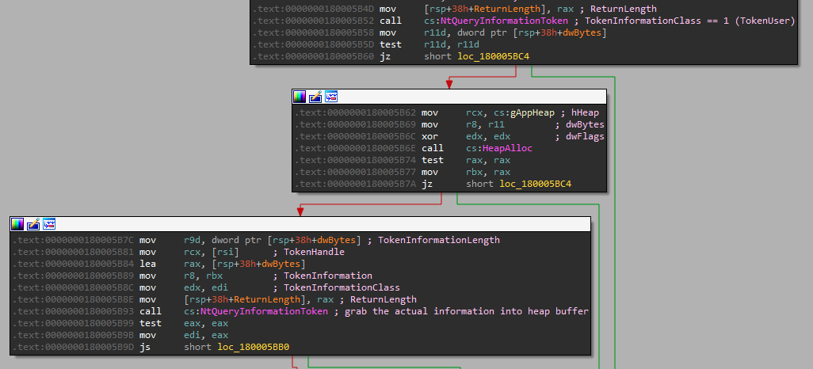

I stepped over it and modified the return value to one of these SIDs  
  - I used "S-1-5-21-3823548243-3100178540-2044283163-1006"
  - The last uuid part is not important as the calculation only uses the middle Machine ID parts

I confirmed that it is indeed the correct SID when the registry key name generated later was "Timerpro"

The g_MachineRandSeed is calculated a little bit after the SID was retrieved

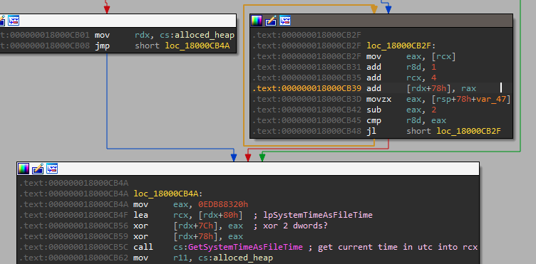

Following through the debugger gave me the g_MachineRandSeed value I needed

```
calculation for gMachineRandomSeed
(0xe3e6b753 + 0xb8c8f86c + 0x79d9491b) ^ 0xedb88320 ==> 0xfb307bfa
```

### I can see the light....

However, when I ran XorDecryptBuffer with the recovered gMachineRandomSeed and **DiMap**'s data  
The decrypted data still looks encrypted  
Most probably, the unknown **a3** function is another decryption routine

If we look back at [EnumAndSendFiles](https://github.com/t3rabyt3-zz/Gozi/blob/494e9f1bc1b57e1f3aee0e3682134ee6483e9ff3/client/conf.c#L1393) in the source code, the **confSendData** function is called after **XorDecryptBuffer**

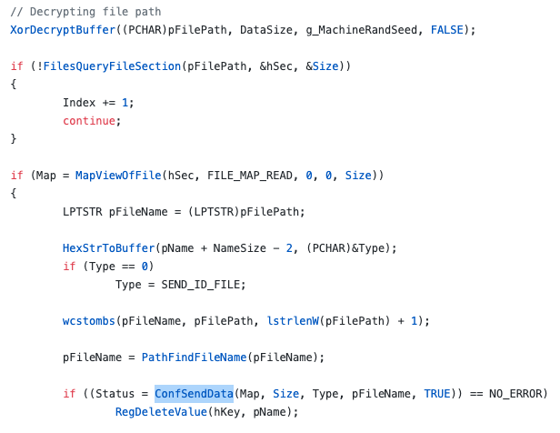

The [confSendData](https://github.com/t3rabyt3-zz/Gozi/blob/494e9f1bc1b57e1f3aee0e3682134ee6483e9ff3/client/conf.c#L896) function will then call the serpent encryption/decryption function

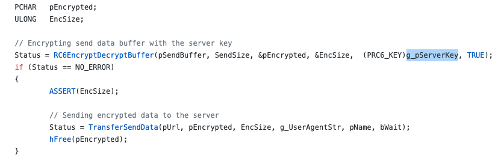

The key used is named **g_pServerKey**  
Searching through the source code, this key seems to be set by a [INI initialization file](https://github.com/t3rabyt3-zz/Gozi/blob/494e9f1bc1b57e1f3aee0e3682134ee6483e9ff3/client/startup.c#L421)

I don't remember seeing such a file or did I?

Looking at the rest of the values set by this INI file, it seems like options related to communication with the C2 server  
Where have we seen data relating to the C2 server?  
Yeap, that not-PX file that we decrypted earlier


Based on the code that I had debugged so far, I knew that the serpent key is 16 bytes long and most probably all ascii  
Look, there is a 16 character long ascii string in that file right after the C2 URL

Putting that key into my [final decryption script](4_decryptflag.py) finally produced the flag

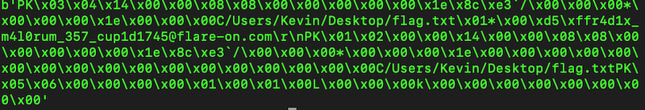

The output is actually a zip file  
Extracting it will give a **flag.txt** file with the flag

The flag is **r4d1x_m4l0rum_357_cup1d1745@flare-on.com**
