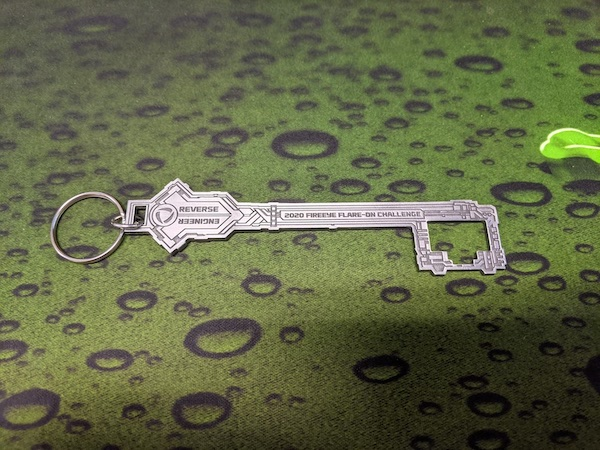

# Flare-On CTF 2020 by FireEye

Challenge site @ http://2020.flare-on.com

This was a 6 weeks long reverse engineering centric CTF created by FireEye

It consists of a single track of 11 challenges.  
Each challenge have to be completed before gaining access to the next.

All challenge zip files can be downloaded from the [official site](http://flare-on.com/files/Flare-On7_Challenges.zip)

Do note all challenge zip files provided are password protected (pw is "flare")

|Challenges 							      |Challenge Type         |
|-------------------------------|:---------------------:|
|[01-fidler](01_fidler)			    |Python 			          |
|[02-garbage](02_garbage)		    |x86 PE (Corrupted, UPX)|
|[03-wednesday](03_wednesday)	  |x86 PE                 |
|[04-report](04_report)		      |Excel Macros 			    |
|[05-tkapp](05_tkapp)	          |TKP .NET DLL       		|
|[06-codeit](06_codeit) 		    |x86 PE (AutoIt Script) |
|[07-recrowd](07_recrowd)   	  |Shellcode (Alpha2)   	|
|[08-aardvark](08_aardvark) 	  |x64 PE (WSL -> x64 ELF)|
|[09-crackinstaller](09_crackinstaller)|x64 PE + Drivers|
|[10-break](10_break) 	   	    |x86 ELF (lib hooking)  |
|[11-rabbithole](11_rabbithole)	|Windows Malware Analysis|

Password to any other encrypted zip files here will be either "flare" or "infected"

Winners will be listed at [flare-on.com](http://flare-on.com/)

Received this nice swag for completing all levels in this CTF

