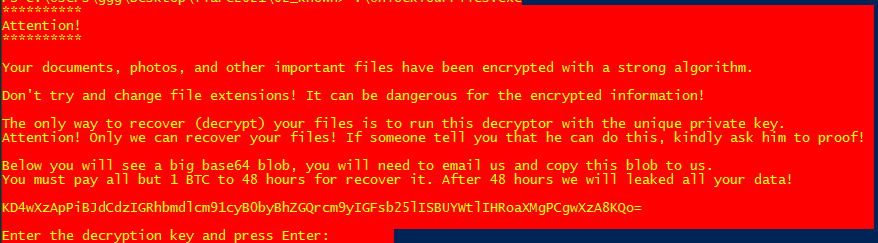
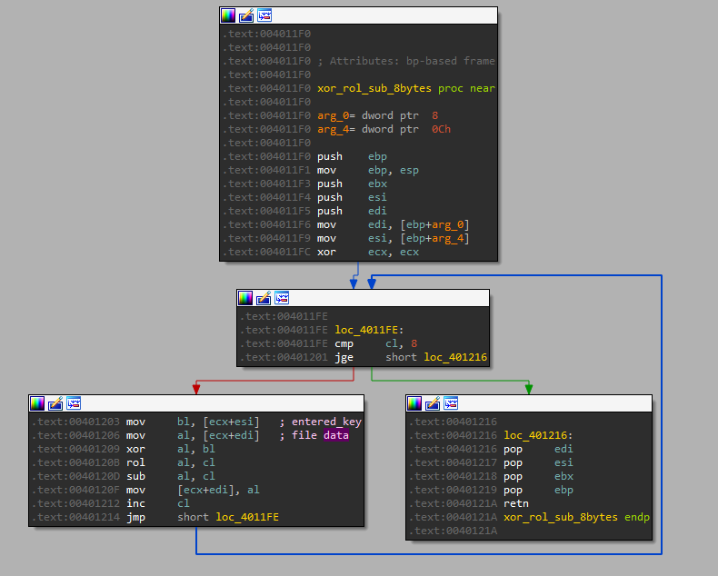

## Flare-On CTF 2021
# Challenge 02 : known

```
We need your help with a ransomware infection that tied up some of our critical files. Good luck.

7-zip password: flare
```

We are provided a 7zip file with a decryption program

Running the decryption program displays the following



Decoding that base64 blob gives the hint

```
> echo -n "KD4wXzApPiBJdCdzIGRhbmdlcm91cyB0byBhZGQrcm9yIGFsb25lISBUYWtlIHRoaXMgPCgwXzA8KQo=" | base64 -d
(>0_0)> It's dangerous to add+ror alone! Take this <(0_0<)
```

The program itself is a x86 Windows PE

I threw it into IDA and looked around  
I debugged it using x64dbg and eventually found the decryption routine at 0x4011F0



```
Decryption routine (key, data)

For every 8 bytes (c is the index, from 0-7):
x = key[c] ^ data[c]
x = x rol c
x = x - c
```

One of the provided encrypted file is a PNG file  
I know that all PNG files starts with a 8 byte header

> 137 80 78 71 13 10 26 10

With this known plaintext, I will be able to retrieve the first 8 bytes of the key

I wrote a little [python script](soln.py) to recover these bytes

```py
def byte_ror(n, d):
    return (n >> d)|(n << (8 - d)) & 0xFF

png_hdr = [137, 80, 78, 71, 13, 10, 26, 10]
enc_png = [0xC7, 0xC7, 0x25, 0x1D, 0x63, 0x0D, 0xF3, 0x56]

key = ""
for c in range(8):
    tmp = png_hdr[c] + c
    tmp = byte_ror(tmp, c)
    tmp = tmp ^ enc_png[c]
    key += chr(tmp)
    
print(key)
```

The recovered 8 bytes is "No1Trust"

Putting this into the decryption program will decrypt all the files

The flag is inside the file named **critical_data.txt**

> (>0_0)> You_Have_Awakened_Me_Too_Soon_EXE@flare-on.com <(0_0<)

The flag is **You_Have_Awakened_Me_Too_Soon_EXE@flare-on.com**
