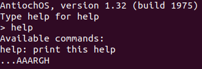
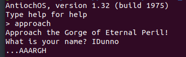
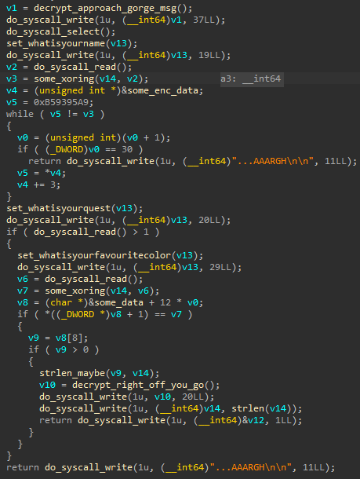
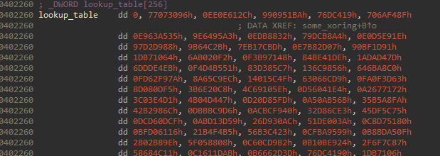
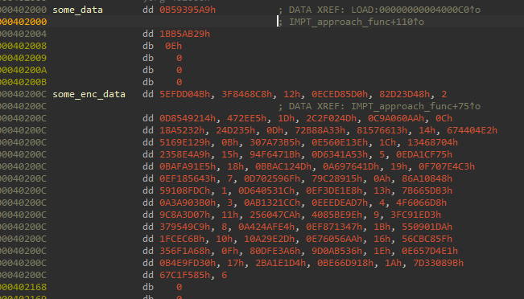
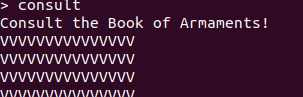
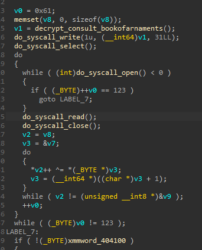
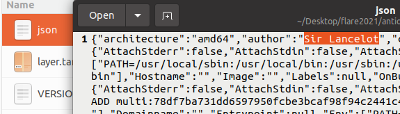
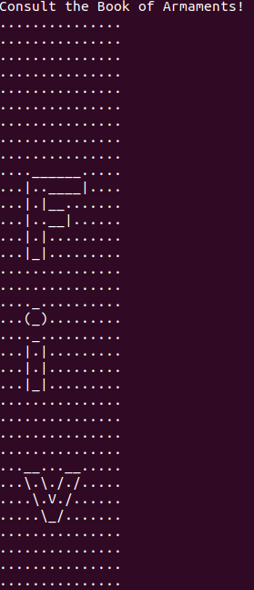

## Flare-On CTF 2021
# Challenge 03 : antioch

```
To solve this challenge, you'll need to ...AAARGH

7-zip password: flare
```

We are provided a 7zip file with a tar file containing lots of folders  
Upon closer inspection, this is actually a docker image

I loaded it with the load command

```sh
>> docker load < antioch.tar
```

Inspeciting the docker image show it mainly runs a binary called AntiochOS

```sh
>> docker image inspect antioch
```


Running the docker image drops us inside some kind of prompt

```sh
>> docker run -it --rm antioch
```



The "help" message was not useful at all

I then extracted the AntiochOS binary so that I could reverse engineer it and see what it does  
To do this, first run the image so that a container exists.  
Then copy the file out from the container

```sh
>> docker run -it --rm antioch

In another prompt:

>> docker container ls -a
CONTAINER ID   IMAGE     COMMAND        CREATED         STATUS                    PORTS     NAMES
44733f186f94   antioch   "/AntiochOS"   3 seconds ago   Up 2 seconds                        nostalgic_haibt
>> docker container cp 44733f186f94:AntiochOS .
```

Now I can throw the binary into IDA and have a closer look

Looking through the "start" exported function, I quickly understood that the program accepts the following commands

- help
- quit
- approach
- consult

**help** displays the very not useful help message while **quit** quits the program

**approach** and **consult** are the interesting commands

### approach command



Googling for the "Gorge of Eternal Peril" reveals that it is referencing a [scene](https://www.youtube.com/watch?v=_7iXw9zZrLo) in the Monty Python movie



Reversing the approach function, it will asks you three questions which is similar to the scene in the movie

- What is your name?
- What is your quest?
- What is your favourite color?

The response of the name and color question is then passed to **some_xoring** function and then checked against some kind of table  
The response of the quest question is only checked for emptiness and is not used at all

Looking at the code of this **some_xoring** function, it eventually used these data as some kind of lookup table



Googling for these contant values, I found that it is actually the lookup table used in [CRC32](https://wiki.osdev.org/CRC32)  
The code in the function looks like CRC32 code as well

Therefore I concluded that the answer to the name and color question is passed through CRC32 (The "\n" must be included for the CRC32 hashing) and then compared against a table of values



After more reversing, I figured out that these data is used in 12 bytes chunk in this format

|Number of Bytes|What is it?|
|---------------|-----------|
|4|CRC32 of Name|
|4|CRC32 of Color|
|4|Some ID number|

Re-arranging them would look something like this

```
[
        0xB59395A9, 0x1BB5AB29, 0xE, 
        0x5EFDD04B, 0x3F8468C8, 0x12, 
        0xECED85D0, 0x82D23D48, 0x2, 
        0x0D8549214, 0x472EE5, 0x1D, 
        0x2C2F024D, 0xC9A060AA, 0xC, 
        0x18A5232, 0x24D235, 0xD, 
        0x72B88A33, 0x81576613, 0x14, 
        0x674404E2, 0x5169E129, 0xB, 
        0x307A73B5, 0xE560E13E, 0x1C, 
        0x13468704, 0x2358E4A9, 0x15, 
        0x94F6471B, 0xD6341A53, 0x5, 
        0x0EDA1CF75, 0x0BAFA91E5, 0x18, 
        0xBBAC124D, 0xA697641D, 0x19, 
        0xF707E4C3, 0x0EF185643, 0x7, 
        0x0D702596F, 0x79C28915, 0xA, 
        0x86A10848, 0x59108FDC, 0x1, 
        0x0D640531C, 0xEF3DE1E8, 0x13, 
        0x7B665DB3, 0x0A3A903B0, 0x3, 
        0x0AB1321CC, 0xEEEDEAD7, 0x4, 
        0x4F6066D8, 0x9C8A3D07, 0x11, 
        0x256047CA, 0x4085BE9E, 0x9, 
        0x3FC91ED3, 0x379549C9, 0x8, 
        0x0A424AFE4, 0xEF871347, 0x1B, 
        0x550901DA, 0x1FCEC6B, 0x10, 
        0x10A29E2D, 0xE76056AA, 0x16, 
        0x56CBC85F, 0x356F1A68, 0xF, 
        0x80DFE3A6, 0x9D0AB536, 0x1E, 
        0xE657D4E1, 0x0B4E9FD30, 0x17, 
        0x2BA1E1D4, 0xBE66D918, 0x1A, 
        0x7D33089B, 0x67C1F585, 0x6
]
```

Do note that the ID number seems to be running from 1 to 30  

It seems like I need to "unhash" these hashes  
I tried various ways, using various wordlists (rockyou, color wordlists, etc...) and even brute-forcing to a certain length  
Hash collision in CRC32 is actually quite easy, therefore even if you managed to brute-force the hash, the input may not be the desired input

Using the above methods, I was able to recover all the "color" hashes but only a couple of the "name" hashes

```
0xB59395A9, 'Indigo', 0xE, 
0x5EFDD04B, 'Blue', 0x12, 
0xECED85D0, 'Coral', 0x2, 
0x0D8549214, 'Black', 0x1D, 
0x2C2F024D, 'Mint', 0xC, 
0x18A5232, 'Tomato', 0xD, 
0x72B88A33, 'Salmon', 0x14, 
0x674404E2, 'Beige', 0xB, 
'Dinky', 'Turquoise', 0x1C, 
0x13468704, 'Transparent', 0x15, 
0x94F6471B, 'Crimson', 0x5, 
0x0EDA1CF75, 'Gray', 0x18, 
0xBBAC124D, 'Bisque', 0x19, 
0xF707E4C3, 'Red', 0x7, 
0x0D702596F, 'Green', 0xA, 
0x86A10848, 'Brown', 0x1, 
0x0D640531C, 'Gold', 0x13, 
0x7B665DB3, 'Orange', 0x3, 
0x0AB1321CC, 'Khaki', 0x4, 
0x4F6066D8, 'Pink', 0x11, 
0x256047CA, 'Periwinkle', 0x9, 
'Zoot', 'Tan', 0x8, 
0x0A424AFE4, 'Orchid', 0x1B, 
0x550901DA, 'Silver', 0x10, 
0x10A29E2D, 'Wheat', 0x16, 
0x56CBC85F, 'Azure', 0xF, 
0x80DFE3A6, 'Yellow', 0x1E, 
0xE657D4E1, 'Purple', 0x17, 
0x2BA1E1D4, 'Chartreuse', 0x1A, 
0x7D33089B, 'Teal', 0x6
```

I tried multiple name wordlists and still had no luck  
I was stuck here for a long time and then I decided to look at the **consult** command instead

### consult command



This command does not seem to take in any user input.



Debugging this function reveals that it will eventually tries to open a bunch of files (a.dat, b.dat, c.dat, etc...)  
It will read the files, process them somehow, then outputs something (which is the "V"s that is shown in the above screenshot)

These files reminded me of something as I saw these files in the folders of the initial tar file


There are actually multiple copies of them in each of them folders  
In the json file of each folder was something interesting



Turns out, in each folder, there is a name in the author field. There are a total of 30 similar folders which matches the number of names what we were looking for

I wrote a [script](get_names.py) that would extract all the authors into a file

### putting it back together

I extracted 30 names and matched their CRC32 hashes against what we had previously  
I re-arranged them according to the ID number and got this

```
[
'Miss Islington', 'Brown', 1, 
'Sir Bors', 'Coral', 2, 
'Tim the Enchanter', 'Orange', 3, 
'Dragon of Angnor', 'Khaki', 4, 
'Brother Maynard', 'Crimson', 5,
'Sir Bedevere', 'Teal', 6,
'Sir Robin', 'Red', 7, 
'Zoot', 'Tan', 8, 
'Squire Concorde', 'Periwinkle', 9, 
'Green Knight', 'Green', 10, 
'Trojan Rabbit', 'Beige', 11,
'Chicken of Bristol', 'Mint', 12, 
'Roger the Shrubber', 'Tomato', 13, 
'Bridge Keeper', 'Indigo', 14, 
'Sir Gawain', 'Azure', 15, 
'Legendary Black Beast of Argh', 'Silver', 16, 
'A Famous Historian', 'Pink', 17, 
'Sir Lancelot', 'Blue', 18, 
'Lady of the Lake', 'Gold', 19, 
'Rabbit of Caerbannog', 'Salmon', 20, 
'Sir Not-Appearing-in-this-Film', 'Transparent', 21, 
'Prince Herbert', 'Wheat', 22, 
'King Arthur', 'Purple', 23, 
'Inspector End Of Film', 'Gray', 24, 
'Sir Ector', 'Bisque', 25, 
'Squire Patsy', 'Chartreuse', 26, 
'Dennis the Peasant', 'Orchid', 27,
'Dinky', 'Turquoise', 28, 
'Black Knight', 'Black', 29,
'Sir Gallahad', 'Yellow', 30
]
```

This is the [script](soln.py) that I wrote to generate the above

I then fired up the docker image and run **approach** 30 times, each time entering the corresponding entry above  
I then run **consult** but there was no change to the result, still a bunch of "V"s  
This was when I realized that the "*.dat" files may not exist in the image

Each of the 30 tar files had different number of "*.dat" files  
I decided to extract them from the folders in order, according to the ID number, overwriting previous versions as I went.

Once that is done, I just run **consult** and I got this



Scrolling through the entire thing will reveal the flag

PS: Seems like alot of guess work for this challenge which I'm not a fan of =/

The flag is **Five-Is-Right-Out@flare-on.com**
