## Flare-On CTF 2021
# Challenge 04 : myaquaticlife

```
What would Flare-On do without a healthy amount of nostalgia for the abraisive simplicity of 1990's UI design? 
Probably do more actual work and less writing fun challenges like this.

7-zip password: flare
```

We are provided a x86 Windows PE binary

A very old school UI is shown when I run the binary

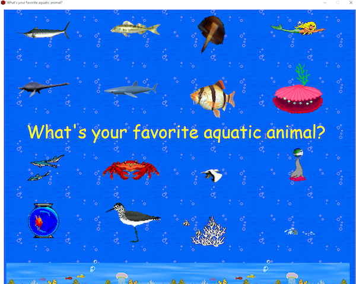

The 16 pictures are clickable  
The center text "What's your favourite aquatic animal" is also clickable  
Once the center text is clicked, it changes to another screen

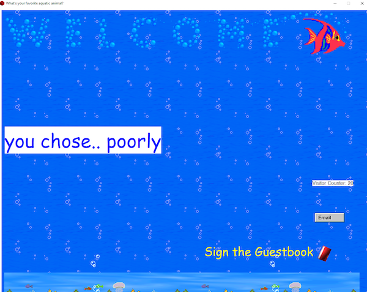

### Let's start analyzing

First of all, looking at the file in a hex viewer reveals that it is upx packed

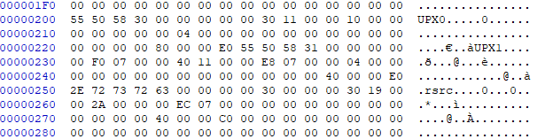

First step is to unpack it using upx

```sh
>> upx -d myaquaticlife.exe
```

Once unpacked, I took a cursory look in IDA  
It is a very bloated binary with lots of functions and strings  
I couldn't find a good starting location to start reversing

Therefore, I tried to do some dynamic analysis on it  
I used procmon to monitor what the binary is doing

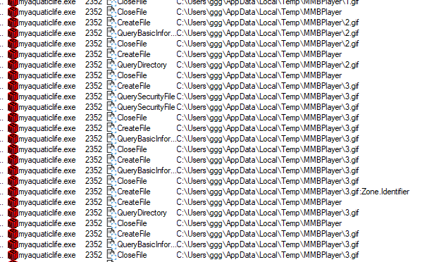

It dropped a bunch of files in the user's **AppData/Local/Temp/MMBPlayer** directory

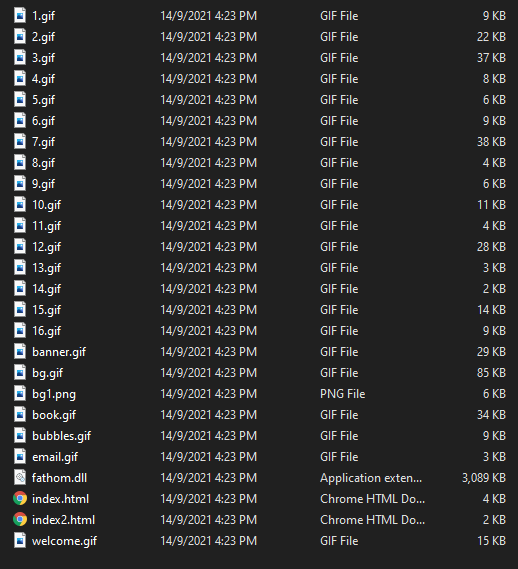

**index.html** is the page that was shown when the binary first started  
**index2.html** is the page that was shown when the text button was clicked

```html
index.html

.....

<div class="main">
    
    <a href="script:Script17"><p class="txt1">What's your favorite aquatic animal?</p></a>
    <a href="script:Script1"></a>
    <a href="script:Script2"></a>
    <a href="script:Script3"></a>
    <a href="script:Script4"></a>
    <a href="script:Script5"></a>
    <a href="script:Script6"></a>
    <a href="script:Script7"></a>
    <a href="script:Script8"></a>
    <a href="script:Script9"></a>
    <a href="script:Script10"></a>
    <a href="script:Script11"></a>
    <a href="script:Script12"></a>
    <a href="script:Script13"></a>
    <a href="script:Script14"></a>
    <a href="script:Script15"></a>
    <a href="script:Script16"></a>
    
    
</div>
.....
```

The buttons are laid out in a 4x4 grid, with 1 being the top left and moving right then down  
The text in the middle is also a button (17)  
Each button calls a corresponding Script* number when clicked

```
| 1| 2| 3| 4|
| 5| 6| 7| 8|
|     17    |
| 9|10|11|12|
|13|14|15|16|
```

However, I could not locate those Script* functions inside the html files

Another interesting file that was dropped is **fathom.dll**  
I threw it into IDA and found some interesting points

It had 17 Exported functions, same as the number of Script* functions

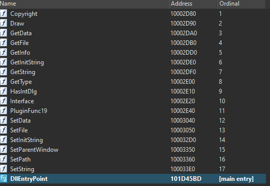

Initially, I thought that each button could have called a specific export function.  
However, when I tested it using a debugger, this was **not** the case

### MMBuilder

There were a bunch of strings in the original binary that looked like this

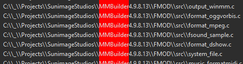

This binary was actually built using a tool called **MMBuilder** (MultiMedia Builder) which is a old Windows tool that could make standalone multimedia applications

It uses a simple scripting language to create the interactivity  
Perhaps, we could recover these scripts?

Scouring the Internet, I managed to find the [MMUnbuilder github page](https://github.com/qprotex/MMUnbuilder)

Running it (take note, it requires Python 2) against the binary actually produced its corresponding **mdb** file

I downloaded the MMBuilder application and was able to open this **mdb** file

Inside, I found all the Script* code

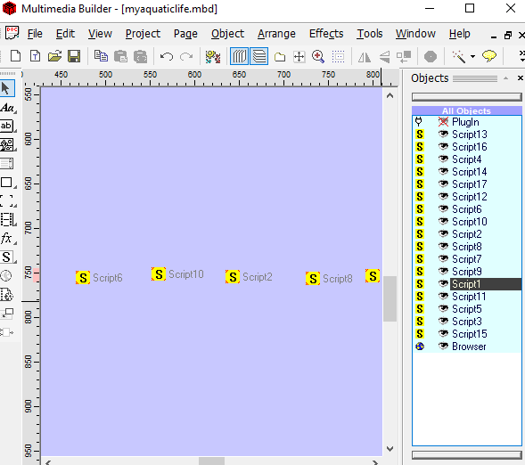

These are what all the Script* function do

|Script|Code|Script|Code|
|------|----|-----|-----|
|1|part1$='derelict:MZZWP'<br>PluginSet("PlugIn","part1$")|9|part1$='lagan:rOPFG'<br>PluginSet("PlugIn","part1$")|
|2|part2$='lagan:BAJkR'<br>PluginSet("PlugIn","part2$")|10|part3$='jetsam:HwdwAZ'<br>PluginSet("PlugIn","part3$")|
|3|part2$='flotsam:DFWEyEW'<br>PluginSet("PlugIn","part2$")|11|part1$='jetsam:SLdkv'<br>PluginSet("PlugIn","part1$")|
|4|part1$='flotsam:PXopvM'<br>PluginSet("PlugIn","part1$")|12|part2$='derelict:LSZvYSFHW'<br>PluginSet("PlugIn","part2$")|
|5|part2$='derelict:LDNCVYU'<br>PluginSet("PlugIn","part2$")|13|part3$='flotsam:BGgsuhn'<br>PluginSet("PlugIn","part3$")|
|6|part3$='derelict:yXQsGB'<br>PluginSet("PlugIn","part3$")|14|part4$='lagan:GTYAKlwER'<br>PluginSet("PlugIn","part2$")|
|7|part2$='jetsam:newaui'<br>PluginSet("PlugIn","part2$")|15|part4$='derelict:RTYXAc'<br>PluginSet("PlugIn","part4$")|
|8|part3$='lagan:QICMX'<br>PluginSet("PlugIn","part3$")|16|part2$='lagan:GTXI'<br>PluginSet("PlugIn","part2$")|
|17|PluginRun("PlugIn","PluginFunc19")<br>PluginGet("PlugIn","var1$")<br>NextPage()<br>.....<br>LoadText("outlabel$","var1$")|

Script1 to Script16 seems to be setting various variables to certain values  
Script17 then calls the PluginFunc19 exported function of the fathom.dll

### PluginFunc19

I believe the solution is to figure out the correct sequence to press the buttons  
I reversed PluginFunc19 to figure out what it is checking for

I debugged the function and several interesting looking strings appears

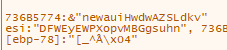

These strings looks like those set in the Script* functions

I tested and kinda confirmed that when you click on one of the 16 buttons, the corresponding string is appended to one of 4 variables (flotsam, jetsam, derelict and lagan)

**PluginFunc19** seems to only check the **flotsam** and **jetsam** strings

First, it load up a buffer with the following intial bytes

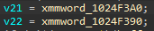

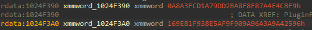

It then loops through these 31 bytes, xoring with bytes from the flotsam string and then subtracting the bytes from the jetsam string  
The resulting bytes are then passed through MD5 and compared against a target hash

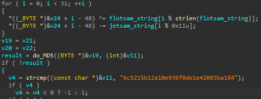

Based on the length restrictions of these strings, I wrote a [brute-force script](soln.py) to try and find the correct strings

```py
import itertools
import binascii
import hashlib

flotsam = {"3": "DFWEyEW", "4": "PXopvM", "13": "BGgsuhn"}
jetsam = {"7": "newaui", "10": "HwdwAZ", "11": "SLdkv"}

initial = bytes.fromhex("9625A4A9A3969A909FAFE538F9819E16F9CBE4A4878F8FBAD29DA7D1FCA3A800")
target_md5 = "6c5215b12a10e936f8de1e42083ba184"

def gen_flotsam():
    choices = ['3', '4', '13']
    for x in itertools.product(choices, repeat=5):
        yield x
        
        
def gen_jetsam():
    choices = ['7', '10', '11']
    for y in itertools.product(choices, repeat=3):
        yield y
        
def gen_md5_input(flot, jet):
    global initial
    md5_input = b""
    for i in range(31):
        tmp = initial[i] ^ ord(flot[i % len(flot)])
        tmp = (tmp - ord(jet[i % 0x11])) & 0xff
        md5_input += bytes([tmp])
    return md5_input
        
        
flotsam_generator = gen_flotsam()
for flot in flotsam_generator:
    jetsam_generator = gen_jetsam()
    for jet in jetsam_generator:
    
        ff = ""
        for f in flot:
            ff += flotsam[f]
            
        jj = ""
        for j in jet:
            jj += jetsam[j]
            
        if len(jj) < 0x11:
            continue
            
        #print("%s : %s" % (ff, jj))
        val = gen_md5_input(ff, jj) # binascii.hexlify(val)
        md5ed = hashlib.md5(val).hexdigest()
        print("%s : %s = %s" % (ff, jj, md5ed))
        if md5ed == target_md5:
            print("Found")
            exit()
```

Running this script gave me the correct inputs that I needed

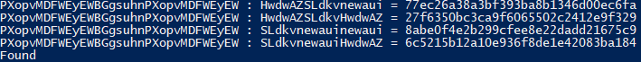

To get these inputs, I need to press the buttons in the order

```
PXopvM DFWEyEW BGgsuhn PXopvM DFWEyEW 
4 3 13 4 3

SLdkv newaui HwdwAZ 
11 7 10
```

Pressing the buttons in the correct order gave me the flag

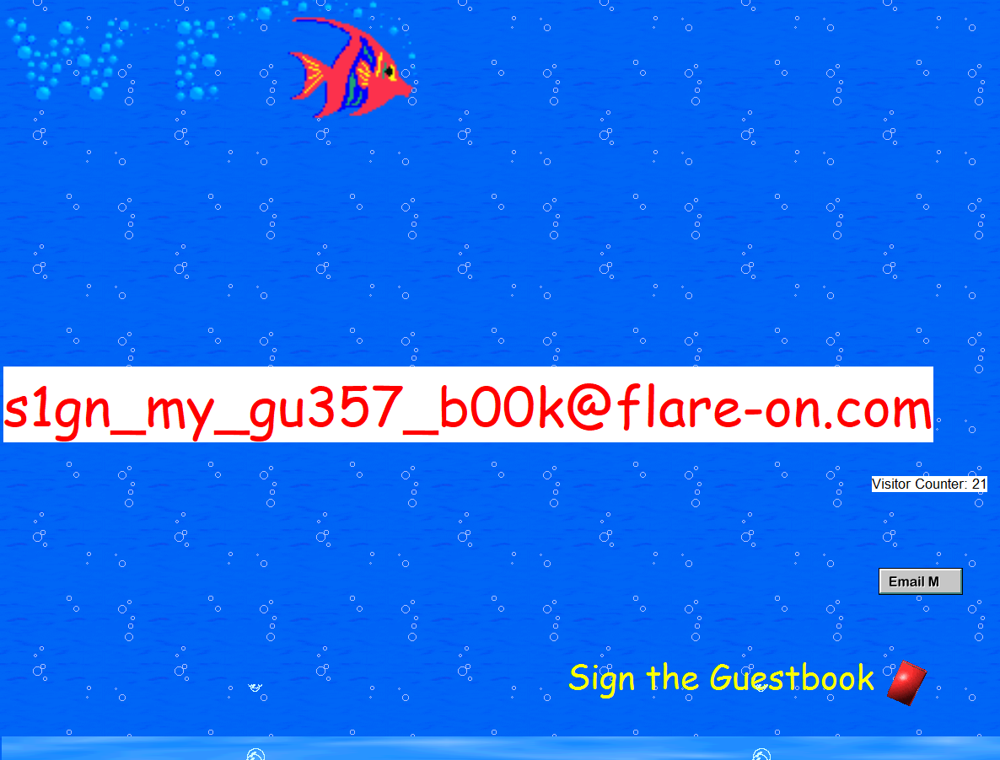

The flag is **s1gn_my_gu357_b00k@flare-on.com**
