## Flare-On CTF 2021
# Challenge 05 : FLARE Linux VM

```
Because of your superior performance throughout the FLARE-ON 8 Challenge, the FLARE team has invited you to their office to hand you a special prize! 
Ooh – a special prize from FLARE ? What could it be? 
You are led by a strong bald man with a strange sense of humor into a very nice conference room with very thick LED dimming glass. 
As you overhear him mumbling about a party and its shopping list you notice a sleek surveillance camera. 
The door locks shut!

Excited, you are now waiting in a conference room with an old and odd looking computer on the table. 
The door is closed with a digital lock with a full keyboard on it.

Now you realise… The prize was a trap! 
They love escape rooms and have locked you up in the office to make you test out their latest and greatest escape room technology. 
The only way out is the door – but it locked and it appears you have to enter a special code to get out. 
You notice the glyph for U+2691 on it. 
You turn you attention to the Linux computer - 
it seems to have been infected by some sort of malware that has encrypted everything in the documents directory, including any potential clues.

Escape the FLARE Linux VM to get the flag - hopefully it will be enough to find your way out.

Hints:

You can import "FLARE Linux VM.ovf" with both VMWare and VirtualBox.
Log in as 'root' using the password 'flare'
If you use VirtualBox and want to use ssh, you may need to enable port forwarding. 
The following link explains how to do it: https://nsrc.org/workshops/2014/btnog/raw-attachment/wiki/Track2Agenda/ex-virtualbox-portforward-ssh.htm
7zip password: flare
```

We are provided a 7zip file with a Linux VM image  
The instruction says that the VM has a malware that has encrypted all the files in the "Documents" folder

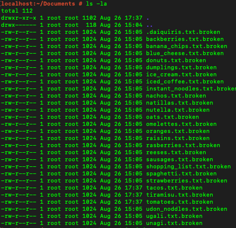

The first step is to find the malware  
Typically, a malware can persist in many ways.  
I looked at running processes, open network ports, etc

Finally, I found it in the cron jobs

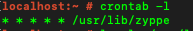

I extracted this binary to analyze it further

```sh
>> scp root@IP:/usr/lib/zyppe .
```

Throwing it into IDA confirms that this is the malware

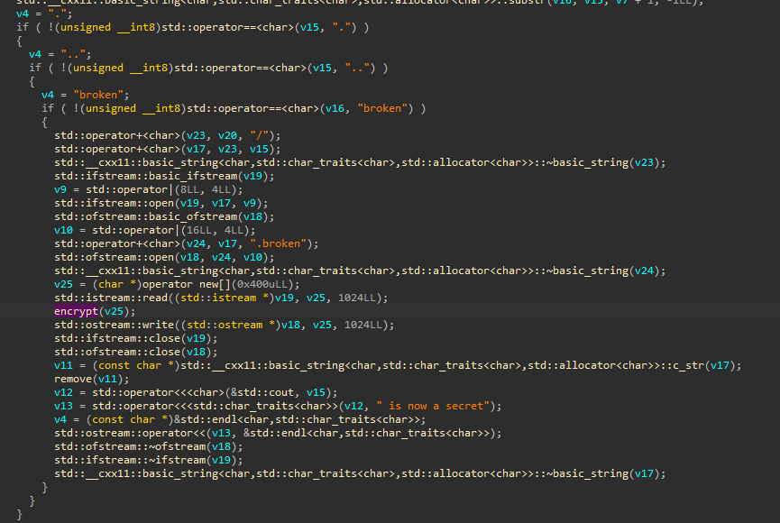

It basically looks for all files in the "Documents" folder and encrypts everything that does not end with ".broken"

### Encryption Algorithm

The encryption algorithm is fairly straightforward

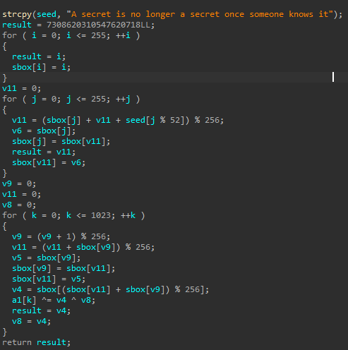

It first creats a sbox initialized with the key "A secret is no longer a secret once someone knows it"  
It then encrypts 1024 bytes  
I reimplented this algorithm in Python

```py
def encrypt(msg, seed):
    sbox = []
    result = 0

    # create sbox
    for i in range(256):
        sbox.append(i)
        
    # initialize sbox with seed
    
    valindex = 0
    for i in range(256):
        valindex = (sbox[i] + valindex + seed[i % 52]) % 256
        tmp_swap = sbox[i]
        sbox[i] = sbox[valindex]
        sbox[valindex] = tmp_swap
        
    # Actual encryption loop
    running_index = 0
    jumping_index = 0
    v8 = 0
    output = bytearray()
    keystream = bytearray()
    loop_limit = 1024
    if len(msg) < 1024:
        loop_limit = len(msg)
        
    for k in range(loop_limit):
        running_index = (running_index + 1) % 256
        jumping_index = (jumping_index + sbox[running_index]) % 256
        tmp_swap = sbox[running_index]
        sbox[running_index] = sbox[jumping_index]
        sbox[jumping_index] = tmp_swap
        
        v4 = sbox[(sbox[jumping_index] + sbox[running_index]) % 256]
        xorkey = v4 ^ v8
        #print("xorkey: %x" % xorkey)
        keystream.append(xorkey)
        output.append(msg[k] ^ xorkey)
        v8 = v4
        
    #return output
    return (output, keystream)
```

What I noticed was that the xor keystream does not depend on the data that it is encrypting  
This means it is the same keystream that is used to encrypt all the files

I wrote [a python script](01_decrypt.py) that would extract this keystream and then use it to decrypt all the encrypted files

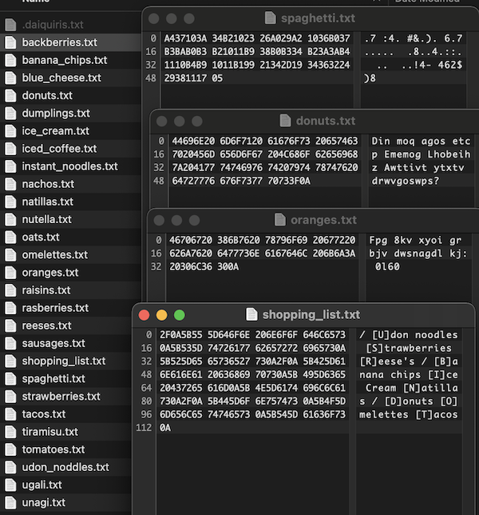

However, some of the files still looks like gibberish while others are in plaintext

### Following the breadcrumbs

As the intro to this challenge says that this is like an escape room game, let's approach it like an escape room game  
In an escape room game, you typically find clues that will lead you to other clues which eventually would lead you to escape.

Let's start with the text files that are in plaintext

#### shopping_list.txt

```
/
[U]don noodles
[S]trawberries
[R]eese's
/
[B]anana chips
[I]ce Cream
[N]atillas
/
[D]onuts
[O]melettes
[T]acos
```

This is actually pointing us to a binary in the vm at /usr/bin/dot  
I extracted it and threw it into ida

```sh
>> scp root@IP:/usr/bin/dot .
```


It basically asks for a password, sha256 it, compares it with a target hash  
If correct, it will print out a flag

This is actually the final binary to run once we have figured out the **Password**

#### U Files

```
unagi.txt
The 1st byte of the password is 0x45

ugali.txt
Ugali with Sausages or Spaghetti is tasty. 
It doesn’t matter if you rotate it left or right, it is still tasty! 
You should try to come up with a great recipe using CyberChef.

udon_noodles.txt
"ugali", "unagi" and "udon noodles" are delicious. 
What a coincidence that all of them start by "u"!
```

*udon_noodles* tells us that files beginning with the same character is part of the same set and should be evaluated together (this is important later)

*ugali* tells us to try bit rotation with the sausages or spagetthi files

Let's try it with [CyberChef](https://gchq.github.io/CyberChef)

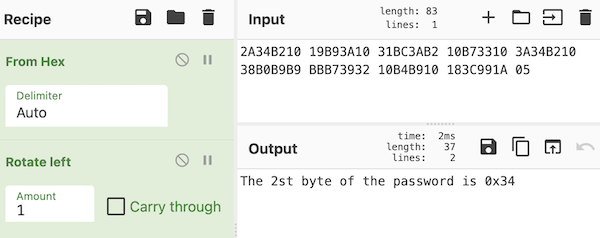 

It works, all the "S" files can be decoded by rotate left of 1 bit

#### S Files

```
sausages.txt
The 2st byte of the password is 0x34

spaghetti.txt
In the FLARE language "spaghetti" is "c3BhZ2hldHRp".

strawberries.txt
In the FLARE team we like to speak in code. 
You should learn our language, otherwise you want be able to speak with us when you escape (if you manage to escape!). 
For example, instead of "strawberries" we say "c3RyYXdiZXJyaWVz".
```

The code that *spagetthi* and *strawberries* are talking about is actually base64  
Looking through the availables files, the **R** files seems to be base64 encoded  
Let's decode them

#### R Files

```
reeses.txt
We LOVE "Reese's", they are great for everything! 
They are amazing in ice-cream and they even work as a key for XOR encoding.

rasberries.txt
The 3rd byte of the password is: 0x51

raisins.txt
The 3rd byte of the password is.. it is a joke, we don't like raisins!
```

*reeses* says that some files are xor encoded with the key "Reese's"

I actually wrote a [python script](02_tryallfiles.py) that would help me test all the files with a certain decoding algorithm

```py
def xor_strings(msg, key):
    output = bytearray()
    for i in range(len(msg)):
        output.append(msg[i] ^ key[i % len(key)])
    return output
```

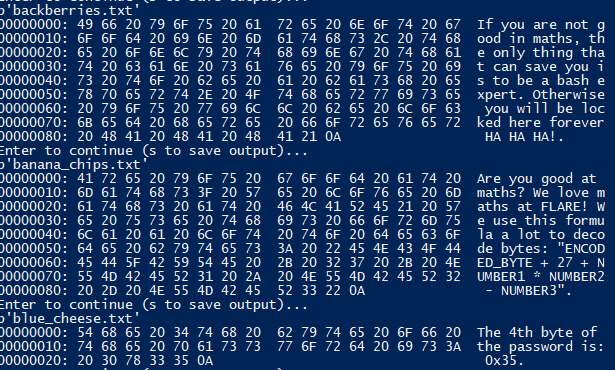

#### B Files

```
backberries.txt
If you are not good in maths, the only thing that can save you is to be a bash expert. 
Otherwise you will be locked here forever HA HA HA!

banana_chips.txt
Are you good at maths? 
We love maths at FLARE! We use this formula a lot to decode bytes:
 "ENCODED_BYTE + 27 + NUMBER1 * NUMBER2 - NUMBER3"

blue_cheese.txt
The 4th byte of the password is: 0x35
```

I actually saw these NUMBER1, NUMBER2, NUMBER3 while exploring the VM  
*backberries* is actually hinting you to look into your bash configurations

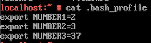

I used back the python script to try and find which files can be decoded using this algorithm

```py
def decode_bananachips(enc):
    output = bytearray()
    for cur in enc:
        output.append((cur + 27 + 2 * 3 - 37) & 0xff)
    return output
```

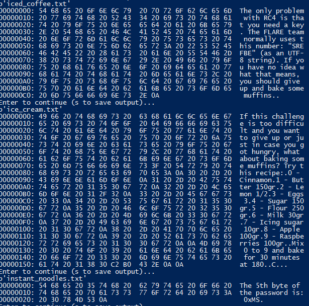

#### I Files

```
ice_cream.txt
If this challenge is too difficult and you want to give up or just in case you got hungry,
what about baking some muffins? Try this recipe:
0 - Cinnamon
1 - Butter 150gr
2 - Lemon 1/2
3 - Eggs 3
4 - Sugar 150gr
5 - Flour 250gr
6 - Milk 30gr
7 - Icing sugar 10gr
8 - Apple 100gr
9 - Raspberries 100gr

Mix 0 to 9 and bake for 30 minutes at 180°C.

iced_coffee.txt
The only problem with RC4 is that you need a key. 
The FLARE team normally uses this number: "SREFBE" (as an UTF-8 string). 
If you have no idea what that means, you should give up and bake some muffins.

instant_noodles.txt
The 5th byte of the password is: 0xMS
```

I was stuck here for a long time trying to figure out what is the number "SREFBE"

I then remembered that all clues from the same set should be considered together  
I then noticed that these characters matches the first character of the ingredients shown in *ice_cream*

Replacing them with the corresponding numbers gives

```
iced_coffee.txt
The only problem with RC4 is that you need a key. 
The FLARE team normally uses this number: "493513" (as an UTF-8 string). 
If you have no idea what that means, you should give up and bake some muffins.

instant_noodles.txt
The 5th byte of the password is: 0x64
```

Again, I tried to rc4 all the files to find which files can be decrypted

```py
def decode_rc4_icedcoffee(enc):
    #key = "SREFBE".encode("UTF-8")
    key = "493513" # refer to dictionary in ice_cream.txt
    cipher = ARC4(key)
    return cipher.decrypt(enc)
```

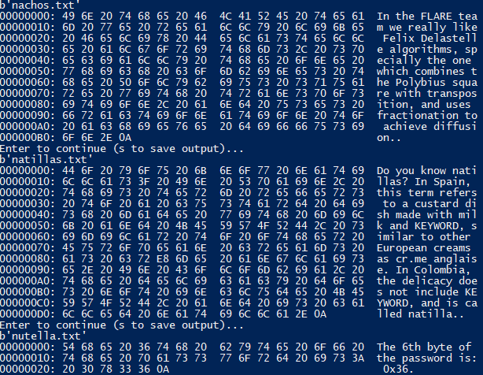

#### N Files

```
nachos.txt
In the FLARE team we really like Felix Delastelle algorithms, 
specially the one which combines the Polybius square with transposition, 
and uses fractionation to achieve diffusion.

natillas.txt
Do you know natillas? 
In Spain, this term refers to a custard dish made with milk and KEYWORD, 
similar to other European creams as crème anglaise. 
In Colombia, the delicacy does not include KEYWORD, and is called natilla.

nutella.txt
The 6th byte of the password is: 0x36
```

Googling about the terms used in *nachos* led me to the **Bifid Cipher**  
This cipher requires a key

Searching about natillas brought me to its wiki page

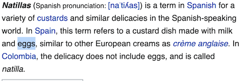

There wasnt a good python implementation of the bifid cipher, therefore I went back to cyber chef

It managed to decode the **D** files

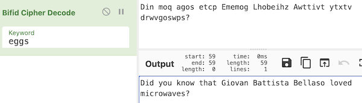

#### D Files

```
donuts.txt
Did you know that Giovan Battista Bellaso loved microwaves?

dumplings.txt
Are you missing something? You should search for it better! 
It's hidden, but not really.

daiquris.txt
The 7th byte of the password is: 0x66
```

*dumplings* was referring to a hidden file named **.daiquris.txt** that was in the same folder

Googling about the name in *donuts* reveals that he came up with the **Autokey** cipher method that Vigenere eventually used in the Vigenere cipher  
It also requires a key, let's try microwaves

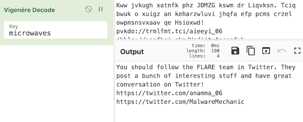

It managed to decode the **O** files

#### O Files

```
oats.txt
You should follow the FLARE team in Twitter. 
They post a bunch of interesting stuff and have great conversation on Twitter!
https://twitter.com/anamma_06
https://twitter.com/MalwareMechanic

omelettes.txt
You should follow the FLARE team in Twitter. 
Otherwise they may get angry and not let you leave even if you get the flag.
https://twitter.com/anamma_06
https://twitter.com/osardar1
https://twitter.com/MalwareMechanic

oranges.txt
The 8th byte of the password is: 0x60
```

The files mentions a few twitter account  
I visited them and found the following conversation between anamma_06 and MalwareMechanic

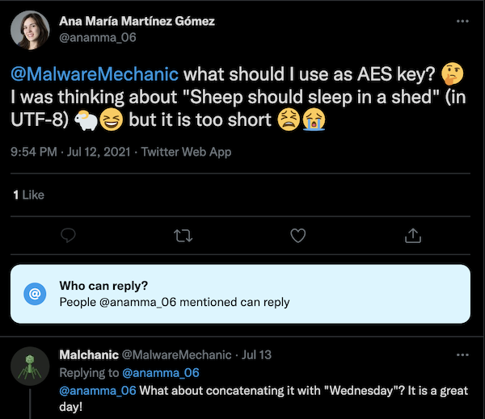

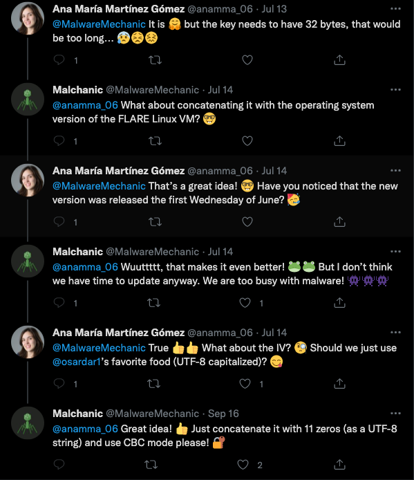

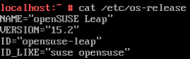

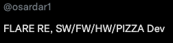

```py
def decode_aes_oats(msg):
    try:
        ct = bytes.fromhex(msg.decode())
        key = "Sheep should sleep in a shed15.2".encode("UTF-8")
        iv = ("PIZZA" + "0" * 11).encode("UTF-8")
        cipher = AES.new(key, AES.MODE_CBC, iv)
        return unpad(cipher.decrypt(ct), AES.block_size)
    except:
        return b"Failed"
```

It managed to decrypt the **T** files

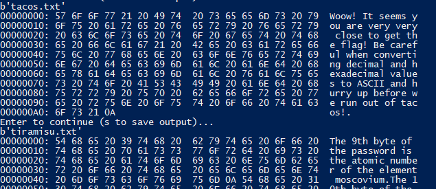

#### T Files

```
tacos.txt

Woow! It seems you are very very close to get the flag! 
Be careful when converting decimal and hexadecimal values to ASCII and hurry up before we run out of tacos!

tiramisu.txt

The 9th byte of the password is the atomic number of the element moscovium
The 10th byte of the password is the bell number preceding 203
The 12th byte of the password is the largest known number to be the sum of two primes in exactly two different ways
The 14th (and last byte) of the password is the sum of the number of participants 
  from Spain, Singapore and Indonesia that finished the FLARE-ON 7, FLARE-ON 6 or FLARE-ON 5

tomatos.txt
It seems you are close to escape... 
We are preparing the tomatoes to throw at you when you open the door! 
It is only a joke...
The 11th byte of the password is the number of unique words in /etc/Quijote.txt
The 13th byte of the password is revealed by the FLARE alias
```

### Recovering the Password

We now have all the parts of the password, let's put them together

```
unagi.txt
The 1st byte of the password is 0x45

sausages.txt
The 2st byte of the password is 0x34

rasberries.txt
The 3rd byte of the password is: 0x51

blue_cheese.txt
The 4th byte of the password is: 0x35

instant_noodles.txt
The 5th byte of the password is: 0xMS (0x64 according to ice_cream.txt)

nutella.txt
The 6th byte of the password is: 0x36

daiquris.txt
The 7th byte of the password is: 0x66

oranges.txt
The 8th byte of the password is: 0x60

tiramisu.txt

The 9th byte of the password is the atomic number of the element moscovium
  = 115
The 10th byte of the password is the bell number preceding 203 
  = 52
The 12th byte of the password is the largest known number to be the sum of two primes in exactly two different ways
  = ??? I don't know
The 14th (and last byte) of the password is the sum of the number of participants from Spain, Singapore and Indonesia that finished the FLARE-ON 7, FLARE-ON 6 or FLARE-ON 5
    = flareon7 --> 9 + 19 + 0 = 28
    = flareon6 --> 7 + 25 + 2 = 34
    = flareon5 --> 4 + 6 + 1 = 11
    = 73

tomatos.txt
The 11th byte of the password is the number of unique words in /etc/Quijote.txt 
   = 108
The 13th byte of the password is revealed by the FLARE alias
```

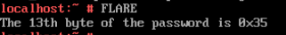

I was able to find all the numbers except the 12th byte which is "the largest known number to be the sum of two primes in exactly two different ways"

```
password = [0x45, 0x34, 0x51, 0x35, 0x64, 0x36, 0x66, 0x60, 115, 52, 108, ?, 0x35, 73]
```

Since its only 1 byte and I know the target hash from reversing /usr/bin/dot, I can [brute force](03_bf.py) it

```py
import hashlib

target_hash = "b3c20caa9a1a82add9503e0eac43f741793d2031eb1c6e830274ed5ea36238bf"

for i in range(256):
    password = bytes([0x45, 0x34, 0x51, 0x35, 0x64, 0x36, 0x66, 0x60, 115, 52, 108, i, 0x35, 73])
    guess = hashlib.sha256(password).hexdigest()
    print("%s: %s" %(password, guess))
    if guess == target_hash:
        print("Found")
        break
```

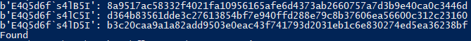

The password is **E4Q5d6f`s4lD5I**

Putting that in the dot binary will produce the flag

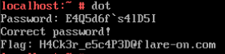

The flag is **H4Ck3r_e5c4P3D@flare-on.com**

PS: This was actually quite a fun challenge and good for introducing new people into CTFs. Great job!
