## Flare-On CTF 2021
# Challenge 06 : petthekitty

```
Hello,

Recently we experienced an attack against our super secure MEOW-5000 network. 
Forensic analysis discovered evidence of the files PurrMachine.exe and PetTheKitty.jpg; 
however, these files were ultimately unrecoverable. 
We suspect PurrMachine.exe to be a downloader and do not know what role PetTheKitty.jpg plays (likely a second-stage payload). 
Our incident responders were able to recover malicious traffic from the infected machine. 
Please analyze the PCAP file and extract additional artifacts.

Looking forward to your analysis, ~Meow

7zip password: flare
```

We are provided a 7zip file with a PCAP network capture

Looking through the PCAP file, there are essentially 2 TCP streams to these 2 destination ports

- 7331
- 1337

Let's look at the stream to port 7331 first

### Extracting the Meowware (Port 7331)

Looking at this stream, 2 files were downloaded

 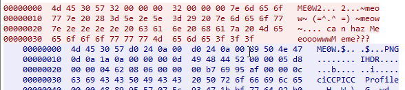
 
 
 
 The **MEOW** data structure seems quite simple and looks something like this
 
 |Bytes|Content|
 |-----|-------|
 |4|MEOW Header "ME0W"|
 |4|Some kind of Length (Later determined to be the plaintext length)|
 |4|Length of payload (n)|
 |n|Payload

The first payload is a [PNG file](data/7331_01.png)

The second payload is some binary file with a [**PA30** file header](data/7331_02.pa30)

It was quite difficult to find information about this file format  
It is a file format used by Windows patches, specifically patch deltas using the MSDelta compression scheme

After a long time searching for information, I found [this blogpost](https://wumb0.in/extracting-and-diffing-ms-patches-in-2020.html) which described it the best

It is basically a format used for a differential patching scheme where you could describe the changes to be made to a file instead of having the entire file  
There isn't much official documentation about this file format

The blogpost also included a [python script](delta_patch.py) (delta_patch.py) that uses Python ctypes to call the relevant Windows API for MSDelta operations  
This is much easier to use than writing a Windows program

Normally, the patching requires 
- Input Base File to be patched
- Delta patch
- Output file (where to write the patched file to)

After playing around with the tool for abit, I was finally able to extract the malware using the following
- Input Base File == First PNG that was received (7331_01.png)
- Delta Patch == Second PA30 file that was received (7331_02.pa30)

```sh
# Requires python3

>> python delta_patch.py -i 7331_01.png -o 7331.wtf 7331_02.pa30
Applied 1 patch successfully
Final hash: OsdAMg6SJ4EFnx69R5NJFq2ToD4utovfwrzBaVxmssk=
```

The resulting file is an executable  
This is quite interesting as you could transform a legit image into an executable

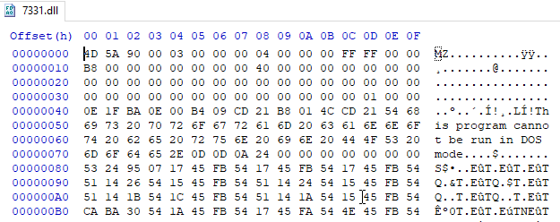

Before analyzing this binary, I also wrote an [extraction script](01_extract.py) that would extract all the payloads of the 2nd tcp stream (on port 1337) for ease of analysis later

### Analyzing the Meowware

THe binary is actually a DLL and it has one exported function **Le_Meow**

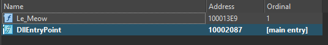

It will connect to the url shown in the initial PCAP on port 1337 which is the 2nd data stream that was seen in the PCAP

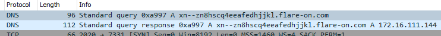

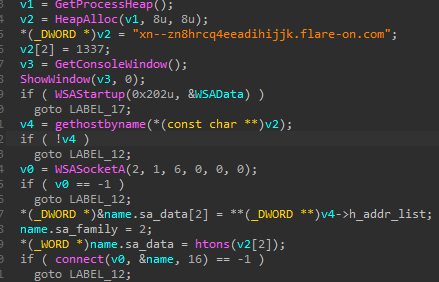

The next step is to figure out what is being sent and received by this binary

Looking at the tcp stream, it appears to be a sequence of PA30 data being transmitted back and forth

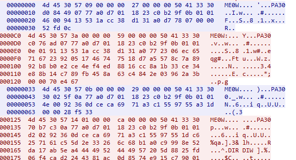

#### Le_Meow

First of all, I tried to debug the **Le_Meow** function using x64dbg and rundll32.exe  
[This post](https://medium.com/malware-buddy/reverse-engineering-tip-analyzing-a-dll-in-x64dbg-b3005d516049) describes how to set it up

As you saw above, it first tries and connect to the url on port 1337  
If that fails, the code just exits

Therefore, I had to set up a [simple server](server.py) listening on port 1337  
I also added a entry in my hosts file to point the revealed domain to the localhost

```py
import socket
import sys

# Create a TCP/IP socket
sock = socket.socket(socket.AF_INET, socket.SOCK_STREAM)

# Bind the socket to the port
server_address = ('127.0.0.1', 1337)
print('starting up on %s port %s' % server_address)
sock.bind(server_address)

# Listen for incoming connections
sock.listen(1)

while True:
    # Wait for a connection
    print('waiting for a connection')
    connection, client_address = sock.accept()

    try:
        print(client_address)

        # Receive the data and print it
        data = connection.recv(1024)
        print(data)
    except:
        print("Exception!")
    finally:
        # Clean up the connection
        connection.close()
```

After connecting to the server, it will check if you have "sedebugprivilege"  
This means I have to run the DLL with elevated permissios (or "as admin")

Once the server is up, running the exported function in elevated privilege will result in this screen popping up

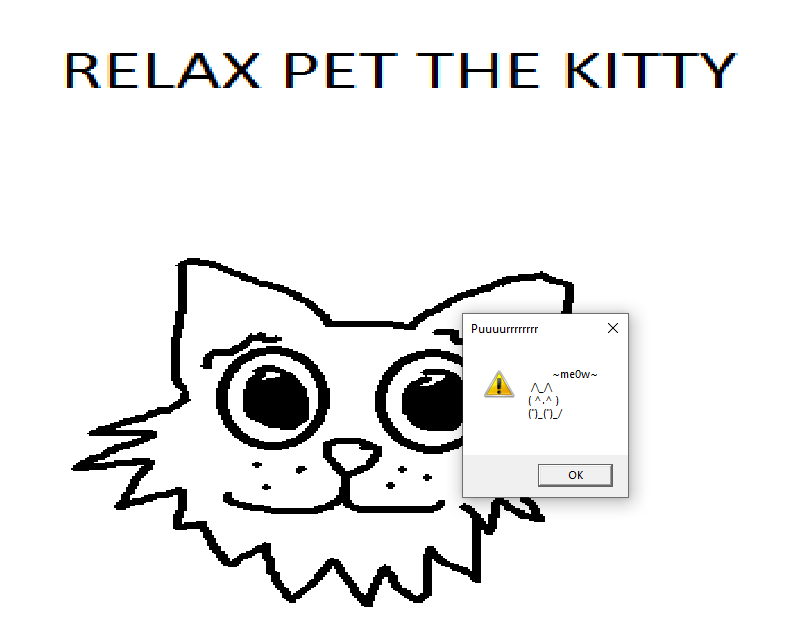

This will fill up the entire screen  
The mouse and keyboard will also stop working

##### Screen Lock / Anti-debug

This is essentially a "screen lock", the user can no longer interact with the screen  
This screen seems to stay up until the main thread finish executing and sends a message to this window  
This works as an anti-debugger feature

If we look at the code, after connecting to the server

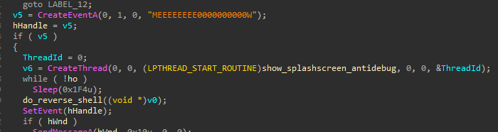

It starts another thread that will run the **show_splashscreen_antidebug** (0x10001CA3) function

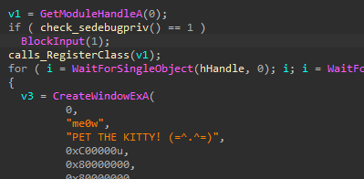

The keypoing is the **BlockInput** call which will block all keyboard and mouse events  
After which, it will create the Window that we saw and display it to cover the entire screen

By removing the call to **BlockInput**, I would then be able to minimize the new window and continue with my debugging

When trying to nop the call to BlockInput away, IDA actually warns me that this address will be modified by the relocation table  
Instead, I used a "jmp short" instruction to bypass this instead

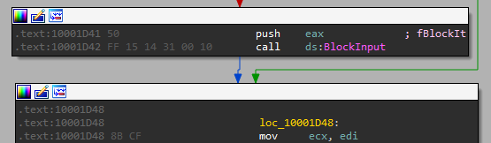

to

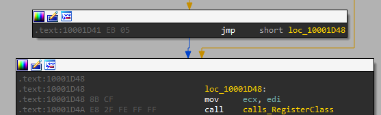

##### Back to the main thread


As the new thread tries to lock the screen, the main thread continues into the **do_reverse_shell** (0x100015D4) function

*Spoilers*: Its basically is a reverse shell with some encryption + compression

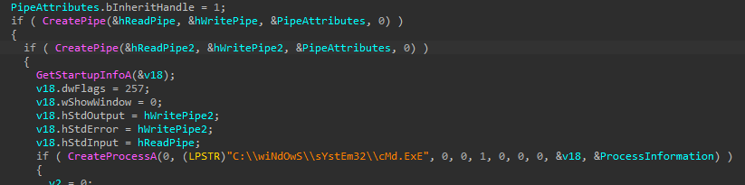

It creates 2 pipes and connects them to a **cmd** process

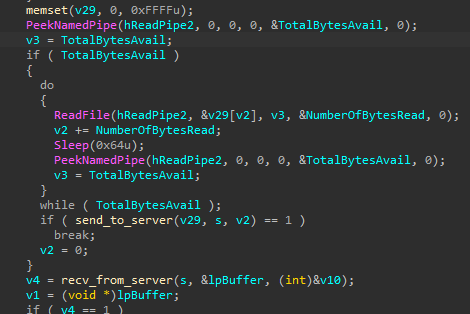

It then proceeds to send data to the server and recv some data from the server

The **send_to_server** function does the following
- XOR the data with the key "meoow"
- Creates a delta file of the data with CreateDeltaB
- Send it to the server

The **recv_from_server** function does the following
- Receive data from server
- Applies delta file to some data with ApplyDeltaB
- Xor the data with the key "meoow"

The key point is the **CreateDeltaB** and **ApplyDeltaB** functions  
They are part of the MSDelta API explained at the beginning of this article

It normally requires a base file to generate a patch but what is the base file being used here?

By debugging the program and stepping through the **send_to_server** function, I noticed that it is generating a delta between these 2 data buffers

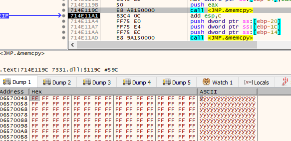

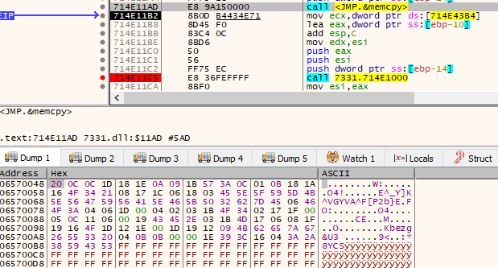

This means that the base file is just a file with lots of 0xff bytes

#### Decoding the data

I now have all the parts needed to decode the data

First of all, I created a file with a bunch of 0xff bytes

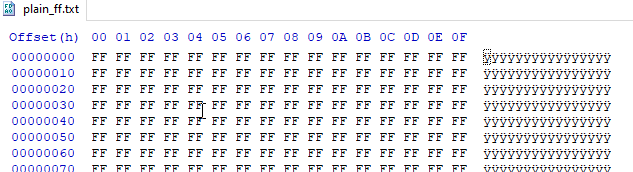

I modified the extraction script earlier into this [decoding script](02_decode.py)  
It requires the delta_patch script I used earlier as well

The script will decode the data as it is read them from the pcap file

```py
from scapy.all import *
import struct
from delta_patch import *

def xorstrings(msg, key):
    output = bytearray()
    for i in range(len(msg)):
        output.append(msg[i] ^ key[i % len(key)])
    return output

def isAllNulls(data):
    for x in data:
        if x != 0:
            return False
    return True

TMP_FILE = "patch.tmp"
    
def main():
    pcap = rdpcap("IR_PURRMACHINE.pcapng")

    for packet in pcap:
        if TCP in packet:
            if packet[TCP].dport == 1337 or packet[TCP].sport == 1337:

                payload = bytes(packet[TCP].payload)
                if len(payload) > 1 and not isAllNulls(payload):
                    plain_len = struct.unpack("<I", payload[4:8])[0]
                    decoded_len = struct.unpack("<I", payload[8:12])[0]
                    patch_data = payload[12:]
				
                    # Write the patch_data into a tmp file
                    with open(TMP_FILE, "wb") as f:
                        f.write(patch_data)
                    
                    # read in the base file (lots of 0xff bytes)    
                    inbuf = b""
                    with open("plain_ff.txt", "rb") as f: # files with all 0xff bytes
                        inbuf = f.read()

                    # Apply the patch
                    buf = cast(inbuf, wintypes.LPVOID)
                    n = len(inbuf)
                    to_free = []
                    legacy = False
                    try:
                        buf, n = apply_patchfile_to_buffer(buf, n, TMP_FILE, legacy)
                        to_free.append(buf)

                        outbuf = bytes((c_ubyte*n).from_address(buf))
                        #print(outbuf)
                    finally:
                        for buf in to_free:
                            DeltaFree(buf)
                            
                    # apply the xor decryption
                    outbuf = outbuf[:plain_len]
                    plaintext = xorstrings(outbuf, b"meoow")
                    
                    out_msg = bytes(plaintext)
                    try:
                        out_msg = out_msg.decode('utf-8', errors='ignore')
                    except:
                        pass
                    print(out_msg)

if __name__ == "__main__":
    main()

```

Running the script will reveal the commands and response that was performed with the reverse shell

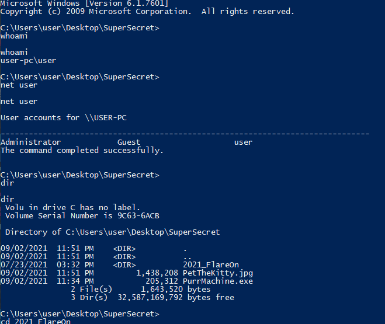

It is a long list of commands, somewhere within in, the flag is revealed

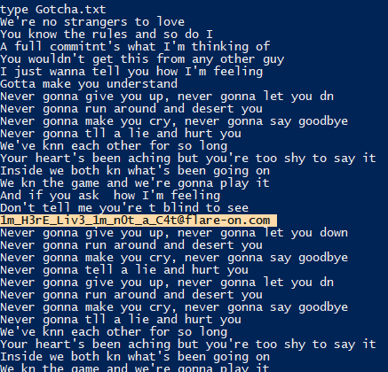

The flag is **1m_H3rE_Liv3_1m_n0t_a_C4t@flare-on.com**
