## Flare-On CTF 2021
# Challenge 07 : spel

```
Pro-tip: start disassembling this one then take a nice long break, 
you've earned it kid.

7-zip password: flare
```

We are provided a 7zip file with a x64 PE binary

As the challenge instruction stated, disassembling this in IDA will take awhile (a few hours for me).  
So start the process and go take a break :)

The disassembly is massive and there isnt really a good place to start investigating  

If you run the binary, you will see this screen with no other option than to close the dialog

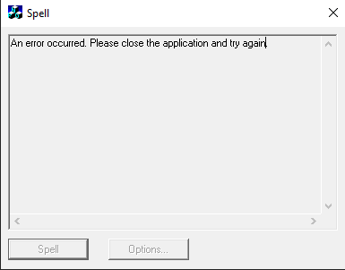

### Wrong Rabbithole

Initially, I thought that I had to fix this error, so that the program can run  
I spent several days and tried many ways to figure out what triggered the error
- I used peinsider and noticed that there was a corrupted png
- I used Resource Hacker to modify and "fix" this png resource

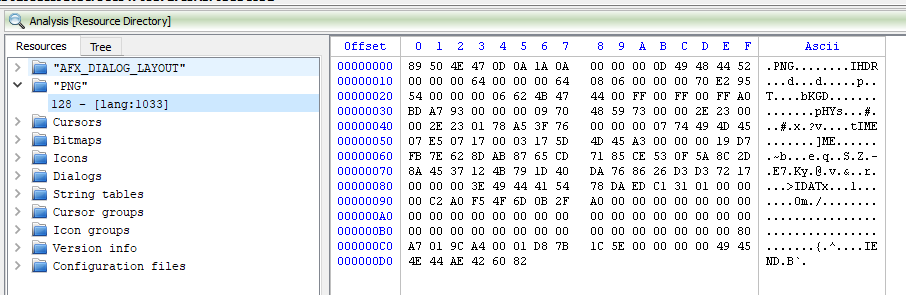

However, I got nowhere and someone suggested that I stop obsessing over the error and look elsewhere

Interestingly, sometimes when I was using resource hacker to modify the png, I was unable to overwrite the executable as it was "still in use" even though I closed the program

This was when I realized that the program continues to run even when I closed the dialog box
- Perhaps this was the hint given by the text "close the application and try again"

### This is very sus

I changed my focus to try and figure out what happens after the dialog box is closed  
I tried static analysis first but the C++ and GUI based code is a beast to analyze

In the end, dynamic analysis yielded more results

I used procmon and noticed that 2 new threads were created after the dialog box is closed

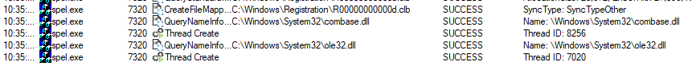

I tried to figure out where these 2 threads are created but as usual the disassembly is difficult to analyze

In the end, I came across this fantastic tool [pe-sieve](https://github.com/hasherezade/pe-sieve) by hasherezade  
This tool scans a process memory and extracts potentially malicious content (e.g. injected DLLs) for further analysis

> pe-sieve64.exe /pid PID

Running it against the process when the dialog box is up shows no suspicious behavior

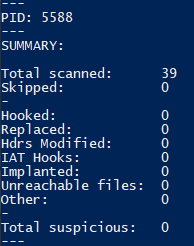

Running it again when the dialog box is closed extracted several suspicious files


A total of 3 Dlls and 1 shellcode blob was extracted

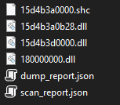

### Sussing them out

I looked through the DLLs and 1 of them caught my attention

This is the DLL with an exported function called "Start"  
Let's name this dll **interesting.dll**

It has a bunch of code with similar patterns where there is a bunch of numbers xored against a key

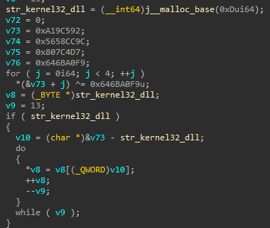

These code blobs are basically decoding strings  
I wrote a simple [python script](xx_decodestrings.py) to help with decoding these strings

```py
import struct

def decode_str(data, key):
    output = b""
    for x in data:
        output += struct.pack("<I", x ^ key)
    return output
  
def main():
    data = []
    #data.append([key, data...])
    data.append([0x1EC648, 0x5F2CB53F, 0x6430F47B, 0x1EAA24]) 
    ....
    
for cur in data:
    print(decode_str(cur[1:], cur[0]).decode().strip())
    
if __name__ == "__main__":
    main()
```

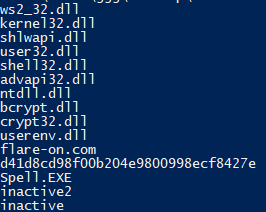

Some of these strings was interesting, especially the one "flare-on.com"  
The hash is actually the MD5 hash of an empty string

I also discovered that this DLL uses a popular malware technique of using function finders to call system functions instead of importing them

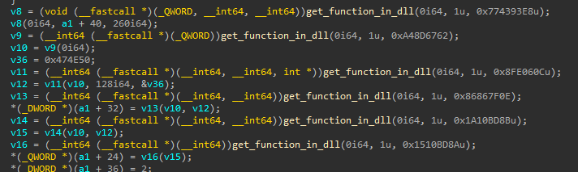

The most straight forward way to figure out what these functions are is to use a debugger to step through them and log them down

The question now is how do I get a breakpoint inside this DLL?  
The method I used was to put breakpoints at common API functions and hope that this DLL will call the function

In the end, the easiest way I found was to put a breakpoint at the call to **VirtualAlloc**

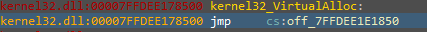

Keep continuing until the first non 0x1800... return address is on the stack

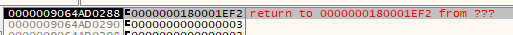

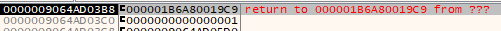

Returning from that call will bring the debugger into **interesting.dll**

I could then start to step through the code and figure out what it is doing

### I see what you're doing

Apparently, one of the first thing that the DLL does in the **Start** exported function is to VirtualAlloc a buffer  
This is where our previous steps brought us to

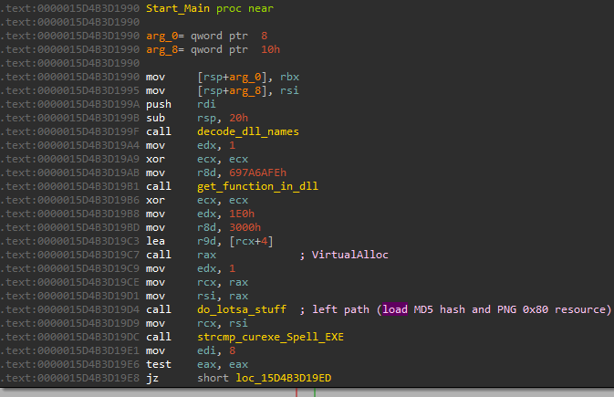

It then loads the MD5 hash string and corrupted PNG resource into memory


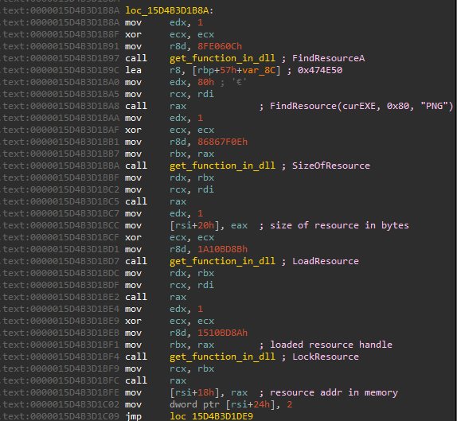

It thens checks that the current exe name is "Spell.EXE"  
It will eventually call ExitProcess if the name does not match

Let's rename the binary to "Spell.EXE" and continue the debugging

It thens calls SleepEx to sleep for 6 minutes  
Of course, we can bypass this by changing the sleep time argument in the debugger

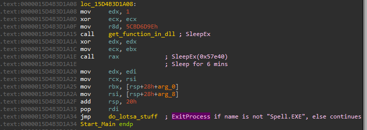

Now, we're back in the **do_lotsa_stuff** function but it will go into a different branch this time

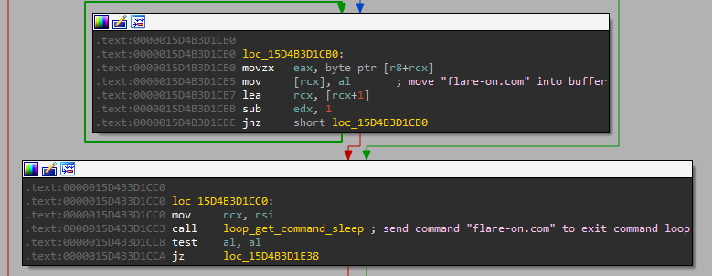

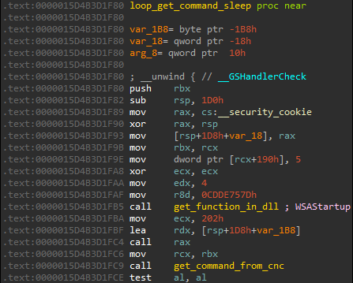

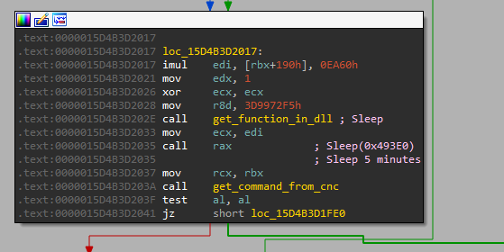

It will basically connect to a "C2" server and asks for a command  
After processing the command, it will then sleep for 5 minutes before asking for the next command again

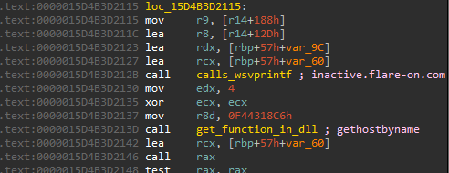


The CNC server is hardcoded to be either "inactive.flare-on.com" or "inactive2.flare-on.com"  
It will connect to port 888

I added those domains to my hosts file and wrote a simple [python script](server.py) to act as the server

The DLL supports 3 commands
- "exe"
- "run"
- "flare-on.com"

The first 2 commands "exe" and "run" does essentially the same thing  
After the command string, it expects another 0x200 bytes of data which would be interpreted as shellcode and executed

The third command "flare-on.com" is the interesting one  
Upon receiving this command, it will exit the waiting for cnc command loop and into the following

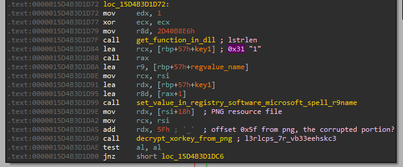

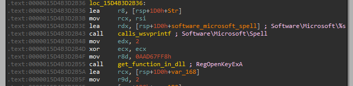

It first saves some kind of binary data into the Registry at **HKCU\Software\Microsoft\Spell** with the name of "1"

It then extracts the corrupted portion of the PNG, runs AES-CBC decrypt on it with the MD5 hash as the key  
This will return the string **"l3rlcps_7r_vb33eehskc3"**

After which, it goes into a big switch case

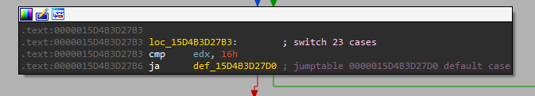

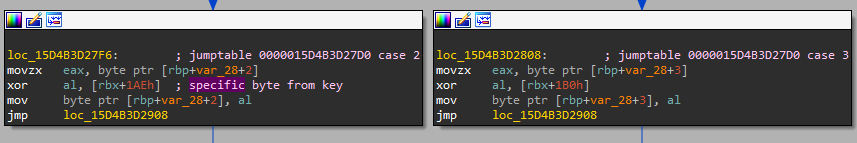

The switch case will basically xor decrypt some data using the key **"l3rlcps_7r_vb33eehskc3"** in a specific order (Remember this order!)

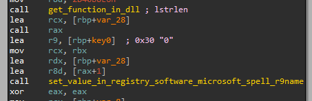

The result is then saved into the same registry key as before with the name "1"

Let's look at the registry key

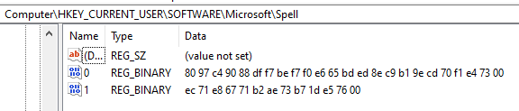 

Hmm, there is still no flag  
I was stuck here for awhile until eventually I guessed that the key is actually the sequence of bytes used as the key in the big switch case

I wrote a simple [python script](yy_flag.py) to eventually print the flag out

```py
xorkey = {}
keystring = "l3rlcps_7r_vb33eehskc3"
start_num = 0x1a8
for i in range(len(keystring)):
    xorkey[start_num + i] = keystring[i]
    
order = [0x1b4, 0x1b5, 0x1ae, 0x1b0, 0x1af, 0x1ae, 0x1ad, 0x1a9, 0x1a8, 0x1ab, 0x1ac, 0x1b9, 0x1b7, 0x1bc, 0x1bb, 0x1bd, 0x1aa, 0x1b2, 0x1b8, 0x1b3, 0x1b6, 0x1aa]


flag = ""
for x in order:
    flag += xorkey[x]
    
print(flag + "@flare-on.com")
```

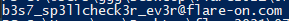

The flag is **b3s7_sp3llcheck3r_ev3r@flare-on.com**
