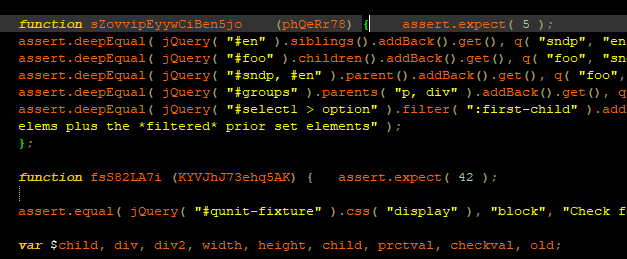
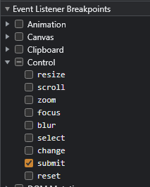
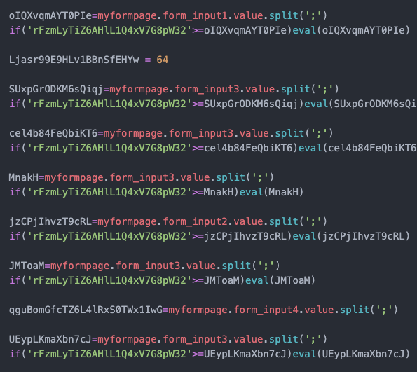
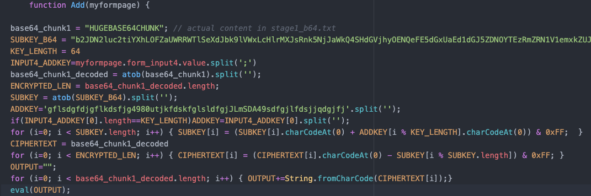
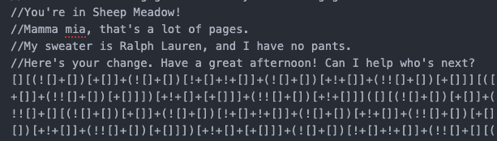
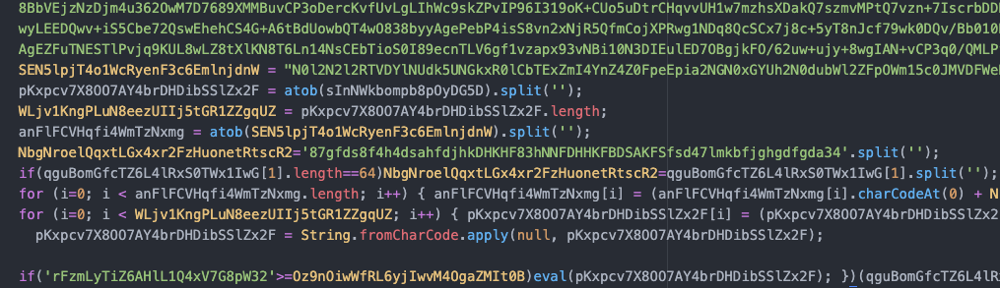
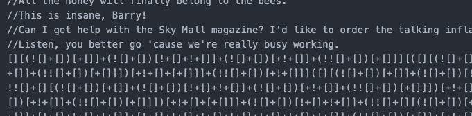

## Flare-On CTF 2021
# Challenge 08 : beelogin

```
You're nearly done champ, just a few more to go. 
we put all the hard ones at the beginning of the challenge this year so its smooth sailing from this point. 
Call your friends, tell 'em you won. 
They probably don't care. 
Flare-On is your only friend now.

7zip password: flare
```

We are provided a 7zip file with a HTML page full of Javascript


### Cutting through the Javascript

There are 5 input fields, a submit button and a whole load of Javascript (about 3MB worth)

However, if you look closer, most of these code are contained within functions and these functions are never called



Most of these code are just gibberish and are never executed  
One way to extract the Javascript that are executed is to use the Chrome Debugger  
Start Chrome, go into developer mode, sources tab, check the break on submit option



When you click the "Submit" button, the debugger should break and you can step through the code  
I copied out all the code that was executed [into this file](beelogin_trimmed.txt)



In fact, the split/eval pairs of code also does nothing, removing them shows a very simple [script](beelogin_trimmed_plain.txt)



The algorithm of the Javascript goes something like this
- A huge encrypted blob is created (From the huge base64 chunk)
- A Encryption key is created (subkey)
- A seed value is created (addkey - 64 bytes long)
- If the input submitted in the 4th input box is 64 bytes long, overwrite the seed with it
- Initialize the encryption key with the seed
  - the loop that adds
- Decrypt the encrypted content with the initialized key
  - the loop that subtracts
- Execute the result as Javascript (via eval)

I converted the decryption into a Python function

```py
import base64
ENCRYPTION_KEY = base64.b64decode(b"b2JDN2luc2tiYXhLOFZaUWRRWTlSeXdJbk9lVWxLcHlrMXJsRnk5NjJaWkQ4SHdGVjhyOENQeFE5dGxUaEd1dGJ5ZDNOYTEzRmZRN1V1emxkZUJQNTN0Umt6WkxjbDdEaU1KVWF1M29LWURzOGxUWFR2YjJqQW1HUmNEU2RRcXdFSERzM0d3emhOaGVIYlE3dm9aeVJTMHdLY2Vhb3YyVGQ4UnQ2SXUwdm1ZbGlVYjA4YVRES2xESnlXU3NtZENMN0J4MnBYdlZET3RUSmlhY2V6Y3B6eUM2Mm4yOWs=")
# Encryption key is 221 bytes long
def decrypt(ciphertext, seed):
    global ENCRYPTION_KEY    
    
    # Initialize the key with the seed
    # seed must be 64 bytes long
    enc_key = bytearray()
    for i in range(len(ENCRYPTION_KEY)):
    #for i in range(len(addkey)):
        tmp = (ENCRYPTION_KEY[i] + seed[i % 64]) & 0xff
        enc_key.append(tmp)
        
    # Decrypt the data
    enc_key = bytes(enc_key)
    decrypted = bytearray()
    for i in range(len(ciphertext)):
        tmp = (ciphertext[i] - enc_key[i % len(enc_key)]) & 0xff
        
        decrypted.append(tmp)
    return decrypted
```

I tried decrypting with the default given seed but the result was gibberish  
I was stuck at this point for awhile as it seems the only way to go forward is to brute force the 64 byte long seed (this would take forever)

### Cryptanalysis

I started to look closer at the decryption code  
First of all, the encryption key is 221 bytes long  
I realized that each byte of the seed only affects a fixed set of bytes in the ciphertext  

For example
- byte 0 of the seed will affect bytes 0, 64, 128, 196 of the encryption key,
  - which would then affect the ciphertexts decrypted by those bytes

  
|Seed|Encryption Key|Ciphertext|
|----|----|----|
|0|0|0, 221, 442, ...|
||64|64, 285, 506, ...|
||128|128, 349, 570, ...|
||196|196, 417, 638, ...|

Instead of brute forcing a 64 byte seed of 1 ciphertext  
I can brute force a 1 byte seed for 221 ciphertexts

First, I [separated the ciphertext]() into 221 byte chunks and saved all the bytes that would be decrypted by each byte of the encryption key into a file  
This way, I would have 221 ciphertext files

```py
#!/bin/python3
#01_extractparts.py

import base64
import itertools

# stage1
ENCRYPTION_KEY = base64.b64decode(b"b2JDN2luc2tiYXhLOFZaUWRRWTlSeXdJbk9lVWxLcHlrMXJsRnk5NjJaWkQ4SHdGVjhyOENQeFE5dGxUaEd1dGJ5ZDNOYTEzRmZRN1V1emxkZUJQNTN0Umt6WkxjbDdEaU1KVWF1M29LWURzOGxUWFR2YjJqQW1HUmNEU2RRcXdFSERzM0d3emhOaGVIYlE3dm9aeVJTMHdLY2Vhb3YyVGQ4UnQ2SXUwdm1ZbGlVYjA4YVRES2xESnlXU3NtZENMN0J4MnBYdlZET3RUSmlhY2V6Y3B6eUM2Mm4yOWs=")

def main():
    global ENCRYPTION_KEY

    with open("stage1_b64.txt", "rb") as f:
        tmpdata = f.read()
    ciphertext = base64.b64decode(tmpdata)
    

    # ENCRYPTION_KEY is 221 bytes long
    # split ciphertext into 221 byte chunks
    n = len(ENCRYPTION_KEY)
    ct = [ciphertext[i:i+n] for i in range(0, len(ciphertext), n)]
    # remove last chunk as its not 221 bytes long (easier for later analysis)
    ct = ct[:-1]

    for i in range(n):
        data = bytearray()
        for part in ct:
            data.append(part[i])

        with open("parts1/%d.bin" % i, "wb") as f:
            f.write(bytes(data))    
    
if __name__ == "__main__":
    main()

```


Next, I performed [analysis](02_analyze.py) using the following assumptions

- The seed is probably typable ascii
- The output must be valid Javascript (as it is passed to a eval call)
  - ASCII with a few control characters
    - I allowed 0xa (\n), 0xd (\r) and 0x9 (\t)

I will brute-force each byte of the seed and keep the valid bytes of each position  
To be a valid seed byte, the resulting decryption of all ciphertext related to the seed position must be valid Javascript (See above)

```py
#!/bin/python3

import base64
import itertools

# stage1
ENCRYPTION_KEY = base64.b64decode(b"b2JDN2luc2tiYXhLOFZaUWRRWTlSeXdJbk9lVWxLcHlrMXJsRnk5NjJaWkQ4SHdGVjhyOENQeFE5dGxUaEd1dGJ5ZDNOYTEzRmZRN1V1emxkZUJQNTN0Umt6WkxjbDdEaU1KVWF1M29LWURzOGxUWFR2YjJqQW1HUmNEU2RRcXdFSERzM0d3emhOaGVIYlE3dm9aeVJTMHdLY2Vhb3YyVGQ4UnQ2SXUwdm1ZbGlVYjA4YVRES2xESnlXU3NtZENMN0J4MnBYdlZET3RUSmlhY2V6Y3B6eUM2Mm4yOWs=")
     
def seed_encryption_key(keyb, seedb):
    return (keyb + seedb) & 0xff

def decrypt_byte(cipherb, keyb):
    return (cipherb - keyb) & 0xff

def is_valid_output(num):
    if num > 127:
        return False

    if num < 0x20:
        if num != 0xa and num != 0xd and num != 0x9:
            return False

    return True

def match_1_position(pos, seedb):
    global ENCRYPTION_KEY

    keyb = seed_encryption_key(ENCRYPTION_KEY[pos], seedb)

    fname = "parts1/%d.bin" % pos
    with open(fname, "rb") as f:
        ciphered = f.read()

    allascii = True
    for c in ciphered:
        tmp = decrypt_byte(c, keyb)
        if is_valid_output(tmp) == False:
            return False
    return True

def main():
    influence = [0] * 64
    for i in range(len(influence)):
        influence[i] = [x for x in range(len(ENCRYPTION_KEY)) if x%64 == i]

    possible = [0] * 64
    for i in range(len(influence)):
        inf = influence[i]

        possible_keys = []

        # Generate the valid seed values for this position with the first ciphertext file
        for t in range(0x30, 0x80):
            if t >= 0x3a and t <0x41:
                continue
            elif t >= 0x5b and t<0x61:
                continue
            elif t >= 0x7b and t<0x80:
                continue
            if match_1_position(inf[0], t):
                possible_keys.append(chr(t))

        #print(possible_keys)
        # Further refine the valid seed values with the subsequenet ciphertext files
        for x in range(1, len(inf)):
            new_possible_keys = []
            for t in possible_keys:
                if match_1_position(inf[x], ord(t)):
                    new_possible_keys.append(t)
            possible_keys = new_possible_keys
            #print(possible_keys)

        possible[i] = possible_keys
    
    # Generate a "valid" key by choosing 1 byte for each seed position
    firstchoice = ""
    for i in range(len(possible)):
        print("%d: %s" % (i, possible[i]))
        firstchoice += possible[i][0]
        #firstchoice += possible[i][len(possible[i])-1]

    print(firstchoice)

    
if __name__ == "__main__":
    main()
```

Running it will give the valid bytes for each seed position

```
0: ['C']
1: ['b', 'c', 'd', 'e', 'f', 'g', 'h']
2: ['V']
3: ['C']
4: ['S', 'V']
5: ['Y']
6: ['w', 'z']
7: ['I']
8: ['1']
9: ['a', 'd']
10: ['U']
11: ['9']
12: ['c']
13: ['V']
14: ['g']
15: ['1']
16: ['u']
17: ['k']
18: ['B']
19: ['n', 'q']
20: ['O']
21: ['2']
22: ['u']
23: ['4']
24: ['R', 'U']
25: ['G']
26: ['r']
27: ['6', '9']
28: ['a']
29: ['V']
30: ['C']
31: ['N']
32: ['W']
33: ['E', 'H']
34: ['j', 'k', 'l', 'm', 'n', 'o', 'p']
35: ['G', 'H', 'I', 'J', 'K', 'L', 'M']
36: ['U']
37: ['u']
38: ['V', 'Y']
39: ['D']
40: ['L']
41: ['m']
42: ['A', 'D']
43: ['O']
44: ['2']
45: ['0', '1', '2']
46: ['c']
47: ['d']
48: ['e', 'h']
49: ['X']
50: ['q']
51: ['3']
52: ['o']
53: ['q']
54: ['p']
55: ['5', '8']
56: ['j']
57: ['m']
58: ['K']
59: ['B']
60: ['B', 'C', 'D', 'E', 'F', 'G', 'H']
61: ['O', 'P', 'Q', 'R', 'S', 'T', 'U']
62: ['Q', 'R', 'S', 'T', 'U', 'V', 'W']
63: ['I']
CbVCSYwI1aU9cVg1ukBnO2u4RGr6aVCNWEjGUuVDLmAO20cdeXq3oqp5jmKBBOQI
```

I picked the first valid character of each position to form a temporary key  
I then tried to use this key to decrypt the encrypted content using the [following script](03_decrypt.py)

```py
#!/bin/python3

import base64
import itertools

# part1
ENCRYPTION_KEY = base64.b64decode(b"b2JDN2luc2tiYXhLOFZaUWRRWTlSeXdJbk9lVWxLcHlrMXJsRnk5NjJaWkQ4SHdGVjhyOENQeFE5dGxUaEd1dGJ5ZDNOYTEzRmZRN1V1emxkZUJQNTN0Umt6WkxjbDdEaU1KVWF1M29LWURzOGxUWFR2YjJqQW1HUmNEU2RRcXdFSERzM0d3emhOaGVIYlE3dm9aeVJTMHdLY2Vhb3YyVGQ4UnQ2SXUwdm1ZbGlVYjA4YVRES2xESnlXU3NtZENMN0J4MnBYdlZET3RUSmlhY2V6Y3B6eUM2Mm4yOWs=")

def decrypt(ciphertext, seed):
    global ENCRYPTION_KEY    
    
    # Initialize the key with the seed
    # seed must be 64 bytes long
    enc_key = bytearray()
    for i in range(len(ENCRYPTION_KEY)):
    #for i in range(len(addkey)):
        tmp = (ENCRYPTION_KEY[i] + seed[i % 64]) & 0xff
        enc_key.append(tmp)
        
    # Decrypt the data
    enc_key = bytes(enc_key)
    decrypted = bytearray()
    for i in range(len(ciphertext)):
        tmp = (ciphertext[i] - enc_key[i % len(enc_key)]) & 0xff
        decrypted.append(tmp)
    return decrypted

def main():
    
    with open("stage1_b64.txt", "rb") as f:
        tmpdata = f.read()
    ciphertext = base64.b64decode(tmpdata)

    # stage1
    keyb = b"CbVCSYwI1aU9cVg1ukBnO2u4RGr6aVCNWEjGUuVDLmAO20cdeXq3oqp5jmKBBOQI"
    print("Trying %s" % keyb)
    result = decrypt(ciphertext, keyb)
    print(result[:256])

    with open("decrypted.txt", "wb") as f:
        f.write(result)
    
if __name__ == "__main__":
    main()
```

I can see some text in the decrypted content

```
Trying b'CbVCSYwI1aU9cVg1ukBnO2u4RGr6aVCNWEjGUuVDLmAO20cdeXq3oqp5jmKBBOQI'
bytearray(b'/5Yev,#buw who can geny whe#heart#znat#is |eatniqg?\r\n//Dffirsgzivk!\r\r/2Uh0oh!\r\n//Thls.\r\n2/Aw leasw&\x7fou*re rut"in#the would. _u{ m{st#mhet#girls.\r\n/2Why ls |ogurt#toghw so#dihfifult?!\r\r//I lkkl yo iavt dnd free!\r\r//Gord ldeg! \\ox cdn really vee wky ke\'s crt')
```

At certain positions, there were several valid bytes  
At this point, its about tweaking the key by switching these valid bytes until the decrypted content makes sense

The background image is actually a hint to what these texts are  
It is actually part of the script of the Bee Movie, specifically this line

> Yes, but who can deny the heart that is yearning?

Eventually, by tweaking the seed with the valid bytes, I arrived at the final correct seed value of **ChVCVYzI1dU9cVg1ukBqO2u4UGr9aVCNWHpMUuYDLmDO22cdhXq3oqp8jmKBHUWI**

```
Trying b'ChVCVYzI1dU9cVg1ukBqO2u4UGr9aVCNWHpMUuYDLmDO22cdhXq3oqp8jmKBHUWI'
bytearray(b"//Yes, but who can deny the heart that is yearning?\r\n//Affirmative!\r\n//Uh-oh!\r\n//This.\r\n//At least you\'re out in the world. You must meet girls.\r\n//Why is yogurt night so difficult?!\r\n//I feel so fast and free!\r\n//Good idea! You can really see why he\'s con")
```

This will produce the correct [decrypted file](03_decrypted.txt)

Somewhere down the file, I see something very familiar



This should look familiar if you have played enough CTFs, this is [JSFuck](http://www.jsfuck.com/) encoding

I used an online [JSFuck decoder](https://enkhee-osiris.github.io/Decoder-JSFuck/) to decode this blob into [readable Javascript](03_jsfuck.js)



### Here we go again

Looks like the exact same decryption routine again with a different encryption key (226 bytes long this time) and ciphertext

I used back the same code and performed the exact same analysis again
- [Break the ciphertext into 226 parts](04_extractparts.py)
- [Analyze and extract valid seed bytes](05_analyze.py)
- [Tweak the seed bytes and find the correct seed](06_decrypt.py)

The correct seed for stage2 is **UQ8yjqwAkoVGm7VDdhLoDk0Q75eKKhTfXXke36UFdtKAi0etRZ3DoHPz7NxJPgHl**

```
Trying b'UQ8yjqwAkoVGm7VDdhLoDk0Q75eKKhTfXXke36UFdtKAi0etRZ3DoHPz7NxJPgHl'
bytearray(b"//He\'s not bothering anybody.\r\n//Why would you question anything? We\'re bees.\r\n//But you\'ve never been a police officer, have you?\r\n//Up on a float, surrounded by flowers, crowds cheering.\r\n//According to all known laws of aviation, there is no way a bee s")
```

Same thing, there is a JSFuck blob somewhere down the file



Decoding this blob will give us the flag

> alert("I_h4d_v1rtU411y_n0_r3h34rs4l_f0r_th4t@flare-on.com")

The flag is **I_h4d_v1rtU411y_n0_r3h34rs4l_f0r_th4t@flare-on.com**
