## Flare-On CTF 2021
# Challenge 09 : evil

```
Mandiant's unofficial motto is "find evil and solve crime". 
Well here is evil but forget crime, solve challenge. 
Listen kid, RFCs are for fools, but for you we'll make an exception :)

The challenge has 3 false flags: 

!t_$uRe_W0u1d_B3_n1ce_huh!@flare-on.com 
1s_tHi$_mY_f1aG@flare-on.com 
N3ver_G0nNa_g1ve_y0u_Up@flare-on.com

7zip password: flare
```

We are provided a 7zip file with a evil executable

Running the binary doesnt really show much  
However, running it in a debugger will show that it hits a deliberate exception

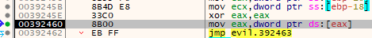

As the challenge introduction said, this challenge is about exceptions

### The Evil Exception Handler

I placed breakpoints all around the SEH handlers but none of them got hit  
After doing some research on exceptions, I realized that there are many ways for a C++ application to define exception handlers

Finally I came across [Vectored Exceptions](https://docs.microsoft.com/en-us/windows/win32/debug/vectored-exception-handling)  
You can define a Vectored Exception handler using the [AddVectoredExceptionHandler](https://docs.microsoft.com/en-us/windows/win32/debug/using-a-vectored-exception-handler)  
This function is imported in our binary and placing a breakpoint there allowed me to locate the exception handler (at 0x6AD0)

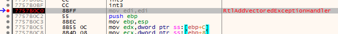

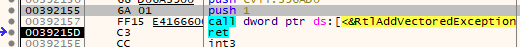

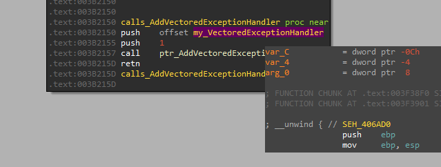

This exception handler does a very neat evil trick

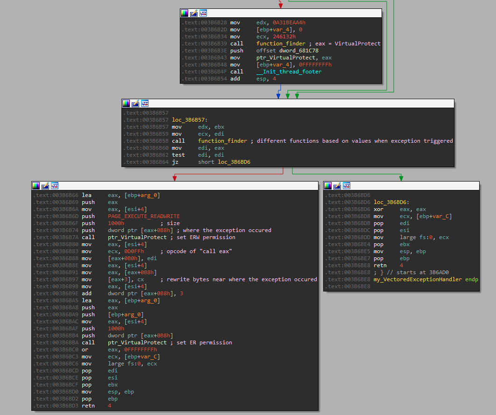

- Finds the function VirtualProtect
- Finds another function that is specified by values in ecx and edx when the exception was triggered
- Let's call the memory location where the exception was triggered "exception location" 
  - Calls VirtualProtect to give "ERW" permission to exception location
  - Overwrites [exception location + 3] with 0xD0FF, which is the opcode of "call eax"
  - Calls VirtualProtect to restore original permission to exception location
  - Set the exception as "handled" and continue execution from [exception location + 3]
    - At that point, the found function is in eax

Essentially, this exception handler is a function finder and it will overwrite code to call the found function  
This is why the initial disassembly of this binary is so messed up

I placed breakpoints inside this function and they are triggered everytime an exception occurs  
This will allow me to figure out what function the exception is actually calling

### Bypassing AntiDebug and AntiVM

From this point on, its a tedious and time consuming process of debugging the binary and fixing the disassembly with the overwritten code so that it makes sense  
I will not go through all the steps here as it was truly a tedious and exhausting process

The first thing that the main function calls is a function that contains a bunch of AntiDebugger and AntiVM checks

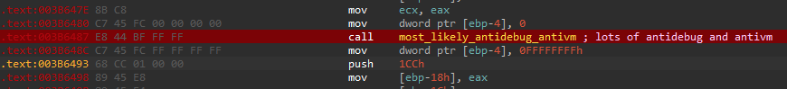 

It is important to bypass all of these checks to enable further analysis  
I also later realized I cannot just nop out these function calls as these checks will be repeated further in the binary  
I mainly used HXD to open the binary to find and patch the opcode bytes

- Overwrite "DbgBreakPoint" function code to remove the int3 instruction
  - Bypass by patching the overwrite with "CC" instead of "C3" which would retain the original code of the function

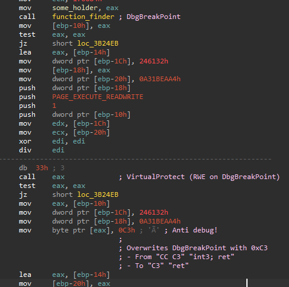

- Overwrite "DbgUiRemoteBreakIn" to call "TerminateProcess" instead
  - Bypass by nopping out the mov instructions that does the actual overwrite of the function

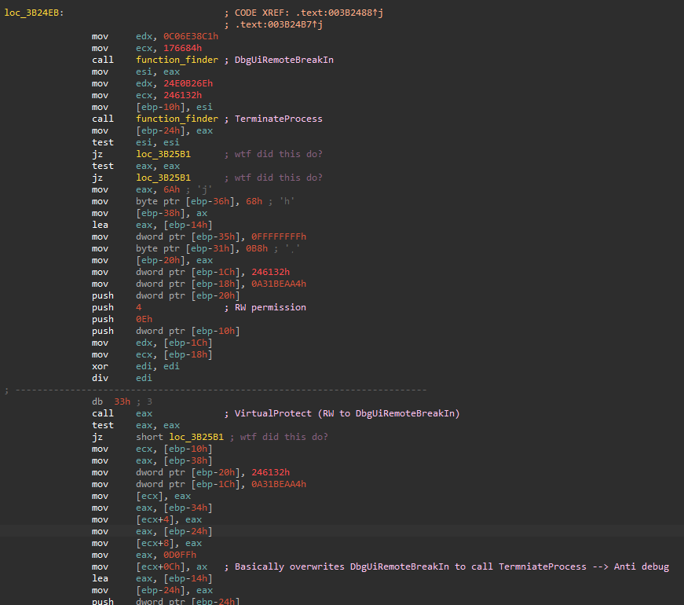

- Checks for VMWare using the VMWare debug IO port and what I believe to be this [ZwSetLtdEntries method](https://eeyeresearch.typepad.com/blog/2006/09/another_vmware_.html)
  - Bypass by patching the "in eax, dx" to "xor eax, eax"
  - The "ZwSetLtdEntries" does not seem to work on my environment (got a STATUS_NOT_IMPLEMENTED error), thus no need to bypasss

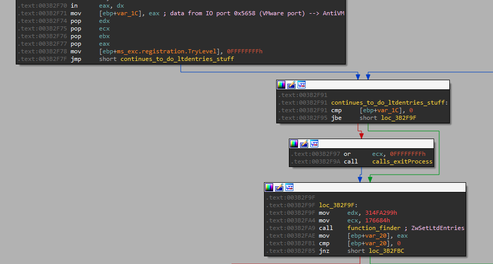

- Checks for VirtualBox using WMI's Win32_PnPEntity
  - I was not using VirtualBox, thus no need to bypass

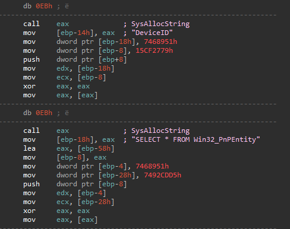

It then creates a "function list" of 6 antidebug functions using
- PEB debugged flag
- CheckRemoteDebuggerPresent API
- NTGlobalFlags
- ThreadLocalStorage
- GetThreadContext (this detects hardware breakpoints)
- GetTickCount (checks for timedelay)  

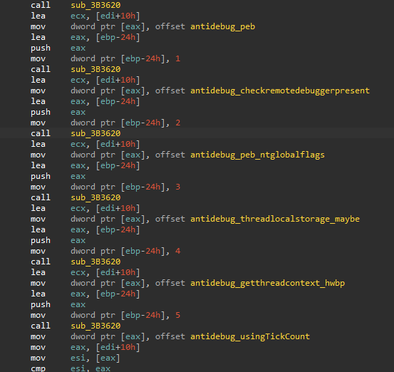

It is important to bypass all 6 as they will be repeatedly called during the rest of the execution  
They can all be bypassed in a similar way by changing the condition jump to a definite jump  
Make them take the "return" path rather than the "ExitProcess" path

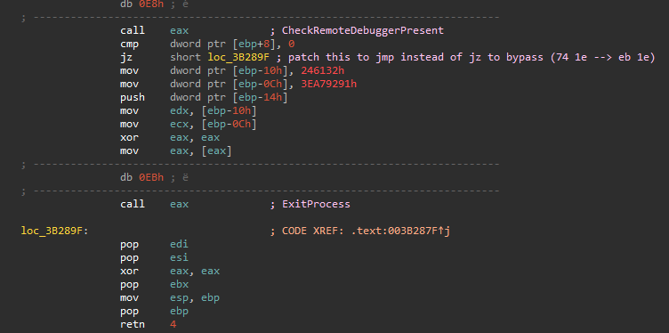

Once all these checks have been bypassed, we can finally get to the actual code

### Multiple Threads (1 & 2)

After the checks are completed, the program will create 2 threads

Thread 1 will indefinitely call functions in the earlier created antidebug function list on a time delay (using Sleep)

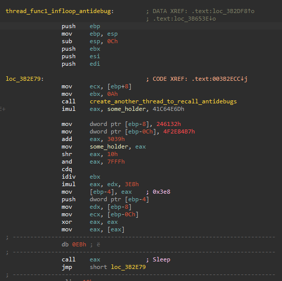

Thread 2 waits for a signal from an object and then creates Thread1 and Thread2 again  
I believe Thread 2 is a watcher thread to recreate Thread 1 and Thread 2 again if they are killed  

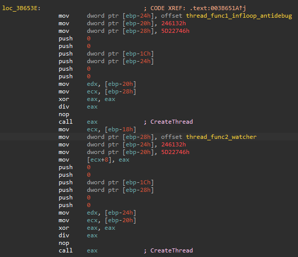

Take care when debugging threads as they will not be executed immediately  
The CPU has to wait for a chance to context switch  
The CPU decides when this happen and I have little control over it  
From my experience, it normally does it during a "call" instruction or when an exception occurs

This also means that debugging from this point on can be extremely disorienting if you have lots of breakpoints as you will be jumping between threads  
My advice is to only enable breakpoints that you are investigating currently and delete/disable old breakpoints that you do not need anymore

### Setting up network with sockets

It then checks if argc is 2, meaning the binary is expecting a parameter  
The next function will use this parameter as a IP to create a Prosmiscuous socket in the following way

```c
inet_addr(argv[1]);
sock = socket(AF_INET, SOCK_RAW, IPPROTO_UDP);
bind(sock, port=0);   // binds to port 0 (random port) which is normal for UDP
WSAIOCTL(SIO_RCVALL); // Receive all packets (i.e Enable Prosmiscuous mode)
setsockopt(SOL_SOCKET, SO_RCVTIMEO, 10000) // Timeout
setsockopt(IPPROTO_IP, IP_HDRINCL, true) // Inlcude IP Header (this is important)
```

It also creates a second socket that I assume is for sending packets  
Another thing to note is that it wants to create a RAW socket which only an Administrator can create, therefore I need to run this binary as an Administrator

### Even More Threads (3 & 4)

It then creates another 2 threads

Thread 3 is responsible for receiving UDP packets and checks for the following
- Destination port in UDP header == 0x1104
- Reserved bit in IP Flags is True
  - This bit is by standard always 0, I have to use scapy to forcefully change this

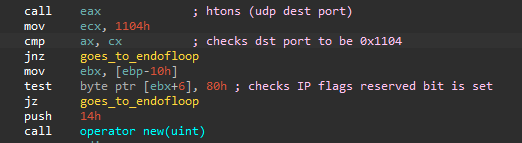

If the checks are passed, the UDP packet is saved somewhere in memory for Thread 4 to process

Thread 4 is responsible for processing the UDP data that passed the initial checks

### Getting to the Flag

Thread 4 expects the data to be in this format

|4 Bytes|4 Bytes|n Bytes|
|----|----|----|
|Command|Length of Payload (n)|Payload|

I used scapy to craft these UDP packets for testing  
Scapy seems to have trouble working with the loopback interface  
I suggest using your actual internal IP for scapy and the evil binary

```py
from scapy.all import *
import struct

def evil(cmd, msg):
	win_ip = "10.4.4.2" # my windows box ip
	win_port = 0x1104
	msglen = len(msg)

	payl = struct.pack("<I", cmd) 
	payl += struct.pack("<I", msglen)
	payl += msg

	pkt1 = IP(dst=win_ip, flags=4)/UDP(dport=win_port)/Raw(load=payl)
	#pkt1.show()
	print("Sending")
	send(pkt1)

```

It accepts a total of 4 commands

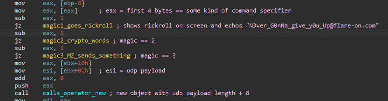

|Command||
|----|----|
|1|Rick Roll|
|2|Check payload for words and sets up crypto|
|3|Decrypt something and send back|
|> 3|Echo response (Not important)|

**Command 1** just decyrpts and shows a rickroll image. Does not do anything important


**Command 2** checks if the UDP data is one of these 4 words
- "L0ve"
- "s3cret"
- "5Ex"
- "g0d"

If so, it then initialize some kind of crypto stuff and stores it in memory

**Command 3** checks if the UDP data starts with "MZ"  

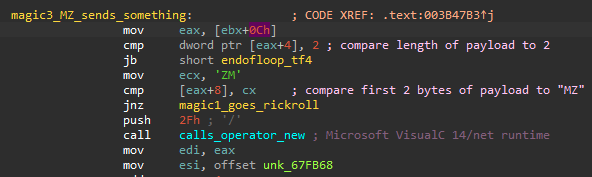

If so, it decrypts a 0x27 bytes buffer and sends it back via UDP

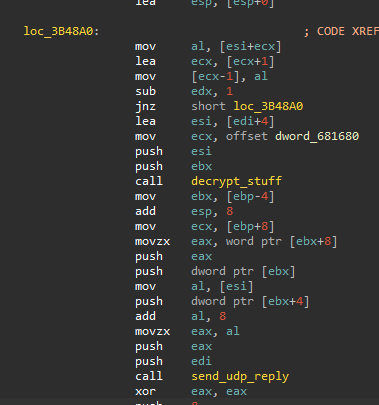

My scapy has problems receiving the UDP response  
I used Wireshark instead to view the response

Here is an example response from Command 3

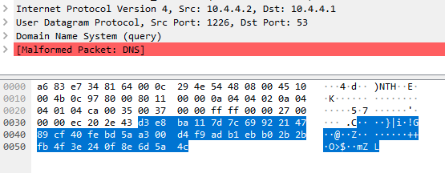

With these information, the [solution](udpp.py) is to send the 4 words with **Command 2** (the order does not matter) then send **Command 3**

```py
from scapy.all import *
import time
import struct

def evil(cmd, msg):
	win_ip = "10.4.4.2" # my windows box ip
	win_port = 0x1104
	msglen = len(msg)

	payl = struct.pack("<I", cmd) 
	payl += struct.pack("<I", msglen)
	payl += msg

	pkt1 = IP(dst=win_ip, flags=4)/UDP(dport=win_port)/Raw(load=payl)
	print("Sending")
	send(pkt1)

def main():
	attempt = [b'g0d\x00', b'L0ve\x00', b's3cret\x00', b'5Ex\x00']
	for x in attempt:
		evil(2, x)
		time.sleep(5)

	evil(3, b"MZ")
	time.sleep(5)

if __name__ == "__main__":
	main()
```

**Command 3** will respond with the flag

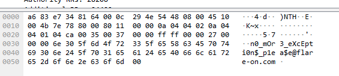

The flag is **n0_mOr3_eXcEpti0n$_p1ea$e@flare-on.com**
