## Flare-On CTF 2021
# Challenge 10 : wizardcult

```
We have one final task for you. 
We captured some traffic of a malicious cyber-space computer hacker interacting with our web server. 
Honestly, I padded my resume a bunch to get this job and don't even know what a pcap file does, 
maybe you can figure out what's going on.

7zip password: flare
```

We are provided a 7zip file with a PCAP network capture 

Looking through it with Wireshark shows a rather straightforward network activity

```
- Seems to be some kind of command injection vulnerability being exploited on the webserver
  - This it not important actually
- The vulnerabiltiy was used to download and execute a ELF binary called **induct**
- There is a whole bunch of IRC communication
- There is also a connection to "ip-api.com"
```

The main challenge is reversing what the **induct** binary is doing  
The binary can be directly exported from Wireshark

Performing strings on the binary reveals a bunch of strings pointing to it being a golang binary

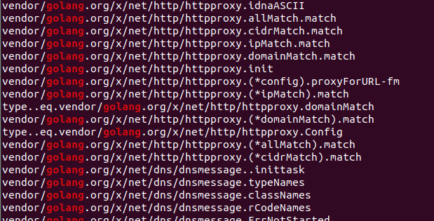

### Tools and Tips for golang analysis

Reversing golang binaries in the past used to be a very painful process   
Fortunately for us, [IDA Pro 7.6](https://hex-rays.com/products/ida/news/7_6/) recently improved their golang support and [IDA's freeware](https://hex-rays.com/ida-free/#download) has also been updated to 7.6

Using this particluar version of IDA made the process much easier, especially with string handling

#### Golang Strings

I would like to highlight how strings are represented in golang binaries  
There are not null terminated and thus IDA sometimes has trouble properly defining them

Golang strings is referenced using a pointer and a length  
Therefore, when a string is being used, there should be a length being loaded nearby as well  
Here is an example, the unknown variable is actually a string but IDA doesnt really know

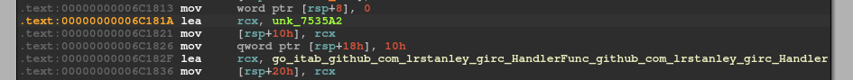

There is a length "0x10" being loaded just after the string pointer  
I can force IDA to recognize this as a string by changing the type of the unknown variable (Click on the name and press Y)  
Give it a char array type with the correct length as shown 

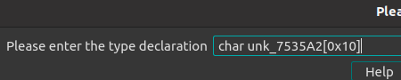

IDA would then be able to recognize it

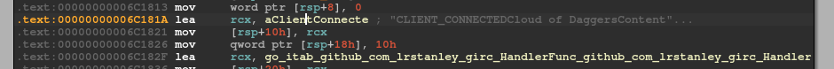

However, sometimes the automated comment is not that accurate  
To fix it, double click the name to go to the memory area, right-click, "Array", and define the length of the array as well

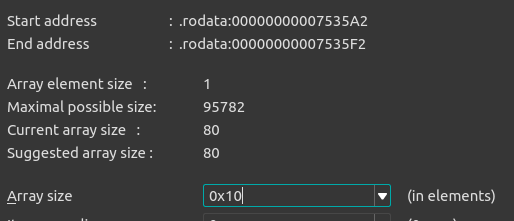

Then, IDA would show it properly

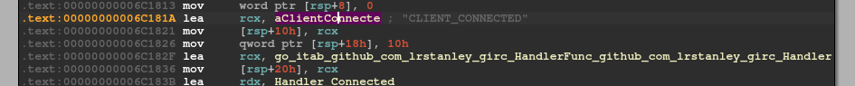

I used this technique multiple times in this binary to fix the string references

#### Golang Function Arguments

Unlike typical x64 calling conventions where function arguments are passed in registers,  
Golang passes function arguments entirely on the stack, similar to how x86 does it

Another very helpful tool was the [GEF](https://github.com/hugsy/gef) plugin for GDB as it's stack trace display was perfect for displaying function arguments

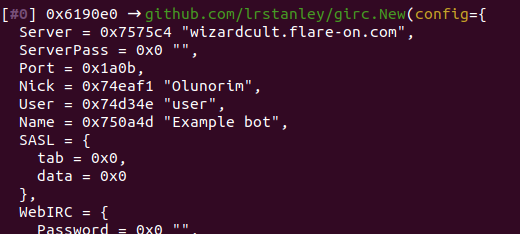


Back to the binary, my analysis method was just to debug the process and figure out what it is doing step by step  
As this was a long and tedious process, I will not be going into too much details of each section

### Main_main

The entry point is in the **main_main** function

It first generates a random name from a Names table

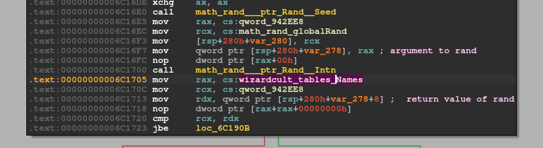

Uses a [IRC client](https://github.com/lrstanley/girc) from github to connect to a IRC server  

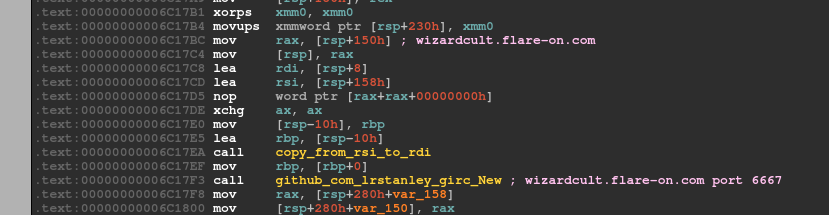

The function arguments could be extracted from the debugger


If you look at the example code from the girc's documentation, it matches quite well with how this binary is connecting as well

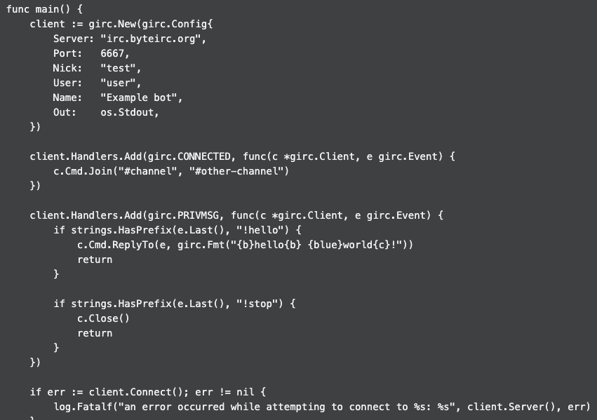

In our case, it also register a handler for the "Connected" and "PRIVMSG" events

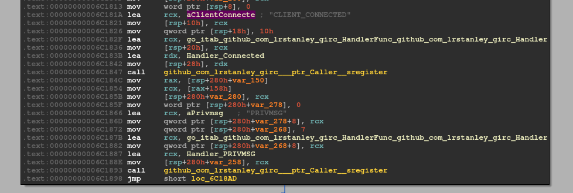

Let's call these 2 functions the **Connected_Handler** and the **Privmsg_Handler**

To further debug the program, I had to setup a IRC server for the binary to connect to

```
Installed inpircd on my Ubuntu VM as the IRC server
  > sudo apt install inspircd
  
Edit /etc/inspircd/inspircd.conf and changed the following settings

  <server name="wizardcult.flare-on.com"
      description="Wizardcult"
      network="Localnet">

  .....
  
  <bind address="127.0.0.1" port="6667" type="clients">
  
  .....
  
Start the server
  > sudo service inpircd start

Add "wizardcult.flare-on.com" to my hosts file pointing to the "127.0.0.1"

I also installed XChat via Ubuntu Software as my IRC client to observe the IRC chats
```

### CONNECTED_HANDLER

This handler is called when a connection to the IRC server is established  
It will first join the channel "#dungeon"

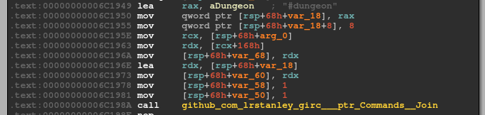

It then builds a data structure that I later called the **Potion Struct**  

|Potion Name|Monster Description|Dungeon Name|Function Pointer|
|-----|-----|-----|-----|
|Potion of Water Breathing|The beast sits in the water, waiting for you to approach it.|The Sunken Crypt|ReadFilePotion (0x6521A0)|
|Potion of Superior Healing|You are wounded.|Burrows of the Brutal Desert|---|
|Potion of Watchful Rest|The beast sings you a lullaby.|Pits of the Savage Mage|---|
|Potion of Acid Resistance|The beast smells quite foul.|Graf's Infernal Disco|CommandPotion (0x651F40)

At the end, it calls the **main_buildInitialBeacon** function which essentially sends the initial beacon back to the "C2" server

#### main_buildInitialBeacon

It first tries to connect to ip-api.com/json/  
This website basically returns you basic information about ur public IP

This is most likely a test for a valid Internet connection  
I initially setup another web server and tried to serve the response from the PCAP file

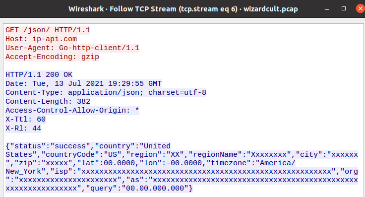

After some frustration, I realized that this response will not work  
Specifically, the "query" parameter must be a valid IP  

This is because, the IP is used to generate a location string like this example from the PCAP

> PRIVMSG #dungeon :Hello, I am Izahl, a 5 level Sorceror. I come from the land of Dewsbury-Hankala-Beckinsdale-Oldham.

Eventually, I allowed Internet access to my VM and this check sucesfully passed  
The initial beacon is the above message

### PRIVMSG_HANDLER

The "Privmsg" event is basically triggered whenever a message is sent/received to/from the channel

It first checks that the channel is "#dungeon"  
It then checks that the sender is using the nickname "dung3onm4st3r13"  
It then processes the command sent by that user

The "dung3onm4st3r13" user is essentially the "C2" server, giving instructions to the infected client  

At this point, I used XChat as my IRC client and connected to the same channel as the user "dung3onm4st3r13"  
This way, I am able to give commands to the binary and see the response in the chatroom  
If the response is too long (and XChat crashes), I used Wireshark to capture the response instead

The commands will be processed by the **wizardcult_comms_ProcessDMMessage** function (0x652320)  
It checks for the command using the **strings_index** function like so

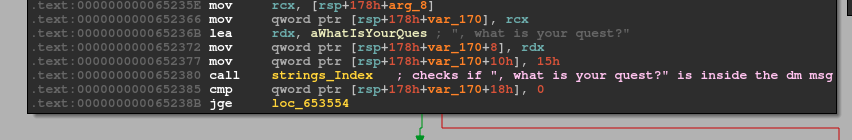

### Commands Flow

I will explain the several commands used in the PCAP file, in the order that it was sent

|what is your quest?|
|----|
|:dung3onm4st3r13!user@127.0.0.1 PRIVMSG #dungeon :Izahl, what is your quest?|
|PRIVMSG #dungeon :My quest is to retrieve the Big Pterodactyl Fossil|

Nothing special here, it will respond with a pre-determined response  
Most likely a "PING" function

|welcome to the party.|
|----|
|:dung3onm4st3r13!user@127.0.0.1 PRIVMSG #dungeon :Izahl, welcome to the party.|

No response is sent  
Most likely, it prepares the client for the next command 

|Potion of Acid Resistance Recipe|
|----|
|:dung3onm4st3r13!user@127.0.0.1 PRIVMSG #dungeon :Izahl, you have learned how to create the Potion of Acid Resistance. To brew it you must combine magnifying glass, kernels of grain, silver spoon, fish tail, undead eyeball, ......|
|PRIVMSG #dungeon :I have now learned to brew the Potion of Acid Resistance|

The potion recipe includes a huge list of ingredients  
I will come back to this later

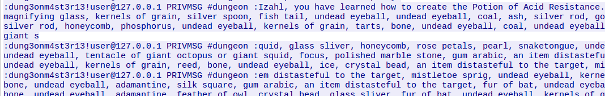

|Entering a dungeon: Graf's Infernal Disco|
|----|
|:dung3onm4st3r13!user@127.0.0.1 PRIVMSG #dungeon :Izahl, you enter the dungeon Graf's Infernal Disco. It is frightening, virtual, danish, flimsy, gruesome great, dark oppressive, bad, average, virtual, last, more strange, inhospitable, slimy, average, and few dismal..|
|PRIVMSG #dungeon :I draw my sword and walk forward into Graf's Infernal Disco carefully, my eyes looking for traps and my ears listening for enemies.|

This essentially gives an argument for the function pointer of this potion (Refer to the potion struct described above)
- CommandPotion (0x651F40)

The list of dungeon descriptions is basically the input

|Fight a monster|
|----|
|:dung3onm4st3r13!user@127.0.0.1 PRIVMSG #dungeon :Izahl, you encounter a Goblin in the distance. It stares at you imposingly. The beast smells quite foul. What do you do?|
|PRIVMSG #dungeon :I quaff my potion and attack!|
|PRIVMSG #dungeon :I cast Moonbeam on the Goblin for 205d205 damage!|
|....|
|PRIVMSG #dungeon :I do believe I have slain the Goblin|

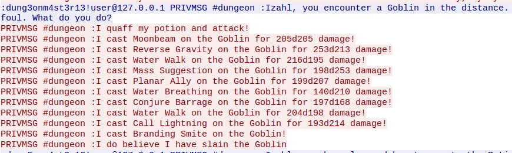

This command essentially tells the client to execute the function pointer  
The response is sent back as a sequence of spell attackts

This sequence is repeated 1 more time for the Potion of Water Breathing

|Potion of Water Breathing Recipe|
|----|
|:dung3onm4st3r13!user@127.0.0.1 PRIVMSG #dungeon :Izahl, you have learned how to create the Potion of Water Breathing. To brew it you must combine magnifying glass, kernels of grain, silver spoon, .... |
|PRIVMSG #dungeon :I have now learned to brew the Potion of Water Breathing|

|Entering a dungeon: Sunken Crypt|
|----|
|:dung3onm4st3r13!user@127.0.0.1 PRIVMSG #dungeon :Izahl, you enter the dungeon The Sunken Crypt. It is flimsy, gruesome great, dark oppressive, bad, average, virtual, last, more strange, inhospitable, slimy, average, few dismal, flimsy, dark and gruesome, inhospitable, inhospitable, frightening, last, slimy, nicest, solid, dark oppressive, few dismal, deep subterranean, last, gruesome great, average, gruesome great, average, cruel, damned, common, and bad..|
|PRIVMSG #dungeon :I draw my sword and walk forward into The Sunken Crypt carefully, my eyes looking for traps and my ears listening for enemies.|

|Fight a monster|
|----|
|:dung3onm4st3r13!user@127.0.0.1 PRIVMSG #dungeon :Izahl, you encounter a Wyvern in the distance. It stares at you imposingly. The beast sits in the water, waiting for you to approach it. What do you do?|
|PRIVMSG #dungeon :I quaff my potion and attack!|
|PRIVMSG #dungeon :I cast Stinking Cloud on the Wyvern for 116d157 damage!|
|.....|
|PRIVMSG #dungeon :I do believe I have slain the Wyvern|

### Breaking it all down

First, let's take a look at the huge list of potion ingredients

#### Potion Ingredients

It is processed inside the **wizardcult_comms_ProcessDMMessage** function around the address 0x653166

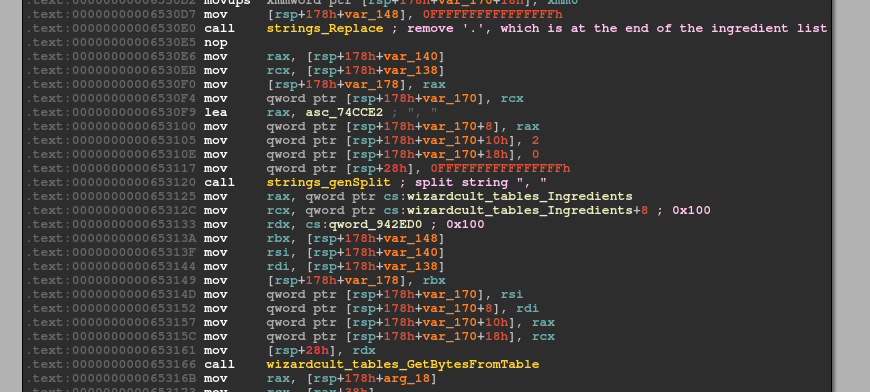 

The huge string is converted into bytes according to a "ingredients" table which is a table of strings

To see this table more easily, I created the following "golang_string" struct in IDA Pro

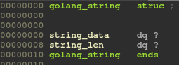

I then defined the table as an array of golang_string with a size of 0x100 entries

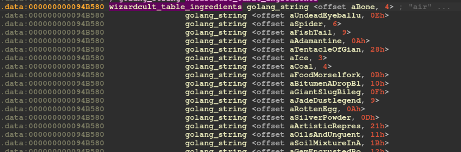

Of course, IDA was not able to decode the strings so nicely, I had to do it manually via the technique I described previously

The translated bytes are then passed into the **wizardcult_vm_LoadProgram** function

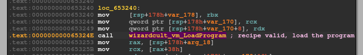

Eventually, the bytes will be decoded as **gob** format

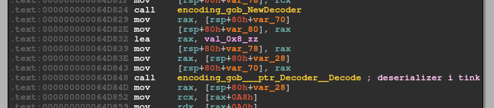

**gob** is essentially a binary serialization format used in golang  
There is actually a [python module](https://github.com/mgeisler/pygob) that can decode this format  

I extracted the entire ingredients table and then wrote a [python script](01_potions.py) that would decode the ingredients

```py
INGREDIENTS = {}
INGREDIENTS["bone"] = 0
INGREDIENTS["undead eyeball"] = 1
....

import pygob

def decode_potion(potion_formula):
	global INGREDIENTS
	parts = potion_formula.split(", ")
	output = bytearray()
	for p in parts:
		output.append(INGREDIENTS[p])
	return bytes(output)
  
  acidresistance = "magnifying glass,.... huge ingredient list"
  potion_acidresist = decode_potion(acidresistance)
  print(pygob.load(potion_acidresist))
```

Running it against the first potion (acid resistance) returned the following

```
Program(
	Magic=4919,
	Input=InputDevice(Name=b''), 
	Output=OutputDevice(Name=b''), 
	Cpus=[
		Cpu(Acc=0, Dat=0, Pc=0, Cond=0, 
			Instructions=[													
				Instruction(Opcode=1, A0=0, A1=4, A2=0, Bm=3, Cond=0), 	
				Instruction(Opcode=5, A0=4, A1=-1, A2=0, Bm=1, Cond=0), 
				Instruction(Opcode=1, A0=-1, A1=1, A2=0, Bm=2, Cond=1), 
				Instruction(Opcode=1, A0=0, A1=4, A2=0, Bm=3, Cond=1), 	
				Instruction(Opcode=1, A0=4, A1=2, A2=0, Bm=3, Cond=0), 	
				Instruction(Opcode=1, A0=2, A1=4, A2=0, Bm=3, Cond=0), 	
				Instruction(Opcode=1, A0=4, A1=1, A2=0, Bm=3, Cond=0)	
			]
		), 
		Cpu(Acc=0, Dat=0, Pc=0, Cond=0, 
			Instructions=[
				Instruction(Opcode=1, A0=0, A1=4, A2=0, Bm=3, Cond=0), 
				Instruction(Opcode=18, A0=162, A1=0, A2=0, Bm=0, Cond=0),
				Instruction(Opcode=1, A0=4, A1=0, A2=0, Bm=3, Cond=0)
			]
		)
	], 
	ROMs=[], 
	RAMs=[], 
	Links=[
		Link(LHDevice=0, LHReg=0, RHDevice=2, RHReg=0), 
		Link(LHDevice=2, LHReg=1, RHDevice=1, RHReg=0), 
		Link(LHDevice=2, LHReg=2, RHDevice=3, RHReg=0)
	]
)
```

It looks like some sort of VM decription  
I will come back to this later

#### Dungeon Decriptions

The dungon description is decoded the same way using another table of strings  
It can be easily retrieved by putting a breakpoint at 0x6526b2

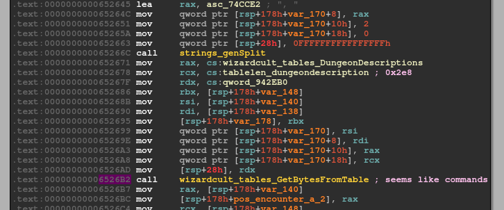

Stepping over the function, we can see the decoded bytes in the RCX register

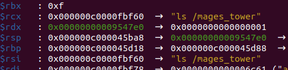

To make debugging easier, I then created a "/mages_tower" directory and placed some files in it

#### Entering the dungeon

When the "enter dungeon" command is given, the binary checks if the appropriate "potion" has been created successfully   
It will only proceed if it has

#### Spell Fight

The spell fight can also be decoded in a similar fashion

It is encoded in the **wizardcult_comms_CastSpells** function (0x653680)

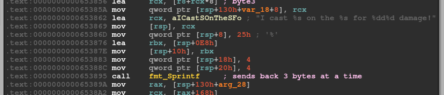

It sends back 3 bytes of data on each line  
The first byte is encoded using another table of strings (Spells table)  
The second and third byte is represented as decimals

> PRIVMSG #dungeon :I cast Wind Walk on the Wyvern for 234d253 damage!

However, I noticed that at the call to this **wizardcult_comms_CastSpells** function,  
The data has already been encrypted at this point  
This function does not perform any encryption and is only responsible for sending the bytes back  
So, where is the data being encrypted?

### Wizard VM

The data is actually encrypted by the Wizard VM  
The Wizard VM is invoked by the 2 function pointers defined in the potion struct

These 2 functions are **wizardcult_potion_CommandPotion** (0x651F40) and **wizardcult_potion_ReadFilePotion** (0x6521A0)

They do essentially what their name suggests which is executing a OS command and reading a file respectively  
At the end of these 2 functions, the data is send into the **wizardcult_vm___ptr_Program__Execute** which will execute the VM described by the potion ingrdients

#### Debugging the VM

This was the hardest and most time consuming part of this challenge

First of all, there are multiple threads running, you may be jumping between threads when you are debugging  
Breakpoint management during debugging is very important

I normally put a breakpoint where I want to investigate, confirm that I am on the correct "thread" and then disable the breakpoint  
I would then step through the program manually (via si or ni) without relying on breakpoints

The place where I placed a breakpoint the most was at the **wizardcult_vm___ptr_Cpu__ExecuteInstruction** function  
This function executes the various opcode described in the VM

#### Deciphering the VM

The first potion (acid resistance) is much easier to analyze  
I used that to debug, test and understand as much of the VM as possible

```
Cpu(Acc=0, Dat=0, Pc=0, Cond=0, 
  Instructions=[													
    Instruction(Opcode=1, A0=0, A1=4, A2=0, Bm=3, Cond=0), 	
    Instruction(Opcode=5, A0=4, A1=-1, A2=0, Bm=1, Cond=0), 
    Instruction(Opcode=1, A0=-1, A1=1, A2=0, Bm=2, Cond=1), 
    Instruction(Opcode=1, A0=0, A1=4, A2=0, Bm=3, Cond=1), 	
    Instruction(Opcode=1, A0=4, A1=2, A2=0, Bm=3, Cond=0), 	
    Instruction(Opcode=1, A0=2, A1=4, A2=0, Bm=3, Cond=0), 	
    Instruction(Opcode=1, A0=4, A1=1, A2=0, Bm=3, Cond=0)	
  ]
), 
```

##### CPU
A CPU contains multilple registers
- r0-r3 channels to other devices (used to communicate with other devices)
- r4 (acc)
- r5 (dat)
- pc (progam counter)
- cond (condition flag)

The cond register will be affected by t** (Test insructions)
- 1 for True
- -1 for False

Each CPU runs in parallel of each other and is triggered when something is sent through the r0-r3 channels (using the "select" api)

##### Instruction
Each instruction receives
- An opcode
- 3 arguments (a0-a2)
- Bm (Register bitmask for each argument)
- Cond (Execute condition)

Bm is a bitmask for each register (less significant for lower number register)
- ZYX (X for A0, Y for A1, Z for A2)
  - 1 means it is a register, treat the argument as the register number
  - 0 means it is a immediate value, treat the argument as a value

Cond is a execute condition, it will be matched against the CPU's cond register
  - 0 means always execute
  - Non-0 means only execute if CPU's cond register matches the value

##### Links

How each device is connected to other devices are described by the Links

```
Links=[
  Link(LHDevice=0, LHReg=0, RHDevice=2, RHReg=0), 
  Link(LHDevice=2, LHReg=1, RHDevice=1, RHReg=0), 
  Link(LHDevice=2, LHReg=2, RHDevice=3, RHReg=0)
]
```

Device 0 is input and Device 1 is output  
Device 2 onwards are the various other devices defined  
Each link is bi-directional

#### Potion of Acid Resistance VM

I drew a diagram to illustrate the acid resistance's links

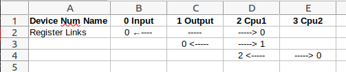

This is the summary of what the "Potion of Acid Resistane" VM is doing  

```
Program(
	Magic=4919,
	Input=InputDevice(Name=b''), 
	Output=OutputDevice(Name=b''), 
	Cpus=[
		Cpu(Acc=0, Dat=0, Pc=0, Cond=0, 
			Instructions=[													 
				Instruction(Opcode=1, A0=0, A1=4, A2=0, Bm=3, Cond=0),  # mov(0, 4, 0, 3, 0)  mov acc <-- r0   ;r0 contains input byte
				Instruction(Opcode=5, A0=4, A1=-1, A2=0, Bm=1, Cond=0), # teq(4, -1, 0, 1, 0) test acc == -1  ; -1 represents EOF	
				Instruction(Opcode=1, A0=-1, A1=1, A2=0, Bm=2, Cond=1), # mov(-1, 1, 0, 2, 1)   T: mov r1 <-- 0xfffffff
				Instruction(Opcode=1, A0=0, A1=4, A2=0, Bm=3, Cond=1), # mov(0, 4, 0, 3, 1)     T: mov acc <== r0
				Instruction(Opcode=1, A0=4, A1=2, A2=0, Bm=3, Cond=0), # mov(4, 2, 0, 3, 0)   mov r2 <-- acc ; sends byte to cpu2r0
				Instruction(Opcode=1, A0=2, A1=4, A2=0, Bm=3, Cond=0), # mov(2, 4, 0, 3, 0)   mov acc <-- r2 ; receive byte from cpu2r0
				Instruction(Opcode=1, A0=4, A1=1, A2=0, Bm=3, Cond=0)  # mov(4, 1, 0, 3, 0)   mov r1 <-- acc
			]
		), 
		Cpu(Acc=0, Dat=0, Pc=0, Cond=0, 
			Instructions=[
				Instruction(Opcode=1, A0=0, A1=4, A2=0, Bm=3, Cond=0),    # mov(0, 4, 0, 3, 0)    mov acc <-- r0
				Instruction(Opcode=18, A0=162, A1=0, A2=0, Bm=0, Cond=0), # xor(162, 0, 0, 0, 0)  xor acc, 162
				Instruction(Opcode=1, A0=4, A1=0, A2=0, Bm=3, Cond=0)     # mov(4, 0, 0, 3, 0)    mov r0 <-- acc
			]
		)
	], 
	ROMs=[], 
	RAMs=[], 
	Links=[
		Link(LHDevice=0, LHReg=0, RHDevice=2, RHReg=0), 
		Link(LHDevice=2, LHReg=1, RHDevice=1, RHReg=0), 
		Link(LHDevice=2, LHReg=2, RHDevice=3, RHReg=0)
	]
)
```

Basically each byte is xored with 162

I extracted the first 256 entries of the Spells table and wrote [another python script](02_spells.py) that would decrypt the spell fight

```py
SPELLS = {}
SPELLS["Eldritch Blast"] = 0
SPELLS["Mass Heal"] = 1
...

import re
import hashlib

def decode_spells(data):
	global SPELLS

	output = bytearray()
	lines = data.split("\n")
	for line in lines:
		pos1 = line.find("I cast ")
		pos2 = line.find(" on the ")
		spellname = line[pos1+len("I cast "):pos2]
		#print(spellname)
		output.append(SPELLS[spellname])
		
		pos3 = line.find("for ")
		if pos3 != -1:
			pos4 = line.find(" damage", pos3)
			diceroll = line[pos3+len("for "):pos4]
			dices = diceroll.split("d")
			#print(dices)
			output.append(int(dices[0]))
			output.append(int(dices[1]))
	return bytes(output)

def main():
	# First spell fight (Cmdline ls)
	with open("spellcast1.txt", "r") as f:
		data = f.read()

	fight1 = decode_spells(data)
	out = bytearray()
	for i in range(len(fight1)):
		out.append(fight1[i] ^ 0xa2)
	print(bytes(out))
  
if __name__ == "__main__":
  	main()
```

Running it decrypts the response to 

> b'cool_wizard_meme.png\ninduct\n'

### Water Breathing (Getting the flag)

Now, let's analyze the much more complicated Potion of Water Breathing  
I will not go through step by step as it is too tedious, below is the summary of the findings instead

First, the command received the following argument via the dungeon desciption

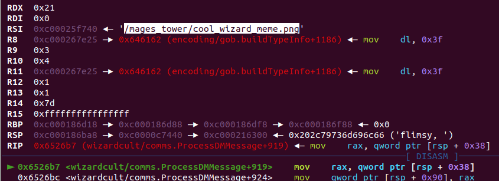

It is passed to the **wizardcult_potion_ReadFilePotion** function  
The file is then read, encrypted by the VM and sent back

I created a test file and saved it as "/mages_tower/cool_wizard_meme.png" to help my analysis

This is a diagram of the VM Links

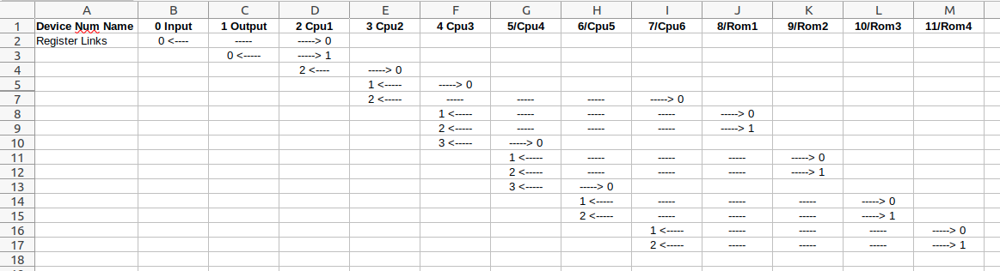

Here is the description

```
Program(
	Magic=4919, 
	Input=InputDevice(Name=b''), 
	Output=OutputDevice(Name=b''), 
	Cpus=[
		Cpu(Acc=0, Dat=0, Pc=0, Cond=0, Instructions=[				
			Instruction(Opcode=1, A0=0, A1=4, A2=0, Bm=3, Cond=0), # mov(0, 4,  0, 3, 0)   mov acc <-- r0
			Instruction(Opcode=5, A0=4, A1=-1, A2=0, Bm=1, Cond=0),# teq(4, -1, 0, 1, 0)   test acc == -1
			Instruction(Opcode=1, A0=-1, A1=1, A2=0, Bm=2, Cond=1),# mov(-1, 1,  0, 2, 1)    T: mov r1 <-- 0xfffffff
			Instruction(Opcode=1, A0=0, A1=4, A2=0, Bm=3, Cond=1), # mov(0, 4,  0, 3, 1)     T: mov acc <== r0
			Instruction(Opcode=1, A0=4, A1=2, A2=0, Bm=3, Cond=0), # mov(4, 2,  0, 3, 0)   mov r2 <-- acc ;; sends byte to cpu2r0
			Instruction(Opcode=1, A0=2, A1=4, A2=0, Bm=3, Cond=0), # mov(2, 4,  0, 3, 0)   mov acc <-- r2 ;; receive byte from cpu2r0
			Instruction(Opcode=1, A0=4, A1=1, A2=0, Bm=3, Cond=0)  # mov(4, 1,  0, 3, 0)	mov r1 <-- acc
		]), 
		Cpu(Acc=0, Dat=0, Pc=0, Cond=0, Instructions=[
			Instruction(Opcode=1, A0=0, A1=4, A2=0, Bm=3, Cond=0),     # mov(0, 4, 0, 3, 0)    mov acc <-- r0 ; rcv byte from cpu1r2 
			Instruction(Opcode=1, A0=4, A1=1, A2=0, Bm=3, Cond=0),     # mov(4, 1, 0, 3, 0)    mov r1 <-- acc ; sends byte to cpu3r0
			Instruction(Opcode=1, A0=1, A1=4, A2=0, Bm=3, Cond=0),     # mov(1, 4, 0, 3, 0)    mov acc <-- r1 ; rcv byte from cpu3r0
			Instruction(Opcode=1, A0=4, A1=2, A2=0, Bm=3, Cond=0),     # mov(4, 2, 0, 3, 0)    mov r2 <-- acc ; send byte to cpu6r0
			Instruction(Opcode=1, A0=2, A1=4, A2=0, Bm=3, Cond=0),     # mov(2, 4, 0, 3, 0)    mov acc <-- r2 ; rcv byte from cpu6r0
			Instruction(Opcode=1, A0=4, A1=1, A2=0, Bm=3, Cond=0),     # mov(4, 1, 0, 3, 0)    mov r1 <-- acc ; send byte to cpu3r0
			Instruction(Opcode=1, A0=1, A1=5, A2=0, Bm=3, Cond=0),     # mov(1, 5, 0, 3, 0)    mov dat <-- r1 ; rcv byte from cpu3r0
			Instruction(Opcode=1, A0=128, A1=4, A2=0, Bm=2, Cond=0),   # mov(128, 4, 0, 2, 0)  mov acc <-- 0x80
			Instruction(Opcode=16, A0=5, A1=0, A2=0, Bm=1, Cond=0),    # and(5, 0, 0, 1, 0)    and acc, dat
			Instruction(Opcode=5, A0=4, A1=128, A2=0, Bm=1, Cond=0),   # teq(4, 128, 0, 1, 0)	 test acc == 0x80
			Instruction(Opcode=1, A0=5, A1=4, A2=0, Bm=3, Cond=1),     # mov(5, 4, 0, 3, 1)      T: mov acc <-- dat
			Instruction(Opcode=18, A0=66, A1=0, A2=0, Bm=0, Cond=1),   # xor(66, 0, 0, 0, 1)     T: xor acc, 0x42 
			Instruction(Opcode=1, A0=5, A1=4, A2=0, Bm=3, Cond=-1),    # mov(5, 4, 0, 3, -1)     F: mov acc <-- dat
			Instruction(Opcode=13, A0=1337, A1=0, A2=0, Bm=0, Cond=0), # not?(1337, 0, 0, 0)   not acc 
			Instruction(Opcode=16, A0=255, A1=0, A2=0, Bm=0, Cond=0),  # and(255, 0, 0, 0, 0)  and acc, 0xff
			Instruction(Opcode=1, A0=4, A1=0, A2=0, Bm=3, Cond=0)      # mov(4, 0, 0, 3, 0)    mov r0 <-- acc ; send byte back to cpu1r2
		]), 
		Cpu(Acc=0, Dat=0, Pc=0, Cond=0, Instructions=[
			Instruction(Opcode=1, A0=0, A1=4, A2=0, Bm=3, Cond=0),     # mov(0, 4, 0, 3, 0)  mov acc <-- r0
			Instruction(Opcode=6, A0=4, A1=99, A2=0, Bm=1, Cond=0),    # tgt(4, 99, 0, 1, 0) test acc < 99
			Instruction(Opcode=1, A0=4, A1=3, A2=0, Bm=3, Cond=1),     # mov(4, 3, 0, 3, 1)    T: mov r3 <-- acc ; sends byte to cpu4r0
			Instruction(Opcode=1, A0=3, A1=0, A2=0, Bm=3, Cond=1),     # mov(3, 0, 0, 3, 1)    T: mov r0 <-- r3  ; rcv byte from cpu4r0, send it back to cpu2r
			Instruction(Opcode=1, A0=4, A1=1, A2=0, Bm=3, Cond=-1),    # mov(4, 1, 0, 3, -1)   F: mov r1 <-- acc
			Instruction(Opcode=1, A0=2, A1=0, A2=0, Bm=3, Cond=-1)     # mov(2, 0, 0, 3, -1)   F: mov r0 <-- r2
		]), 
		Cpu(Acc=0, Dat=0, Pc=0, Cond=0, Instructions=[
			Instruction(Opcode=1, A0=0, A1=4, A2=0, Bm=3, Cond=0),     # mov(0, 4, 0, 3, 0)    mov acc <-- r0
			Instruction(Opcode=6, A0=4, A1=199, A2=0, Bm=1, Cond=0),   # tgt(4, 199, 0, 1, 0)  test acc < 199
			Instruction(Opcode=1, A0=4, A1=3, A2=0, Bm=3, Cond=1),     # mov(4, 3, 0, 3, 1)      T: mov r3 <-- acc ;  sends byte to cpu5r0
			Instruction(Opcode=1, A0=3, A1=0, A2=0, Bm=3, Cond=1),     # mov(3, 0, 0, 3, 1)      T: mov r0 <-- r3  ; rcv byte from cpu5r0, send it back to cpu3r3
			Instruction(Opcode=10, A0=100, A1=0, A2=0, Bm=0, Cond=-1), # sub(100, 0, 0, 0, -1)   F: sub acc, 100
			Instruction(Opcode=1, A0=4, A1=1, A2=0, Bm=3, Cond=-1),    # mov(4, 1, 0, 3, -1)     F: mov r1 <-- acc
			Instruction(Opcode=1, A0=2, A1=0, A2=0, Bm=3, Cond=-1)     # mov(2, 0, 0, 3, -1)     F: mov r0 <-- r2
		]), 
		Cpu(Acc=0, Dat=0, Pc=0, Cond=0, Instructions=[
			Instruction(Opcode=1, A0=0, A1=4, A2=0, Bm=3, Cond=0),     # mov(0, 4, 0, 3, 0)    mov acc <-- r0
			Instruction(Opcode=10, A0=200, A1=0, A2=0, Bm=0, Cond=0),  # sub(200, 0, 0, 0, 0)  sub acc, 200
			Instruction(Opcode=1, A0=4, A1=1, A2=0, Bm=3, Cond=0),     # mov(4, 1, 0, 3, 0)    mov r1 <--acc ; sends byte to rom3r0
			Instruction(Opcode=1, A0=2, A1=0, A2=0, Bm=3, Cond=0)      # mov(2, 0, 0, 3, 0)    mov r0 <-- r2 ; receive byte from rom3r1, send it to cpu4r3
		]), 
		Cpu(Acc=0, Dat=0, Pc=0, Cond=0, Instructions=[
			Instruction(Opcode=1, A0=1, A1=4, A2=0, Bm=3, Cond=0),     # mov(1, 4, 0, 3, 0)	mov acc <-- r1 ; rcv byte from rom4r0 
			Instruction(Opcode=16, A0=1, A1=0, A2=0, Bm=0, Cond=0),    # and(1, 0, 0, 0, 0)	and acc, 1
			Instruction(Opcode=5, A0=4, A1=1, A2=0, Bm=1, Cond=0),     # teq(4, 1, 0, 1, 0)	test acc == 1 (odd) 
			Instruction(Opcode=1, A0=0, A1=5, A2=0, Bm=3, Cond=0),     # mov(0, 5, 0, 3, 0)	mov dat <-- r0 ; rcv byte from cpu2r2
			Instruction(Opcode=1, A0=2, A1=4, A2=0, Bm=3, Cond=0),     # mov(2, 4, 0, 3, 0)	mov acc <-- r2 ; rcv byte from rom4r1
			Instruction(Opcode=13, A0=1337, A1=0, A2=0, Bm=0, Cond=1), # not(1337, 0, 0, 0, 1)   T: not acc
			Instruction(Opcode=16, A0=255, A1=0, A2=0, Bm=0, Cond=1),  # and(255, 0, 0, 0, 1)    T: and acc, 0xff
			Instruction(Opcode=18, A0=5, A1=0, A2=0, Bm=1, Cond=0),    # xor(5, 0, 0, 1, 0)	xor acc, dat
			Instruction(Opcode=1, A0=4, A1=0, A2=0, Bm=3, Cond=0)      # mov(4, 0, 0, 3, 0)	mov r0 <-- acc ; send byte to cpu2r2
		])
	], 
	ROMs=[
		ROM(A0=0, A1=0, Data=[90, 132, 6, 69, 174, 203, 232, 243, 87, 254, 166, 61, 94, 65, 8, 208, 51, 34, 33, 129, 32, 221, 0, 160, 35, 175, 113, 4, 139, 245, 24, 29, 225, 15, 101, 9, 206, 66, 120, 62, 195, 55, 202, 143, 100, 50, 224, 172, 222, 145, 124, 42, 192, 7, 244, 149, 159, 64, 83, 229, 103, 182, 122, 82, 78, 63, 131, 75, 201, 130, 114, 46, 118, 28, 241, 30, 204, 183, 215, 199, 138, 16, 121, 26, 77, 25, 53, 22, 125, 67, 43, 205, 134, 171, 68, 146, 212, 14, 152, 20]), 
		ROM(A0=0, A1=0, Data=[185, 155, 167, 36, 27, 60, 226, 58, 211, 240, 253, 79, 119, 209, 163, 12, 72, 128, 106, 218, 189, 216, 71, 91, 250, 150, 11, 236, 207, 73, 217, 17, 127, 177, 39, 231, 197, 178, 99, 230, 40, 54, 179, 93, 251, 220, 168, 112, 37, 246, 176, 156, 165, 95, 184, 57, 228, 133, 169, 252, 19, 2, 81, 48, 242, 105, 255, 116, 191, 89, 181, 70, 23, 194, 88, 97, 153, 235, 164, 158, 137, 238, 108, 239, 162, 144, 115, 140, 84, 188, 109, 219, 44, 214, 227, 161, 141, 80, 247, 52]), 
		ROM(A0=0, A1=0, Data=[213, 249, 1, 123, 142, 190, 104, 107, 85, 157, 45, 237, 47, 147, 21, 31, 196, 136, 170, 248, 13, 92, 234, 86, 3, 193, 154, 56, 5, 111, 98, 74, 18, 223, 96, 148, 41, 117, 126, 173, 233, 10, 49, 180, 187, 186, 135, 59, 38, 210, 110, 102, 200, 76, 151, 198]), 
		ROM(A0=0, A1=0, Data=[97, 49, 49, 95, 109, 89, 95, 104, 111, 109, 49, 101, 115, 95, 104, 52, 116, 51, 95, 98, 52, 114, 100, 115]
	)], 
	RAMs=[], 
	Links=[
		Link(LHDevice=0, LHReg=0, RHDevice=2, RHReg=0), 
		Link(LHDevice=2, LHReg=1, RHDevice=1, RHReg=0), 
		Link(LHDevice=2, LHReg=2, RHDevice=3, RHReg=0), 
		Link(LHDevice=3, LHReg=1, RHDevice=4, RHReg=0), 
		Link(LHDevice=3, LHReg=1, RHDevice=4, RHReg=0), 
		Link(LHDevice=3, LHReg=2, RHDevice=7, RHReg=0), 
		Link(LHDevice=4, LHReg=1, RHDevice=8, RHReg=0), 
		Link(LHDevice=4, LHReg=2, RHDevice=8, RHReg=1), 
		Link(LHDevice=4, LHReg=3, RHDevice=5, RHReg=0), 
		Link(LHDevice=5, LHReg=1, RHDevice=9, RHReg=0), 
		Link(LHDevice=5, LHReg=2, RHDevice=9, RHReg=1), 
		Link(LHDevice=5, LHReg=3, RHDevice=6, RHReg=0), 
		Link(LHDevice=6, LHReg=1, RHDevice=10, RHReg=0), 
		Link(LHDevice=6, LHReg=2, RHDevice=10, RHReg=1), 
		Link(LHDevice=7, LHReg=1, RHDevice=11, RHReg=0), 
		Link(LHDevice=7, LHReg=2, RHDevice=11, RHReg=1)
	]
)
```

This VM has something new called ROMs

I noticed that the size of the ROMs are quite interesting

- ROM1 [100]
- ROM2 [200]
- ROM3 [56]
- ROM4 [24]

The first 3 ROMs adds up to 256 bytes and match nicely with the instructions  
It is actually used as a substituion cipher (or a sbox)  

ROM4 is actually ascii "a11_mY_hom1es_h4t3_b4rds" and is used as a XOR key

It also did a very cheeky thing with the "tgt" (Test GreaterThan) and "tlt" (Test LesserThan) instructions  
They are actually testing the opposite  
tgt returns True if it is less than  
tlt returns True if it is greater than 

During debugging, following an input byte from start to end was quite difficult due to the nature of multiple threads  
Instead, I focused on each cpu at a time to understand what each cpu was doing

CPU 3, 4 and 5 are basically performing the sbox substitions  
CPU 1, 2 and 6 are the most important to understand as they perform the nots and xors

It does several substitions, xors and nots  
I re-implemented the encryption function in python

```py
def encryptbyte(msgb, i):
	global SBOX, XORKEY

	tmp = SBOX[msgb]
	xorb = XORKEY[i % len(XORKEY)]
	if i % 2 == 1: #odd index
		xorb = (~xorb) & 0xff
	tmp ^= xorb
	tmp = SBOX[tmp]

	if tmp & 0x80:
		tmp ^= 0x42

	result = (~tmp) & 0xff
	return result
```
 
I used my testing file to test this and confirmed that the output from the python function and the binary is the same

I reversed the algorithm and wrote a [decryption script](03_cryptor.py)

```py
def reverse_sbox():
	global SBOX

	out = SBOX[:] # make a copy

	for i in range(len(SBOX)):
		out[SBOX[i]] = i
	return out

def decryptbyte(encb, i, rev_sbox):
	tmp = (~encb) & 0xff

	if tmp & 0x80:
		tmp ^= 0x42

	tmp = rev_sbox[tmp]
	xorb = XORKEY[i % len(XORKEY)]
	if i % 2 == 1: #odd index
		xorb = (~xorb) & 0xff
	tmp ^= xorb
	result = rev_sbox[tmp]

	return result
  
def decrypt(enc):
  	rev_sbox = reverse_sbox()

  	out = bytearray()
  	for i in range(len(enc)):
  		out.append(decryptbyte(enc[i], i, rev_sbox))

  	return bytes(out)
```

Running the script against the bytes in the second spellfight allowed me to recover the png sent in the PCAP


The flag is **wh0_n33ds_sw0rds_wh3n_you_h4ve_m4ge_h4nd@flare-on.com**
