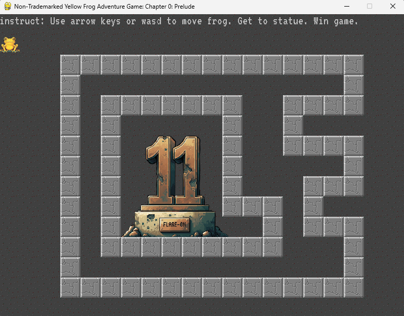
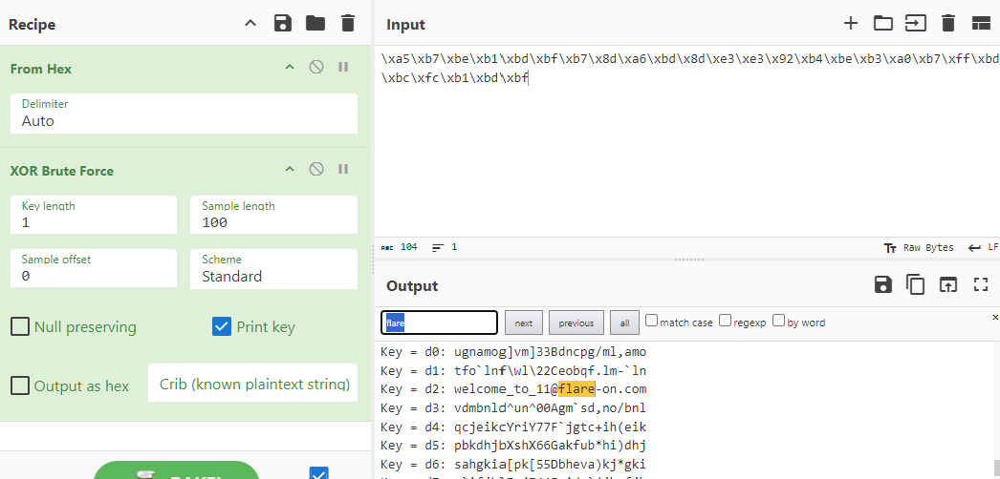

## Flare-On CTF 2024
# Challenge 01 : frog

```
Welcome to Flare-On 11! 

Download this 7zip package, unzip it with the password 'flare', and read the README.txt file for launching instructions. 
It is written in PyGame so it may be runnable under many architectures, but also includes a pyinstaller created EXE file for easy execution on Windows.

Your mission is get the frog to the "11" statue, and the game will display the flag. 
Enter the flag on this page to advance to the next stage. 
All flags in this event are formatted as email addresses ending with the @flare-on.com domain.

7-zip password: flare
```

We are provided a 7zip file with a simple Python script running a game



The flag is actually in the python script file.

```python
...
def GenerateFlagText(x, y):
    key = x + y*20
    encoded = "\xa5\xb7\xbe\xb1\xbd\xbf\xb7\x8d\xa6\xbd\x8d\xe3\xe3\x92\xb4\xbe\xb3\xa0\xb7\xff\xbd\xbc\xfc\xb1\xbd\xbf"
    return ''.join([chr(ord(c) ^ key) for c in encoded])
...
```

It is protected by a single xor byte  
Brute-forcing the byte will give us the key



The flag is **welcome_to_11@flare-on.com**