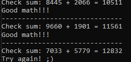
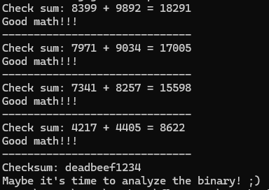
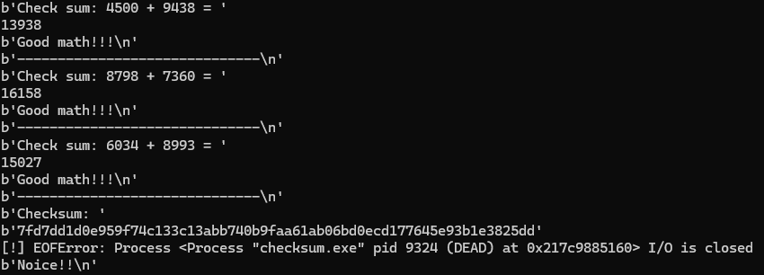
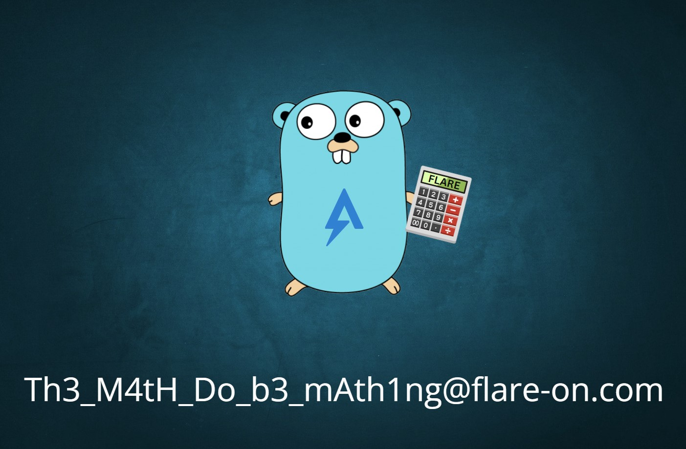

## Flare-On CTF 2024
# Challenge 02 : checksum

```
We recently came across a silly executable that appears benign. 
It just asks us to do some math... 
From the strings found in the sample, we suspect there are more to the sample than what we are seeing. 
Please investigate and let us know what you find!

7zip archive password: flare
```

We are provided a 7zip file with a EXE binary written in Golang

The binary asks a sequence of math questions



I used [pwintools](https://github.com/masthoon/pwintools) to get a python interface to this binary  
This is so I can use python to automatically calculate these math questions  
On hindsight, might be easier to patch the binary to bypass all these math question as it does not seem to affect the later operations

```python
from pwintools import *
import time

tmp = p.recv(128)
parts = tmp.split(b" ")
tmpsum = int(parts[2]) + int(parts[4])
print(tmpsum)
p.sendline(str(tmpsum))
print(p.recvline())
print(p.recvline())
```

After answering a couple of math questions it would then ask you for a checksum  
If you give it a hex string, it will ask you to analyze the binary



I analyzed the binary using IDA.  
As it is in GO, it is a little hard to read  

I did not fully reverse the entire binary but noted some interesting points

- A very large encrypted flag is decrypted using the ChaCha20-Poly1305 algorithm
- Something is written into "UserCacheDirectory\\REAL_FLAREON_FLAG.JPG"
- main.a function is interesting
	- The input of this function is xored with "FlareOn2024"
	- It then is compared against the Base64 decoded version of "cQoFRQErX1YAVw1zVQdFUSxfAQNRBXUNAxBSe15QCVRVJ1pQEwd/WFBUAlElCFBFUnlaB1ULByRdBEFdfVtWVA\=\="

Due to the first 2 points above, I believe the flag is in a image form.  
I reversed the main.a operations and got the hex string that would match the base64 string

I put all these into a [script](soln.py) and the flag is written to the cache directory which in my case was in "C:\\Users\\username\\Appdata\\Local\\"

```python
from pwintools import *
import time
import base64

RECVSIZE = 128

def xorbytes(msg, key):
    out = b""
    for i in range(len(msg)):
        out += (msg[i] ^ key[i % len(key)]).to_bytes(1)
    return out 

def processMath(p, mathline):
    parts = mathline.split(b" ")
    tmpsum = int(parts[2]) + int(parts[4])
    print(tmpsum)
    p.sendline(str(tmpsum))
    print(p.recvline())
    print(p.recvline())

def processChecksum(p, reqline):
    tmp = base64.b64decode("cQoFRQErX1YAVw1zVQdFUSxfAQNRBXUNAxBSe15QCVRVJ1pQEwd/WFBUAlElCFBFUnlaB1ULByRdBEFdfVtWVA==")
    tmp = xorbytes(tmp, b"FlareOn2024")
    p.sendline(tmp)
    print(p.recvline())
    return ""

p = Process("checksum.exe")
for x in range(32):
    time.sleep(1)
    tmp = p.recv(RECVSIZE)
    print(tmp)
    if tmp.split(b":")[0] == b"Check sum":
        processMath(p, tmp)
    elif tmp.split(b":")[0] == b"Checksum":
        processChecksum(p, tmp)
        break
    else:
        print("Unknown Request")
        break
```





The flag is **Th3_M4tH_Do_b3_mAth1ng@flare-on.com**