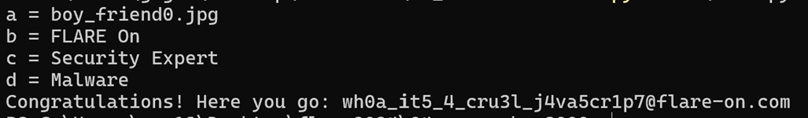

## Flare-On CTF 2024
# Challenge 04 : Meme Maker 3000

```
You've made it very far, I'm proud of you even if noone else is. 
You've earned yourself a break with some nice HTML and JavaScript before we get into challenges that may require you to be very good at computers.

7zip archive password: flare
```

We are provided a 7zip file with a html page  
Inside this page is a very huge blob of obfuscated Javascript  
This challenge is about de-obfuscating this code to obtain the flag

The "a0p" function is a deobfuscator  
I opened the html file in a chrome browser and used the devtool console to deobfuscate the a0p calls

Here is a copy of the roughly [deobfuscated javascript](meme.js)

I will highlight the important parts of the script below

```js
...
const a0c = ['When you find a buffer overflow in legacy code',
    'Reverse Engineer',
    'When you decompile the obfuscated code and it makes perfect sense',
    'Me after a week of reverse engineering',
    'When your decompiler crashes',
    "It's not a bug, it'a a feature",
    "Security 'Expert'",
    'AI',
    "That's great, but can you hack it?",
    'When your code compiles for the first time',
    "If it ain't broke, break it",
    "Reading someone else's code",
    'EDR',
    'This is fine',
    'FLARE On',
    "It's always DNS",
    'strings.exe',
    "Don't click on that.",
    'When you find the perfect 0-day exploit',
    'Security through obscurity',
    'Instant Coffee',
    'H@x0r',
    'Malware',
    '$1,000,000',
    'IDA Pro',
    'Security Expert']

...

a0e = {
    'doge1.png': ...
    'draw.jpg':  ...
    'drake.jpg': ...
    'two_buttons.jpg': ...
    'fish.jpg': ...
    'boy_friend0.jpg': ...
    'success.jpg': ...
    'disaster.jpg': ...
    'aliens.jpg': ...
}

...

function a0k() {
    const t = a0p, a = a0g.alt.split('/').pop();
    if (a !== Object.keys(a0e)[0x5])
        return;
    const b = a0l.textContent
      , c = a0m.textContent
      , d = a0n.textContent;

    if (a0c.indexOf(b) == 0xe && a0c.indexOf(c) == a0c.length - 0x1 && a0c.indexOf(d) == 0x16) {
        var e = new Date().getTime();
        while (new Date().getTime() < e + 0xbb8) {}
        
        var f = d[0x3] + 'h' + a[0xa] + b[0x2] + a[0x3] + c[0x5] + c[c.length - 0x1] + '5' + a[0x3] + '4' + a[0x3] + c[0x2] + c[0x4] + c[0x3] + '3' + d[0x2] + a[0x3] + 'j4' + a0c[0x1][0x2] + d[0x4] + '5' + c[0x2] + d[0x5] + '1' + c[0xb] + '7' + a0c[0x15][0x1] + b.replace('\x20', '-') + a[0xb] + a0c[0x4].substring(0xc, 0xf);
        f = f.toLowerCase(),
        alert(atob('Q29uZ3JhdHVsYXRpb25zISBIZXJlIHlvdSBnbzog') + f);
    }
}
```

The textContent of **a0l**, **a0m** and **a0n** will contain one of the strings from a0c randomly  
The function **a0k** checks that each of them is equal to a specific string  
If all of them match, then the flag is printed out

I replicated this logic in my [python script](soln.py)

```python
import base64

a0c = ['When you find a buffer overflow in legacy code',
    'Reverse Engineer',
    'When you decompile the obfuscated code and it makes perfect sense',
    'Me after a week of reverse engineering',
    'When your decompiler crashes',
    "It's not a bug, it'a a feature",
    "Security 'Expert'",
    'AI',
    "That's great, but can you hack it?",
    'When your code compiles for the first time',
    "If it ain't broke, break it",
    "Reading someone else's code",
    'EDR',
    'This is fine',
    'FLARE On',
    "It's always DNS",
    'strings.exe',
    "Don't click on that.",
    'When you find the perfect 0-day exploit',
    'Security through obscurity',
    'Instant Coffee',
    'H@x0r',
    'Malware',
    '$1,000,000',
    'IDA Pro',
    'Security Expert']

a = 'boy_friend0.jpg'
b = a0c[0xe]
c = a0c[len(a0c)-1]
d = a0c[0x16]

tmp = d[0x3] + 'h' + a[0xa] + b[0x2] + a[0x3] + c[0x5] + c[len(c) - 0x1] + '5' + a[0x3] + '4' + a[0x3] + c[0x2] + c[0x4] + c[0x3] + '3' + d[0x2] + a[0x3] + 'j4' + a0c[0x1][0x2] + d[0x4] + '5' + c[0x2] + d[0x5] + '1' + c[0xb] + '7' + a0c[0x15][0x1] + b.replace('\x20', '-') + a[0xb] + a0c[0x4][0xc:0xf];
  
print("a = %s" % a)
print("b = %s" % b)
print("c = %s" % c)
print("d = %s" % d)
print(base64.b64decode('Q29uZ3JhdHVsYXRpb25zISBIZXJlIHlvdSBnbzog').decode() + tmp.lower())
```

Running the script will produce the flag



The flag is **wh0a_it5_4_cru3l_j4va5cr1p7@flare-on.com**