## Flare-On CTF 2024
# Challenge 05 : sshd

```
Our server in the FLARE Intergalactic HQ has crashed! 
Now criminals are trying to tell sell me my own data!!! 
Do your part, random internet hacker, to help FLARE out and tell us what data they stole! 
We used the best forensic preservation technique of just copying all the files on the system for you.

7zip archive password: flare
```

We are provided a 7zip file with a Linux Filesystem

Following the name of the challenge, I tried to find stuff related to sshd in the filesystem  
Interestingly, there was a coredump of the sshd process

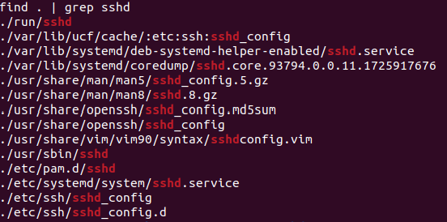

## Analyzing the coredump

This coredump can be loaded by gdb with its corresponding binary  
Therefore, I extracted the sshd binary (from usr/sbin) and the coredump

I can then run gdb (remember to set the sysroot to the root of the extracted filesystem)

```
$ gdb ./sshd -c sshd.core.93794.0.0.11.1725917676
(gdb) set sysroot /path/to/extracted/filesystem
```

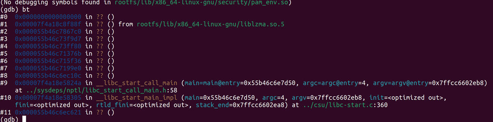

If everything is loaded properly, we can view the backtrace (bt) to see that it crashed somewhere in liblzma  
liblzma and sshd is giving me [xz backdoor](https://www.wired.com/story/xz-backdoor-everything-you-need-to-know/) vibes

### Finding liblzma base address

I ran "info proc mappings" in gdb but there was no liblzma entry there  
However there is a very suspicious "deleted" portions  
This can be confirmed by running "info shared" and comparing the liblzma address is inside this deleted portion

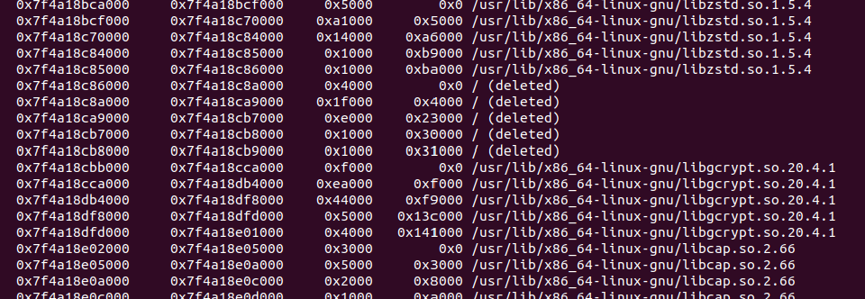

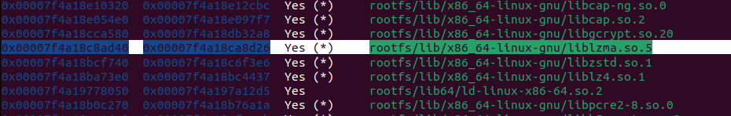
### Reversing liblzma

I extracted liblzma file from the filesystem and threw it into IDA  
I then rebase the base address to 0x7f4a18c86000 (Edit -> Segment -> Rebase Program)

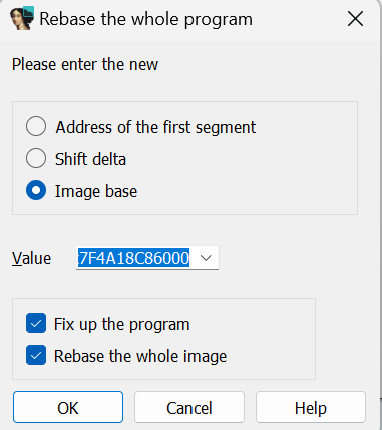

I then went to the address where the crash occurred (0x7F4A18C8F88F)

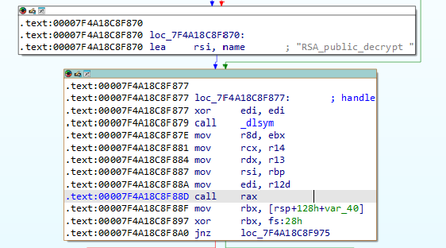

It seems like it was crashed intentionally  
rax contains the result of a dlsym(0x0) function call  

The interesting code are the code before this crash  
I have already renamed some of these functions and variables in the below screenshot

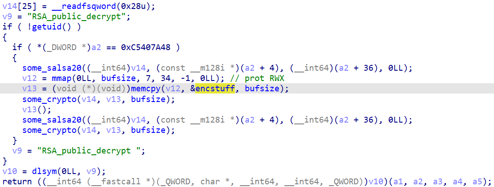

Salsa20 can be identified with its iconic "expand 32-byte k" constant

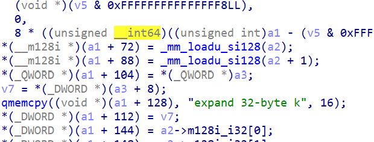

The presence of salsa20 leads me to believe that the encryption algorithm used here is chacha20/xchacha20  
This is also the same algorithm used in the actual xz_utils backdoor 

It is decrypting a buffer in the .rodata section of this binary (pointed to by the **encstuff** variable)  
bufsize is also known (0xf96)  
I extracted these 0xf96 bytes and saved it into a file

I got the encrypted ciphertext but where is the key?  
The key and nonce is provided in the a2 argument  
- 4 byte magic (0xc5407a48)
- 32 byte key
- 8/12 byte nonce

I was looking for the key in several places before I stumbled onto rsi

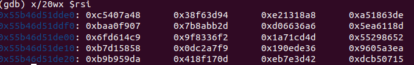

It matches the magic bytes!!  

I got everything I need to perform the decryption  
Here is a python script to decrypt these data

```python
from Crypto.Cipher import ChaCha20

thekey = bytes.fromhex("943DF638A81813E2DE6318A507F9A0BA2DBB8A7BA63666D08D11A65EC914D66F")
thenonce = bytes.fromhex("F236839F4DCD711A52862955") # 12-byte version F236839F4DCD711A52862955

with open("encrypted.bin", "rb") as f:
    ciphertext = f.read()

cipher = ChaCha20.new(key=thekey, nonce=thenonce)
plaintext = cipher.decrypt(ciphertext)

with open("decrypted.bin", "wb") as f:
    f.write(plaintext)

print("Decrypted contents written to decrypted.bin")
```

### Reversing Shellcode

I threw the output file into IDA PRO and it turned out to be shellcode  
The shellcode calls a series of syscall and is fairly straight-forward

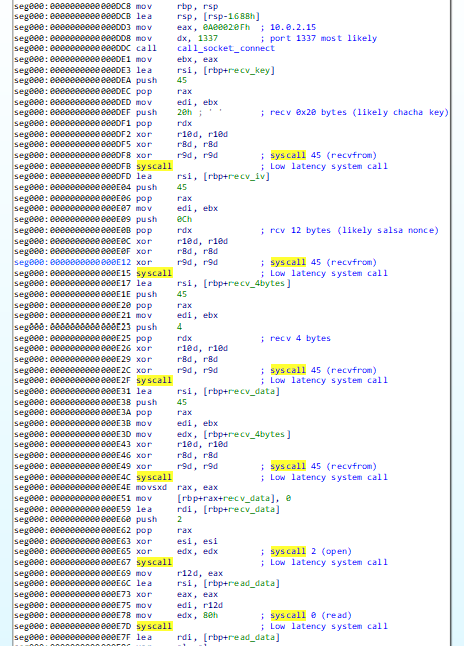

Here is a pseudocode of the operations that it will perform

```
s = connect(socket(AF_INET, SOCK_STREAM, IPPROTO_TCP))
recvfrom(s, 32) # recv 32 bytes (likely key)
recvfrom(s, 12) # recv 12 bytes (likely nonce)
ssize = recvfrom(s, 4) # later determined to be string size
fname = recv(s, ssize) # recv number of bytes described in the previous 4 bytes

fhandle = open(fname)
fdata = read(fhandle)

Do crypto on fdata

sendto(s, 4, len(encrypted_fdata))  # send 4 bytes, likely length of response
sendto(s, n, encrypted_fdata)  # send the encrypted response
```

The shellcode receives key information from the network and a string that will be used in a open() and read() syscalls  
I guessed that it was some kind of filename/filepath  
The file content is then encrypted and sent back  
The crypto operations looks similar to chacha20 before
### Hunt for the encrypted data

Where would I be able to find this encrypted data?  
There is no magic bytes to look for anymore

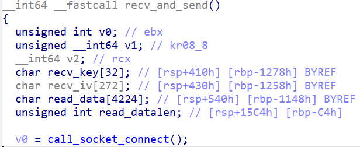

If we look at the shellcode local variables, the filedata is actually stored on the stack during this shellcode operation (about 5000 bytes away)  
I looked at the data in the crash log about 5000 bytes away and spotted something interesting  
That looks like a filepath

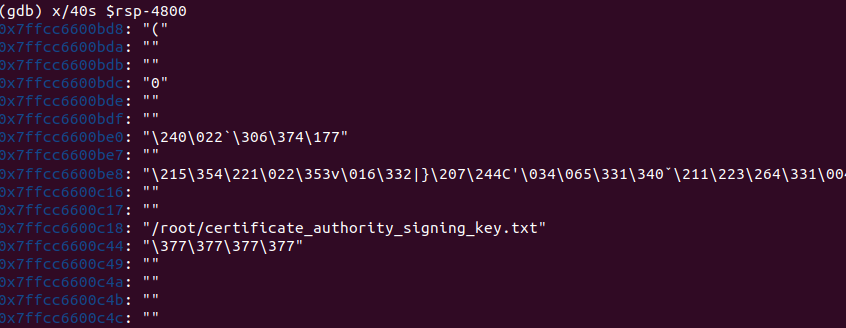

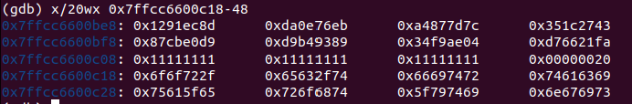

The byte structure looks very similar to what the shellcode is creating  

Based on the offsets again, the encrypted data should be at 32+272 byte offset

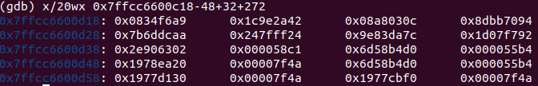

I extracted the key, nonce and encrypted data and tried to decrypt them using Chacha20  
However, I only got gibberish
### Running the shellcode

I was stuck here for awhile until a friend suggested to run the shellcode directly.

First, I patched the IP that the shellcode will connect to "127.0.0.1"

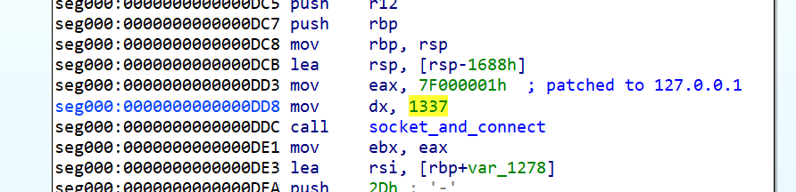

I found a shellcode loader code that could load shellcode from a file at [this github](https://gist.github.com/levisre/f3e591d299569db949b2e002e0e3eb12)

```c
#include <stdio.h>
#include <stdlib.h>

// enable cross compiling
#ifdef __linux__
#include <sys/mman.h>
#elif _WIN32 || _MINGW_
#include <windows.h>
#endif

//Declaration of Function pointer, which will be ussed to call the shellcode
typedef void (*fp) (void);

int getFileSize(FILE* filePointer)
{
	fseek(filePointer,0L, SEEK_END);
	int size = ftell(filePointer);
	fseek(filePointer,0L, SEEK_SET);
	return size;
}

int main(int argc, char const *argv[])
{
	if(argc == 2)
	{
		FILE* shellcode = fopen(argv[1],"rb");
		if(shellcode)
		{
			int len = getFileSize(shellcode);
			printf("Shellcode length: %d\n", len);
			char* buffer = NULL;
			//Allocate Memory to store shellcode
			#ifdef __linux__
			buffer = (char*) mmap (NULL, len+1, PROT_EXEC | PROT_READ | PROT_WRITE, MAP_ANONYMOUS | MAP_SHARED, -1, 0);
			#elif _WIN32 || _MINGW_
			buffer = (char*) VirtualAlloc(NULL, len+1, MEM_COMMIT, PAGE_EXECUTE_READWRITE);
			#endif
			if(buffer!=NULL)
			{
				fread(buffer, len+1, 1, shellcode);
				fclose(shellcode);
				fp shell = (fp) buffer;
				//Invoke Shellcode
				printf("Shellcode has been loaded at %p. Press any key to execute it...",buffer);
				getchar();
				shell();
				printf("Executing done! Unloading shellcode and cleaning up memory...\nx");
				#ifdef __linux__
				munmap(buffer, len+1);
				#elif _WIN32 || _MINGW_
				VirtualFree(buffer, 0, MEM_RELEASE);
				#endif
				return 0;
			}
			else
			{
				printf("Could not allocate memory for buffer! Process aborted...");
				return -1;
			}		
		}
		else
		{
			perror("Could not load shellcode from file!");
			return -1;
		}
	
	}
	else
	{
		printf("ERROR: No shellcode file specified!\nUse: %s <path_to_shellcode>", argv[0]);
		return -1;
	}
}
```

> gcc -o shellcode shellcode.c -z execstack

With the assistance of ChatGPT, I then wrote a [simple python server](server.py) to send the keys and filename

```python
import socket
import time

# Define the host and port
HOST = '0.0.0.0'  # Listen on all interfaces
PORT = 1337

# Create a TCP/IP socket
with socket.socket(socket.AF_INET, socket.SOCK_STREAM) as server_socket:
    server_socket.bind((HOST, PORT))
    server_socket.listen()

    print(f"Listening on port {PORT}...")

    while True:
        # Wait for a connection
        client_socket, addr = server_socket.accept()
        with client_socket:
            print(f"Connected by {addr}")

            # Prepare the data to send
            data_32_bytes = bytes.fromhex("8D EC 91 12 EB 76 0E DA 7C 7D 87 A4 43 27 1C 35 D9 E0 CB 87 89 93 B4 D9 04 AE F9 34 FA 21 66 D7")  # 32 byte key
            data_12_bytes = bytes.fromhex("11 11 11 11 11 11 11 11 11 11 11 11")  # 12 byte nonce
            data_4_bytes = bytes.fromhex("2C")    # 4 bytes of data

            # Send the data in the specified order
            print("sending 1")
            client_socket.sendall(data_32_bytes)
            time.sleep(2)

            print("sending 2")
            client_socket.sendall(data_12_bytes)
            time.sleep(2)

            print("sending 3")
            client_socket.sendall(data_4_bytes)
            time.sleep(2)

            print("sending 4")
            client_socket.sendall(b"/home/user/Desktop/flare2024/05_sshd/encflag")
            print("Sent data")

            # Receive a message from the client
            received_data = client_socket.recv(1024)  # Adjust buffer size as needed
            print("Receive 1: %s" % received_data)
            # Receive a message from the client
            received_data = client_socket.recv(1024)  # Adjust buffer size as needed
            print("Receive 2: %s" % received_data)
```

The encrypted data is stored in "/home/user/Desktop/flare2024/05_sshd/encflag"  
This will work because Chacha20 is a commutative cipher, meaning encrypting the ciphertext again will produce it's plaintext

Now we can run the shellcode and the server

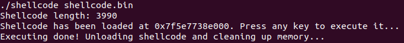

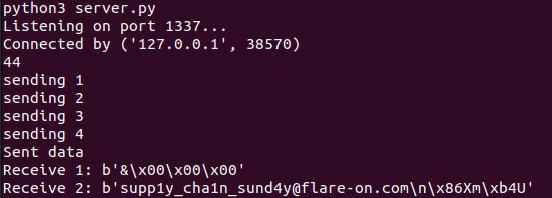

The flag is **supp1y_cha1n_sund4y@flare-on.com**