## Flare-On CTF 2024
# Challenge 06 : bloke2

```
You've been so helpful lately, and that was very good work you did. 
Yes, I'm going to put it right here, on the refrigerator, very good job indeed. 
You're the perfect person to help me with another issue that come up. 

One of our lab researchers has mysteriously disappeared. 
He was working on the prototype for a hashing IP block that worked very much like, but not identically to, the common Blake2 hash family. 
Last we heard from him, he was working on the testbenches for the unit. 
One of his labmates swears she knew of a secret message that could be extracted with the testbenches, but she couldn't quite recall how to trigger it. Maybe you could help?

7zip archive password: flare
```

We are provided a 7zip file with Verilog Scripts  
Included is a readme that tells you how to setup your environment to build and run them  
I used a Ubuntu environment and just needed to install verilog

> sudo apt install iverilog

I was able to build the project and run the test cases

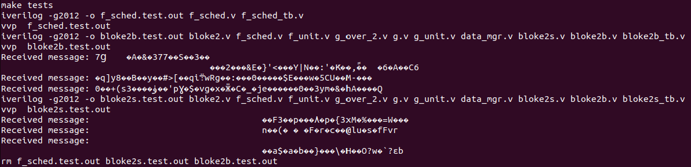

The readme also specified that we only need to edit the testbenches (\*\_tb.v) files to get the flag  
It also specified that some internal values of the Blake2 hash was changed to discourage brute-forcing, so we should not aim for that

## What is Verilog

Verilog is a language for designing hardware on chips

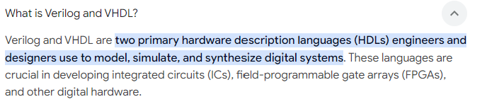

One important point to note is that the "code" in the "scripts" are not normally executed sequentially  
A lot of it are actually asynchronous and would have to be controlled by some type of clock signal

## Tracing back

I am not an expert in hardware design  
I first took a look at all the scripts to see if there is anything that stood out

I noticed some code that was performing some kind of xoring with a constant in data_mgr.v

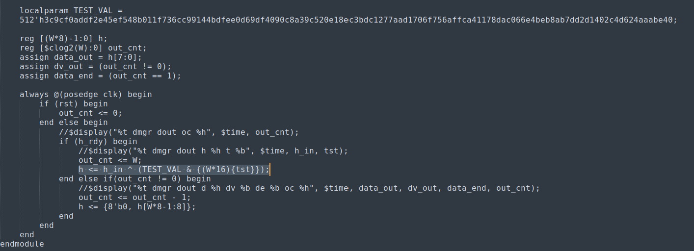

I added some logging to see if this code is being hit

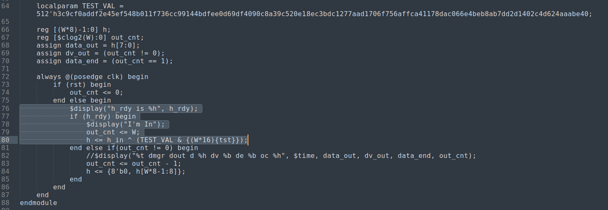

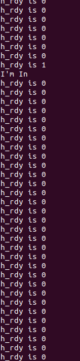

Running the tests with "make tests" again shows that it is only entered once and most of the time, h_rdy is 0  
Is it possible to make this h_rdy always be 1?

I tried to trace it back through the wires but I was unable to make it always 1  
I decided to stop and look at other things

Another signal "tst" is also used in the block of code performing the xor  
I restored the original logging statements to see the state of "tst" 

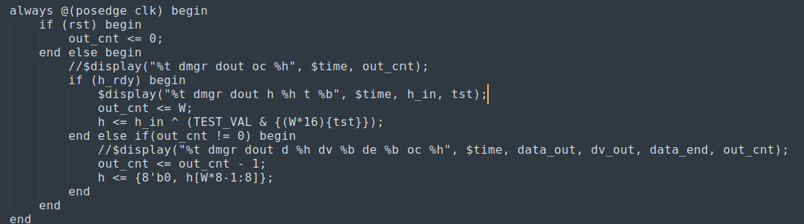

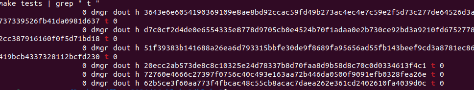

The state of "tst" is always 0  
I was thinking that if this signal is always 0 then the "&" operation will always result in 0  
This means the subsequent xor operation would also be with 0  
Xoring with 0 does nothing

Therefore, i started to trace this wire to see if I can set it to 1

From data_mgr.v, the "tst" is connected to "finish"

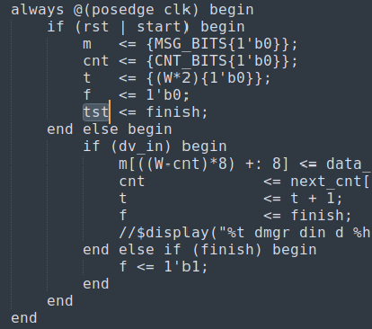

"finish" is a input line into the data_mgr module


In bloke2.v, the bloke2 module uses the data_mgr module  
It connects it's finish line to data_mgr's finish line

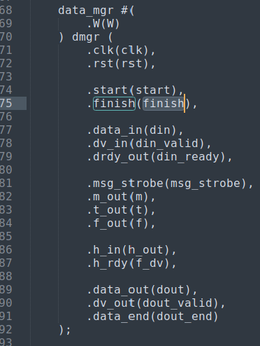

bloke2's finish line is a input line into bloke2 module

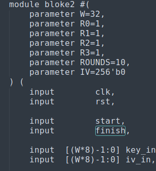

In bloke2b.v, it also connects it's finish line to bloke2's finish line

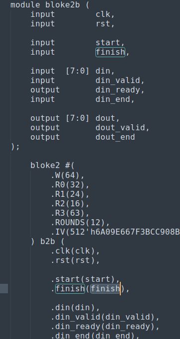

In bloke2b_tb.v, it also connects it's finish line to bloke2b's finish line

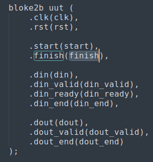

However, bloke2_tb.v is a testbench file  
This means it will simulate the chip design with test signals  

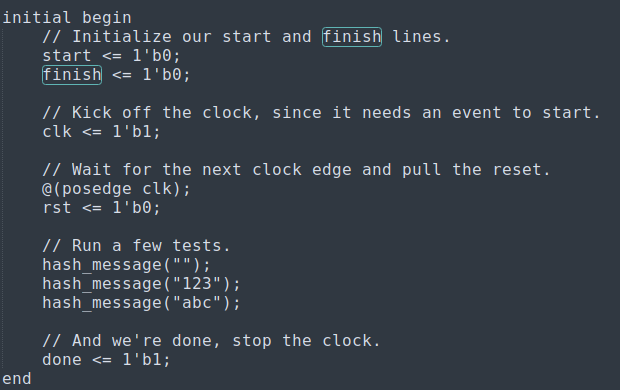

This test bench will run the "hash_message" function multiple times  
I tried changing the finish signal here to 1, but it did not really do anything

Let's look inside the hash_message function

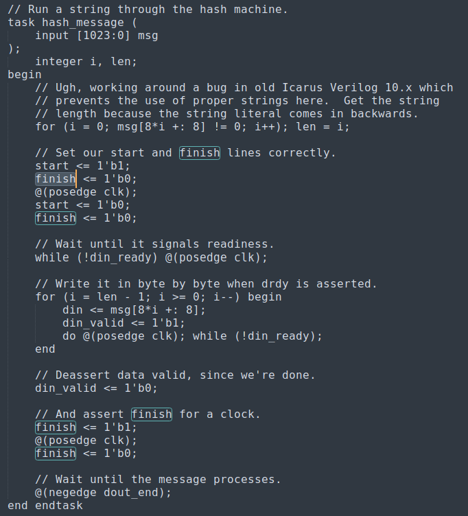

It seems like the finish line is set back to 0 inside this function  
I played around with all these finish signals  
When I changed this particular signal to 1 ...

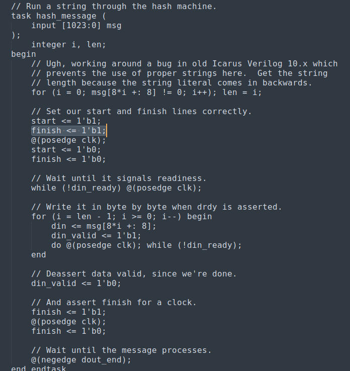

and run the tests ...

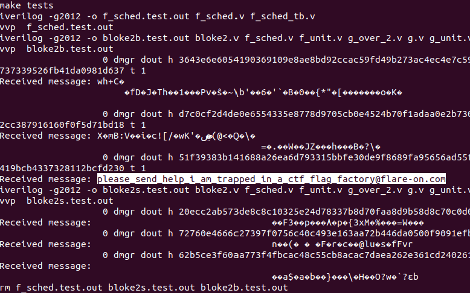

The flag is revealed

The flag is **please_send_help_i_am_trapped_in_a_ctf_flag_factory@flare-on.com**
