## Flare-On CTF 2024
# Challenge 07 : fullspeed

```
Has this all been far too easy? 
Where's the math? Where's the science? Where's the, I don't know.... cryptography? 
Well we don't know about any of that, but here is a little .NET binary to chew on while you discuss career changes with your life coach.

7zip archive password: flare
```

We are provided a 7zip file containing a binary and a pcap capture

Running the binary does not do much, it runs for awhile and then prints "err"  
Given that there is a pcap involved, I am assuming that it is trying to connect to some network

Although the challenge description mention that this is a .NET binary, throwing it into IDA or DNSpy shows that it is not a normal .NET binary.
Of note, are these interesting sections 

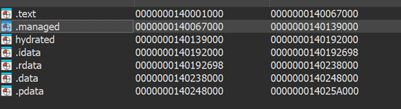

Googling about the ".managed" and "hydrated" sections reveals that this is likely compiled using .NET AOT (Ahead-of-Time) , which is basically a natively compiled .NET binary  
All the functions are unnamed and IDA was not able to identify system libraries.

## Generating Symbols (Signatures)

Researching on .NET AOT, I came across this [useful article from harfanglab](https://harfanglab.io/insidethelab/reverse-engineering-ida-pro-aot-net/)  
In particular, it describes a way to generate symbols so that it will be easier to reverse the binary

The rough steps for this process is as follow
-  Create a .NET AOT project in Visual Studio 
	- C# Console App -> Make sure to check the AOT option
- Write a program that imports a majority of the system modules 
	-  I used the [example](Program.cs) provided in the article
- Generate the binary by publishing it (Right-click Project -> Publish) 
	- This will produce a exe and a corresponding symbols pdb file
- Open this binary in IDA Pro, making sure the pdb file is loaded
- Run the [idb2pat.py](https://github.com/mandiant/flare-ida/blob/master/python/flare/idb2pat.py) from within IDA Pro
	- This will generate a  .pat pattern file
- Run the **sigmake.exe** from FLAIR utilities on this .pat file to generate a .sig signature file
	- Download the Flair utilities from HexRay's website
	- I was able to download it with a free account
- When you run **sigmake**, there will be signature collisions highlighted in a .exc file
	- Follow the instructions to tell it how to resolve the collisions
	- I just made it prioritize the first entry of each collision

This is my generated [signature file](Test1.sig) and it's corresponding [collision file](Test1.exc)

Load the signature file into IDA (Load File -> Flair Signature) and many of the system functions will be identified

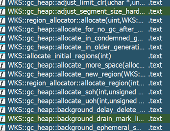
## Initial Reversing

As this binary have something to do with the network, I used the networking functions as a starting point to investigate the binary  
Tracing back from WSAConnect and recv, I eventually come across this interesting function

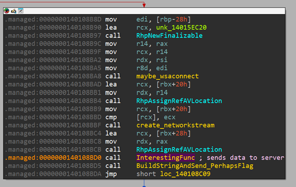

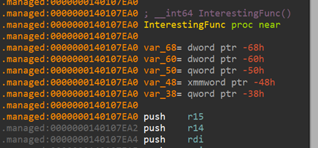

Debugging **interestingFunc** reveals that it is the part of the code that sends and receives bytes on the network

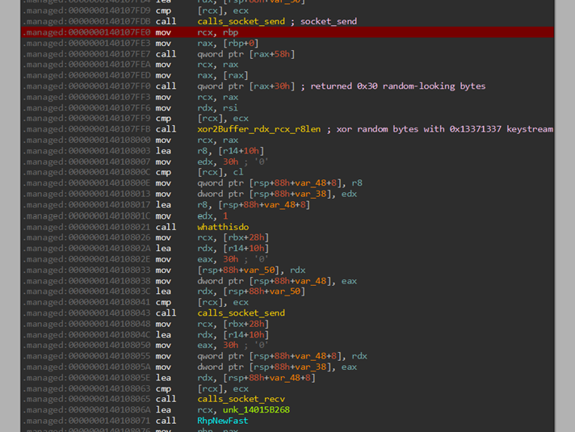

There was also a call to some kind of String De-obfuscation function (this will be important later)

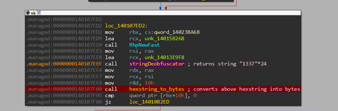
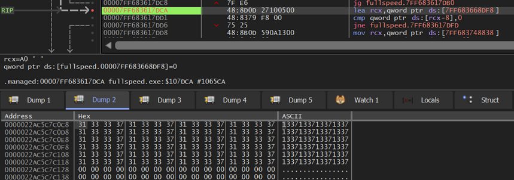

Debugging it also reveals where it is trying to connect to (192.168.56.103 : 31337)

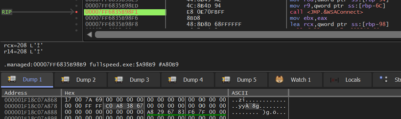

This actually matches the IP that is in the pcap capture as well

I created a matching subnet, gave my VM a static IP and wrote a simple [python server script](server.py)

```python
import socket
import time
import struct

def xorbytes(msg, key):
    out = b""
    for x in range(len(msg)):
        out += (msg[x] ^ key[x % len(key)]).to_bytes(1,"big")
    return out
    
# Define the host and port
HOST = '0.0.0.0'  # Have to listen on 192.168.56.103
PORT = 31337

key1 = b"\x13\x37\x13\x37"

# Create a TCP/IP socket

with socket.socket(socket.AF_INET, socket.SOCK_STREAM) as server_socket:
    server_socket.bind((HOST, PORT))
    server_socket.listen()
    print(f"Listening on port {PORT}...")
    
    while True:
        # Wait for a connection
        client_socket, addr = server_socket.accept()
        with client_socket:
            print(f"Connected by {addr}\n")
  
            # Receive a message from the client
            received_data = client_socket.recv(1024)  # Adjust buffer size as needed
            print("Receive 1 (Len 0x%x): %s" % (len(received_data), received_data.hex()))
            print("Decrypted : %s\n" % xorbytes(received_data, key1).hex())

            # Receive a message from the client
            received_data = client_socket.recv(1024)  # Adjust buffer size as needed
            print("Receive 2 (Len 0x%x): %s" % (len(received_data), received_data.hex()))
            print("Decrypted : %s\n" % xorbytes(received_data, key1).hex())

            # senddata1 = b"\x52\x76\x52\x76" * 12 # 0x41414141 ^ 0x13371337
            senddata1 = bytes.fromhex("a0d2eba817e38b03cd063227bd32e353880818893ab02378d7db3c71c5c725c6bba0934b5d5e2d3ca6fa89ffbb374c31") # replay
            # senddata1 = xorbytes(bytes.fromhex("c90102faa48f18b5eac1f76bb40a1b9fb0d841712bbe3e5576a7a56976c2baeca47809765283aa078583e1e65172a3fd"), key1)
            client_socket.sendall(senddata1)
            print("Sent %d bytes (%s)" % (len(senddata1), senddata1))
            print("Decrypted : %s\n" % xorbytes(senddata1, key1).hex())
            time.sleep(2)

            # senddata2 = b"\x51\x75\x51\x75" * 12 # 0x42424242 ^ 0x13371337
            senddata2 = bytes.fromhex("96a35eaf2a5e0b430021de361aa58f8015981ffd0d9824b50af23b5ccf16fa4e323483602d0754534d2e7a8aaf8174dc" + "f272d54c31860f") # replay
            # senddata2 = xorbytes(bytes.fromhex("c90102faa48f18b5eac1f76bb40a1b9fb0d841712bbe3e5576a7a56976c2baeca47809765283aa078583e1e65172a3fd"), key1)
            client_socket.sendall(senddata2)
            print("Sent %d bytes (%s)" % (len(senddata2), senddata2))
            print("Decrypted : %s\n" % xorbytes(senddata2[0:0x30], key1).hex())
            print("Decrypted Extra: %s\n" % xorbytes(senddata2[0x30:], key1).hex())
            time.sleep(2)

            # senddata3 = bytes.fromhex("f272d54c31860f")
            # client_socket.sendall(senddata3)
            # print("Sent %d bytes (%s)" % (len(senddata3), senddata3))
            # print("Decrypted : %s\n" % xorbytes(senddata3, key1).hex())
            # time.sleep(2)

            # Receive a message from the client
            received_data = client_socket.recv(1024)  # Adjust buffer size as needed
            print("Receive 3 (Len 0x%x): %s" % (len(received_data), received_data.hex()))
```

With these in place, I was able to debug the binary  
These are the findings of my initial recon into the binary

- Connects to 192.168.56.103 at TCP port 31337
- Generate 2 sets of random 0x30 bytes and xor it with 0x13371337
- Sends these 2 sets of xored bytes over to the server
- Received 2 sets of 0x30 bytes and xor them with 0x13371337
- Do a bunch of unknown stuff
- Generate SHA-512 hash using some seemingly random 16 bytes
- Parts of the resulting hash is used to initialize what seems like a salsa20/chacha20 cipher

At this point, there were so many unknowns, I decided to focus on what the binary does after receiving the 2 0x30 byte chunks from the server
## Big Numbers

It was a pain to debug was there were lots of nested function calls to perform very simple tasks  
The main function that I investigated was at this address (ignore the renamed function name for now)

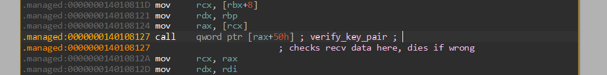

This function processed the received bytes and throws an exception if something goes wrong  
With my server script, I was able to replay "correct" packets (from the pcap capture)  
I also used "wrong" packets (0x41414141s and 0x42424242s) to help me debug and trace more easily

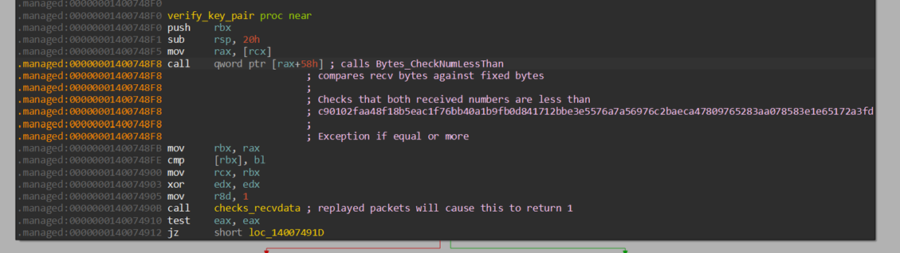

Reversing the function call at 0x1400748F8 revealed something very important  
I realized that it was treating the 2 received buffers as huge numbers and comparing it against another number

Realizing that I was dealing with big numbers made reversing the subsequent **checks_recvdata** function much easier  
It was basically performing a bunch of modulo arithmetic to check that the 2 received numbers are valid

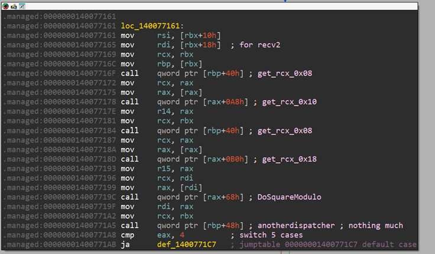
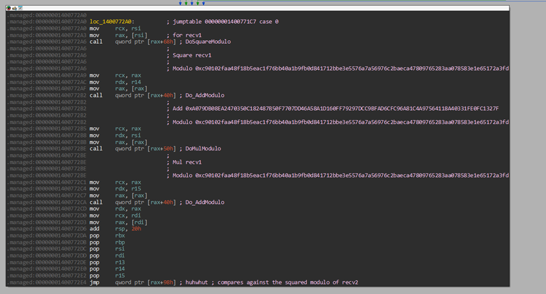

Here is a summary of the verification logic in **checks_recvdata**

```python
#### recv1 and recv2 verification logic ####
# recv1 and recv2 are the 2 numbers that was received through the network
# mn is the modulo number

mn = 0xc90102faa48f18b5eac1f76bb40a1b9fb0d841712bbe3e5576a7a56976c2baeca47809765283aa078583e1e65172a3fd
recv2_checksum = (recv2 * recv2) % mn

add1 = 0xA079DB08EA2470350C182487B50F7707DD46A58A1D160FF79297DCC9BFAD6CFC96A81C4A97564118A40331FE0FC1327F
add2 = 0x9F939C02A7BD7FC263A4CCE416F4C575F28D0C1315C4F0C282FCA6709A5F9F7F9C251C9EEDE9EB1BAA31602167FA5380
tmp = (recv1 * recv1) % mn
tmp = (tmp + add1) % mn
tmp = (tmp * recv1) % mn
recv1_chksum = (tmp + add2) % mn

Checks that recv1_chksum == recv2_checksum
# This means recv1 and recv2 is a key pair?
```

This imply that a set of key-pairs were exchanged between the binary and the server at the start of the network capture  
At this point, I also realized that this could be a full-on Cryptography challenge
## Initialization and Randomization

Next, I focused my RE effort on the code before any data is sent  
My line of thinking was that it must be setting up some kind of crypto before sending data

Remember the "**StringDeobfuscator**" function previously?  
I set a breakpoint there and see what other strings are being loaded  
This led me to a very interesting function

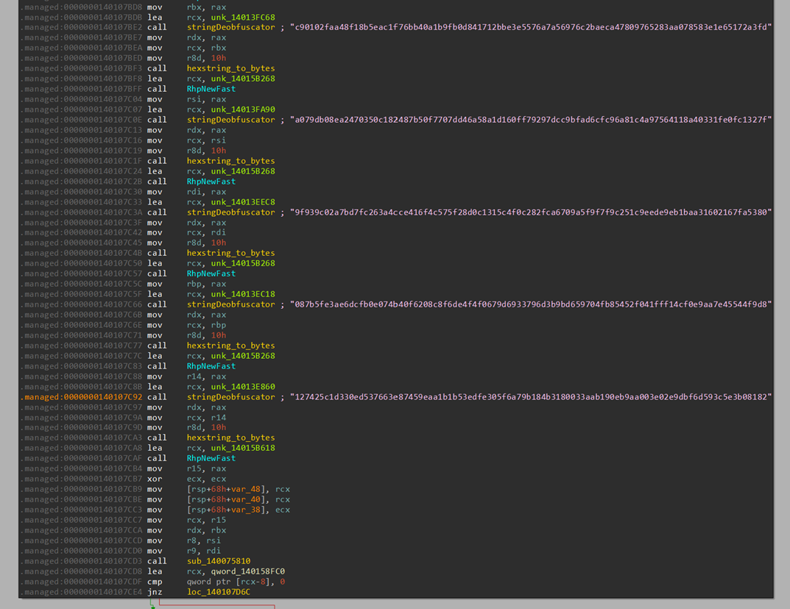

It was also at this time where I realized that this binary uses the BouncyCastle Library, but I do not have any signatures for it.
I re-generated the signatures using some sample code utilizing the BouncyCastle library (Install it via nuget first)  
I added the following code to my test project

```csharp
	using Org.BouncyCastle.Crypto;
	using Org.BouncyCastle.Crypto.Engines;
	using Org.BouncyCastle.Crypto.Generators;
	using Org.BouncyCastle.Crypto.Modes;
	using Org.BouncyCastle.Crypto.Paddings;
	using Org.BouncyCastle.Crypto.Parameters;
	using Org.BouncyCastle.Security;
	using Org.BouncyCastle.Asn1.X9;
	using Org.BouncyCastle.Math.EC;
	using Org.BouncyCastle.Math;

	...
	
   // BouncyCastle Example
   X9ECParameters ecParams = ECNamedCurveTable.GetByName("secp256k1");
   string message = "Hello, this is a test message!";
   string password = "StrongPassword123";
   byte[] encryptedMessage = EncryptData(message, password);
   Console.WriteLine("Original Message: " + message);
   Console.WriteLine("Encrypted Message: " + BitConverter.ToString(encryptedMessage));
```

I regenerated the signature and loaded it into IDA.
Now it makes more sense

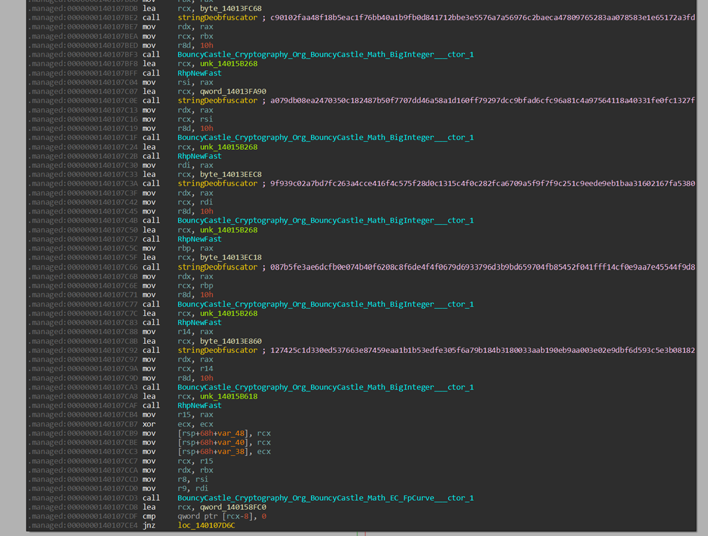

It is creating some kind of Elliptic Curve  
Reading up on some of its documentation, these are the parameters being loaded

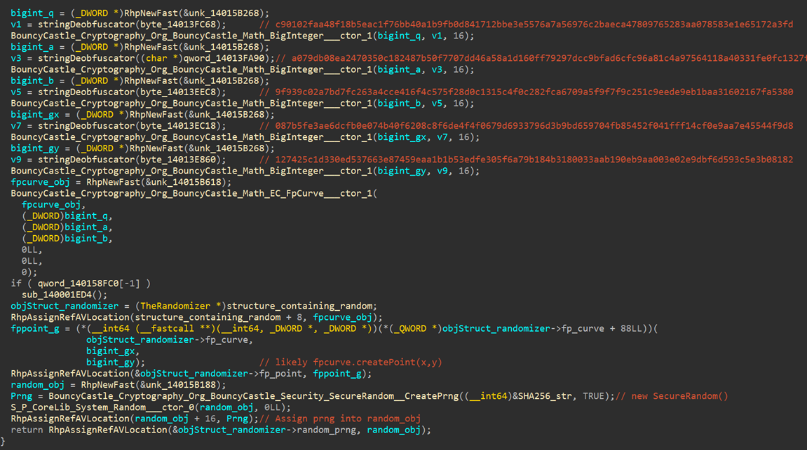

Since we are using ECC cryptography, that means that the 4 buffers of 0x30 bytes each might be the public keys of the 2 endpoints  
A public key in ECC is a set of (x, y) coordinates  
The 2 endpoints might be performing some kind of Diffie Hellman exchange with ECC keys
## Math and Lots of it (EC Math)

I tried reversing some of the code that utilizes these public keys but it consists of very complicated mathematical operations  
After much frustration, I was thinking that all these math are just the ECC crypto code and we do not need to reverse the code anymore

We already have the parameters of the EC Curve (with it's Generator point G) and 2 sets of Public Keys  
Of note, it is using a custom curve, not a pre-defined curve  
Therefore, I started to think that there might be some kind of mathematical vulnerability in the chosen values  

I am not an expert in Cryptography Math, hence I started reading up on it  
I started to dig into how Elliptic Curve Cryptography works, especially with the dangers of using custom curves  

First of all, I used sagemath for the rest of the calculation  
This is because sagemath has a in-built function that could calculate the order of an Elliptic Curve given it's curve parameters  
I could be wrong here but this is what I understood from what the "order" of an EC is

```
A simple modulo arithmetic operation with a modulo number m has the possibility of (m-1) values
However, in a EC, not all of these (m-1) values is a valid point on the curve  
The order of a EC is the actual number of distinct valid points on the curve
```

Sagemath calculated the order of this specific curve to be 30937339651019945892244794266256713890440922455872051984762505561763526780311616863989511376879697740787911484829297 which is not a prime

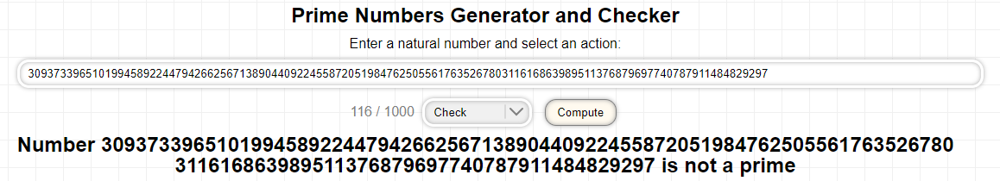

This reminded me of a similar [Diffie-Hellman challenge in a Flare-on]() many years ago and I started looking into Pohlig Hellman attacks
## Pohlig Hellman Attack

I found a [pohlig hellman sagemath script for EC](https://github.com/pwang00/Cryptographic-Attacks/blob/master/Public%20Key/Diffie%20Hellman/pohlig_hellman_EC.sage)

I tried to run it on our curve but ...

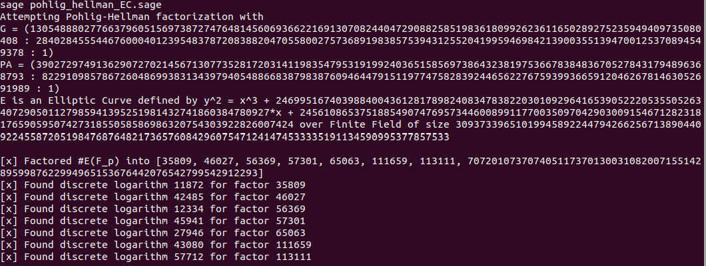

It hung on the last factor because the last factor is still a very large prime number

At this point, I was stuck for awhile  
I searched for other techniques all over the internet
In the end, while I was arguing with ChatGPT, it gave me an interesting idea

Instead of calculating the discrete log of the last huge prime factor, we could ignore it and then build in a small brute-force at the end of the script

Here is what I modified in my [sagemath script]()

```python
def pohlig_hellman_EC_smallfactor(G, PA, E, debug=True):
    """ Attempts to use Pohlig-Hellman to compute discrete logarithm of A = g^a mod p"""
    # This code is pretty clunky, naive, and unoptimized at the moment, but it works.

    n = E.order() 
    print("[X] Order of the curve is %d" % n)
    factors = [p_i ^ e_i for (p_i, e_i) in factor(n)]
    crt_array = []

    if debug:
        print("[x] Factored #E(F_p) into %s" % factors)

    # only perform the attack on "small" factors
    small_factors = []
    for tmp in factors:
        if tmp > 2^32:
            continue
        small_factors.append(tmp)

    for p_i in small_factors:
        g_i = G * (n // p_i)
        h_i = PA * (n // p_i)
        x_i = BSGS(g_i, h_i, p_i, E)
        if debug and x_i != None:
            print("[x] Found discrete logarithm %d for factor %d" % (x_i, p_i))
            crt_array += [x_i]
        
        elif x_i == None:
            print("[] Did not find discrete logarithm for factor %d" % p_i)

    kA = crt(crt_array, small_factors)

    if kA * G == PA:
        print("[x] Recovered confirmed private key : %d" % kA)
        return kA
    else:
        print("[x] Recovered private key was incorrect : %d" % kA)
        print("Attempting brute force of last few bits : %d" % kA)
        # Brute force the last few bits of the private key
        prod_moduli = prod(small_factors)  # Product of the moduli (prime factors)
        for i in range(2^16):  # Try brute-forcing the last few bits (adjust the range as necessary)
            candidate_key = kA + i * prod_moduli
            if candidate_key * G == PA:
                print(f"Brute force successful! Found correct private key: {candidate_key}")
                return candidate_key
        else:
            print("Brute force failed. Unable to recover the correct private key.")
            return False
```

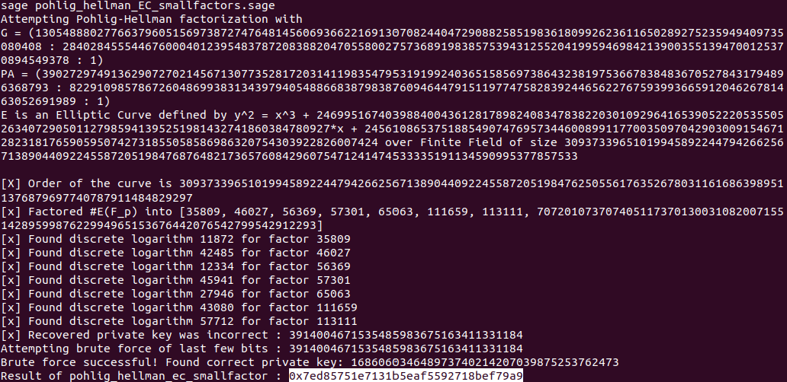

I was actually surprised that it worked  
The attack managed to recover the private key belonging to this public key

```
P_x = 0x195b46a760ed5a425dadcab37945867056d3e1a50124fffab78651193cea7758d4d590bed4f5f62d4a291270f1dcf499
P_y = 0x357731edebf0745d081033a668b58aaa51fa0b4fc02cd64c7e8668a016f0ec1317fcac24d8ec9f3e75167077561e2a15

priv = 0x7ed85751e7131b5eaf5592718bef79a9
```

## Finally, the FLAG

The private key was a 16 byte value, and I had a guess where it was being generated  
I went back to the debugger and forcefully changed the generated bytes to match the above private key (Take note of the endianness)  


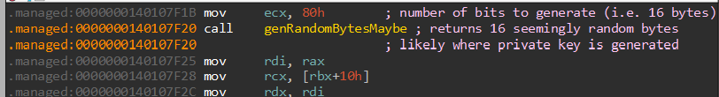

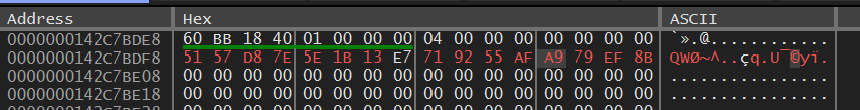

If we let the program continue to run, we can see that the bytes sent and received matches the bytes in the pcap capture

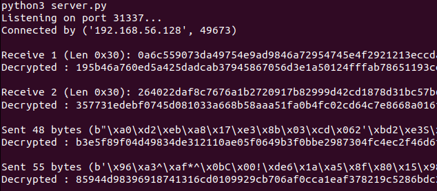

I then breakpoint where the SHA512 hash was being generated and these are the input and output of the SHA512 operation

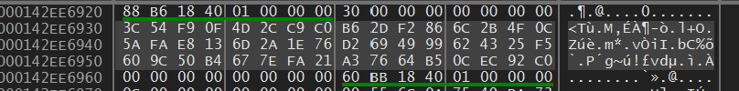
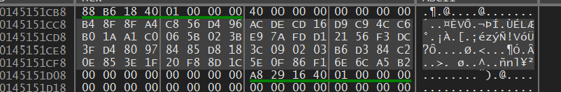

I can actually directly use the hash output for the next steps, but I wanted to find out what the input to this hash function was  
If we do some math with the recovered private key, we can actually find out  

According to Diffie Hellman, the shared secret is derived by multiplying the private key with the public key of the other endpoint  
I used tinyec to calculate and found out that it is actually hashing the x coordinate of the shared secret

```python
q = 0xc90102faa48f18b5eac1f76bb40a1b9fb0d841712bbe3e5576a7a56976c2baeca47809765283aa078583e1e65172a3fd # or p (modulus)
a = 0xa079db08ea2470350c182487b50f7707dd46a58a1d160ff79297dcc9bfad6cfc96a81c4a97564118a40331fe0fc1327f
b = 0x9f939c02a7bd7fc263a4cce416f4c575f28d0c1315c4f0c282fca6709a5f9f7f9c251c9eede9eb1baa31602167fa5380
gx = 0x087b5fe3ae6dcfb0e074b40f6208c8f6de4f4f0679d6933796d3b9bd659704fb85452f041fff14cf0e9aa7e45544f9d8
gy = 0x127425c1d330ed537663e87459eaa1b1b53edfe305f6a79b184b3180033aab190eb9aa003e02e9dbf6d593c5e3b08182

n = 30937339651019945892244794266256713890440922455872051984762505561763526780311616863989511376879697740787911484829297

from tinyec.ec import SubGroup, Curve
import hashlib

field = SubGroup(p=q, g=(gx, gy), n=n, h=1)
curve = Curve(a=a, b=b, field=field, name='wutf') 

Alice_priv = 0x7ed85751e7131b5eaf5592718bef79a9
Alice_public = Alice_priv * curve.g
print("Alice public key")
print("%x %x" % (Alice_public.x, Alice_public.y))
print("")

Bob_public = Alice_public
Bob_public.x = 0xb3e5f89f04d49834de312110ae05f0649b3f0bbe2987304fc4ec2f46d6f036f1a897807c4e693e0bb5cd9ac8a8005f06
Bob_public.y = 0x85944d98396918741316cd0109929cb706af0cca1eaf378219c5286bdc21e979210390573e3047645e1969bdbcb667eb
shared_key = Alice_priv * Bob_public
print("Shared Secret")
print("%x %x" % (shared_key.x, shared_key.y))
print("")

print("SHA512 Hash")
print(hashlib.sha512(shared_key.x.to_bytes(0x30, "big")).hexdigest())
print("")
```

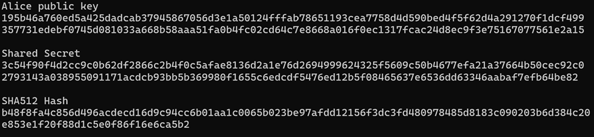

The hash is then used to initialize a chacha20 cipher as evident with this string

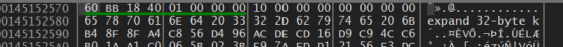
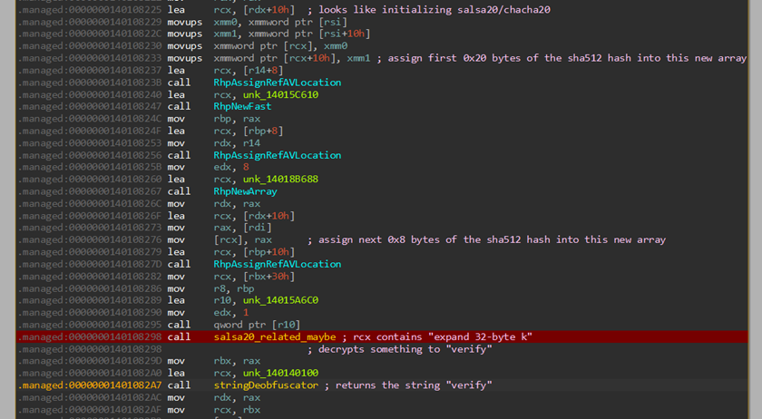

I wrote a [python script](laststep_chacha.py) that will create a ChaCha20 cipher with the respective values and successfully decrypted the rest of the pcap stream

```python
from Crypto.Cipher import ChaCha20
import base64

ct = [
    bytes.fromhex("f272d54c31860f"),
    bytes.fromhex("3fbd43da3ee325"),
    bytes.fromhex("86dfd7"),
    bytes.fromhex("c50cea1c4aa064c35a7f6e3ab0258441ac1585c36256dea83cac93007a0c3a29864f8e285ffa79c8eb43976d5b587f8f35e699547116"),
    bytes.fromhex("fcb1d2cdbba979c989998c"),
    bytes.fromhex("61490b"),
    bytes.fromhex("ce39da"),
    bytes.fromhex("577011e0d76ec8eb0b8259331def13ee6d86723eac9f0428924ee7f8411d4c701b4d9e2b3793f6117dd30dacba"),
    bytes.fromhex("2cae600b5f32cea193e0de63d709838bd6"),
    bytes.fromhex("a7fd35"),
    bytes.fromhex("edf0fc"),
    bytes.fromhex("802b15186c7a1b1a475daf94ae40f6bb81afcedc4afb158a5128c28c91cd7a8857d12a661acaec"),
    bytes.fromhex("aec8d27a7cf26a17273685"),
    bytes.fromhex("35a44e"),
    bytes.fromhex("2f3917"),
    bytes.fromhex("ed09447ded797219c966ef3dd5705a3c32bdb1710ae3b87fe66669e0b4646fc416c399c3a4fe1edc0a3ec5827b84db5a79b81634e7c3afe528a4da15457b637815373d4edcac2159d056"),
    bytes.fromhex("f5981f71c7ea1b5d8b1e5f06fc83b1def38c6f4e694e3706412eabf54e3b6f4d19e8ef46b04e399f2c8ece8417fa"),
    bytes.fromhex("4008bc"),
    bytes.fromhex("54e41e"),
    bytes.fromhex("f701fee74e80e8dfb54b487f9b2e3a277fa289cf6cb8df986cdd387e342ac9f5286da11ca2784084"),
    bytes.fromhex("5ca68d1394be2a4d3d4d7c82e5"),
    bytes.fromhex("31b6dac62ef1ad8dc1f60b79265ed0deaa31ddd2d53aa9fd9343463810f3e2232406366b48415333d4b8ac336d4086efa0f15e6e59"),
    bytes.fromhex("0d1ec06f36")
]

key = bytes.fromhex("b48f8fa4c856d496acdecd16d9c94cc6b01aa1c0065b023be97afdd12156f3dc")
nonce = bytes.fromhex("3fd480978485d818")
cipher = ChaCha20.new(key=key, nonce=nonce)

for x in ct:
    print(cipher.decrypt(x))

print(base64.b64decode("RDBudF9VNWVfeTB1cl9Pd25fQ3VSdjNzQGZsYXJlLW9uLmNvbQ=="))
```


The flag is **D0nt_U5e_y0ur_Own_CuRv3s@flare-on.com**