## Flare-On CTF 2024
# Challenge 10 : Catbert Ransonware

```
A dire situation has arisen, yet again, at FLARE HQ. 
One of our employees has fallen victim to a ransomware attack, and the culprit is none other than the notorious Catbert, our malevolent HR manager. 
Catbert has encrypted the employee's disk, leaving behind a cryptic message and a seemingly innocent decryption utility. 
However, this utility is not as straightforward as it seems. 
It's deeply embedded within the firmware and requires a keen eye and technical prowess to extract. 
The employee's most valuable files are at stake, and time is of the essence. 
Please, help us out one.... last... time.

7zip archive password: flare
```

We are provided a zip file with a bios image and a raw disk
## Running the Image (QEMU)

Reading up on bios images, I realized that we can run it using QEMU  
I first tried running it in a Linux QEMU but it did not work  
Running it on a Windows QEMU worked

> qemu-system-x86_64 -bios ./bios.bin -drive file=./disk.img,format=raw -s

I used the -s to start a gdbserver on QEMU  
I tried to use a debugger but could not find a way to find the correct address to put a breakpoint on  
In the end, I did not really need it  
Go Static Analysis!!

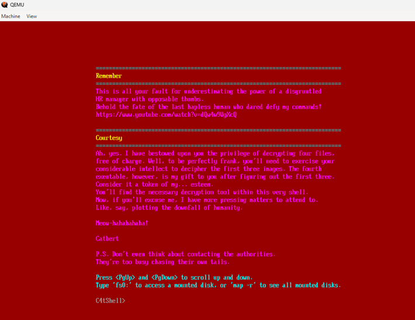

We are presented with some kind of custom shell  
If we do some listing of the attached disk, we see some .c4tb files

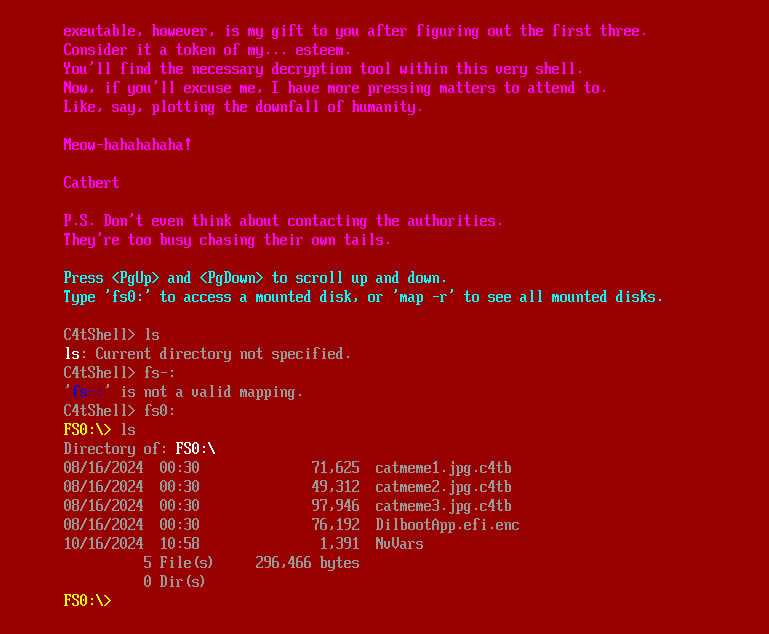

Running help also reveals a function called **decrypt_file** 

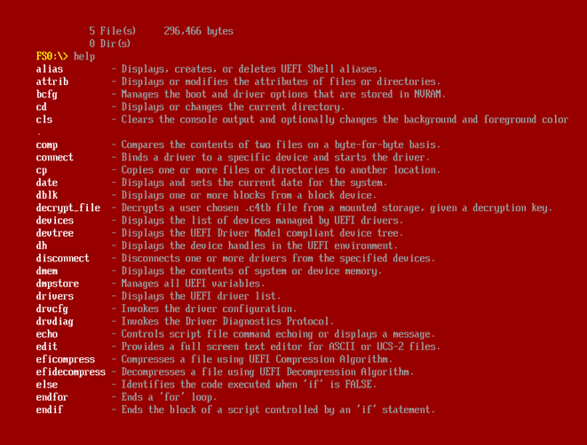

We can run that function against a c4tb file and provide a password


## Exploring the UEFI Image

Reading up on reversing UEFI images, I came across the [efiXplorer project](https://github.com/binarly-io/efiXplorer), which is a plugin for analyzing EFI images in IDA Pro  
I installed the plugin and the loader according to the project's website instructions

I can then throw the bios.bin file into IDA and you can parse it as a UEFI Image

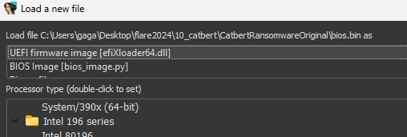

Once its loaded, I can run the plugin **efiXplorer** via the Edit -> Plugin menu  
This will rename many of the system functions and well known system globals  
After running the plugin, each EFI module can be seen in the Exports and Segments window

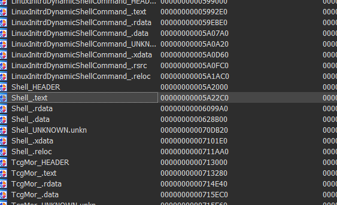

I searched for "c4tb" in the Strings windows and found some interesting strings  
Tracing from those strings brought me to the function that handles the "decrypt_file" command

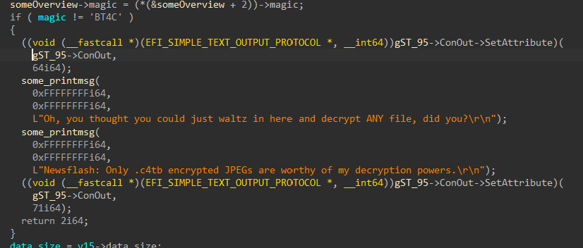

## Reversing C4TB

This is a huge functuon and it took me some time to pinpoint the important parts  
First, I figured out the structure of a c4tb file

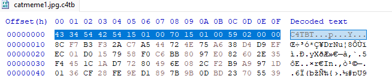

```
Structure of C4TB files
Header 16 bytes
    | 4 byte : Magic "C4TB"
    | 4 Byte : n Len of Data
    | 4 Byte : Start of Section2
    | 4 Byte : z Len of Section2
Data [n bytes + padding (\x00) to 16 byte boundary]
Section2 [z bytes]
```

This "Section2" that I named will become very important later on  
After the check on the magic bytes shown in the above screenshot, it copies some data around  
Based on my assumption of the structure, the copies make sense

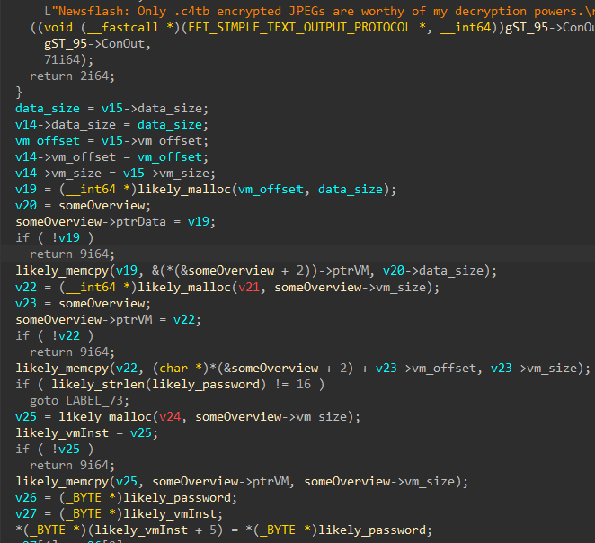

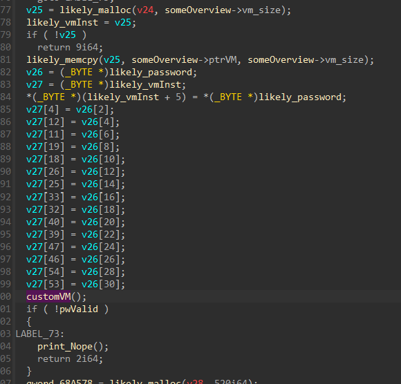

In the above screenshots, I have already renamed Section2 to "VM" (Spoilers!!)  
There are 4 important parts, before calling into the "customVM" function
- It checks that the password is 16 Unicode character long (32 bytes)
- It copies the Section2 of the C4TB file into its own malloc region
- It then replaces certain bytes of this malloc region with our password characters
- The "pwValid" flag is set inside the customVM function, therefore it is key to reverse that

The "customVM" function is a huge function handling a huge switch case

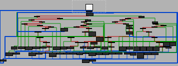
## CustomVM

After reading through the code in this function, I finally realized what it was doing  
It was interpreting bytes in the Section2 memory region as Instruction bytes  
This is a custom Virtual Machine running some kind of custom instruction set

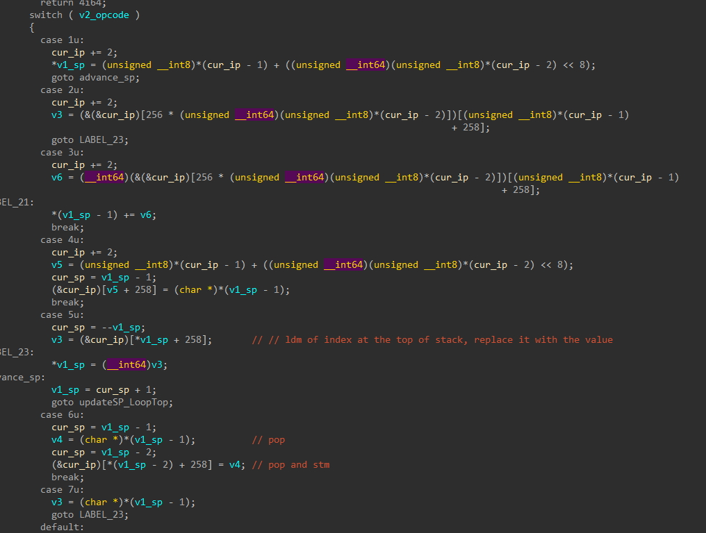

These are some features of this instruction set

```
1. Instruction Pointer points to which byte will be executed next (All instructions are 1 byte with possible operands following it)
2. There is a stack that is pointed to by a "Stack Pointer" (r9 register)
3. Each entry on the stack is 8 bytes wide
4. There is some kind of memory region that can be accessed through STM-like (Store to Memory) and LDM-like (Load from Memory) instructions
5. The STM/LDM instructions uses a index to reference which memory cell to write/read into
6. The "jmp" instructions uses absolute addressing from the base of the section (there is no relative jump)
```

I managed to decode the following opcodes

```
Stack size is 8 bytes
TOS = Top of stack
STM = Store to Memory
LDM = Load from Memory

Opcode 01 : push next 2 bytes
Opcode 05 : pop -> value, TOS = LDM [value]
Opcode 06 : pop -> value , pop -> index, stm [index]=value

Opcode 09 : pop 2, add them, push res
Opcode 0d : pop 2, multiply them, push res
Opcode 0e : jmp to next 2 bytes
Opcode 0f : pop -> cmpres, jmp to next 2 bytes if cmpres is True
Opcode 10 : pop -> cmpres, jmp to next 2 bytes if cmpres is False
Opcode 11 : pop -> value, push TOS == value (compare equal)
Opcode 12 : pop -> value, push TOS < value (compare lessthan)

Opcode 14 : pop -> value, push TOS > value (compare morethan)

Opcode 18 : return 0
Opcode 19 : pop into pwValid (must be 1 to continue)

Opcode 1b : pop -> value, TOS |= value (bitwise or)
Opcode 1c : pop -> value, TOS &= value (bitwise and)
Opcode 1d : pop -> value, TOS %= value (Modulo)
Opcode 1e : pop -> value, TOS << value (shift left)
Opcode 1f : pop -> value, TOS >> value  (shift right)

Opcode 21: pop -> value, TOS ror32 val (rotate right)
Opcode 24: pop -> value, TOS rol8 val (rotate left)
Opcode 25: pop -> value, TOS ror8 val (rotate right)
```

I decoded the VM from the first image by hand  
However, after that, I wrote a [python parser](parsevm.py) to parse these instruction bytes into text for easier processing  
This is how the output looks like

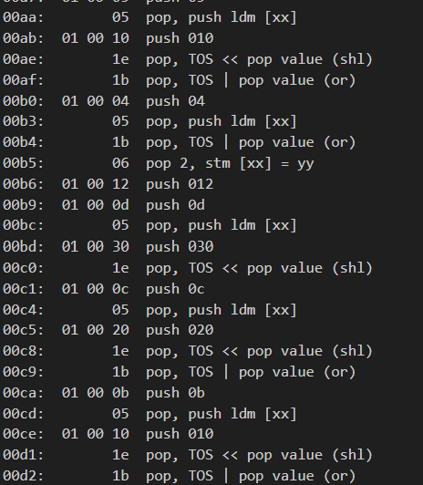

I can now read through the instruction trace and figure out what it is doing  
Basically, each VM is checking if our password is valid  
If it is valid, the rest of the code will proceed to decrypt the image

I analyzed them and figured out how each of these images' VM is checking our password
## Cat1

The first image checks our password using the following logic

```
Loads the Key "Da4ubicle1ifeb0b"
Perform the following operations
	# key[2] rol8 4
    # key[9] ror8 2
    # key[d] rol8 7
    # key[f] rol8 7
The rotated key is compared against our password
```

The solution to this is easy

```python
def solve1():
    print("---cat1---")
    key = list("Da4ubicle1ifeb0b")
    key[2] = chr(rol8(ord(key[2]), 4))
    key[9] = chr(ror8(ord(key[9]), 2))
    key[0xd] = chr(rol8(ord(key[0xd]), 7))
    key[0xf] = chr(rol8(ord(key[0xf]), 7))
    print("".join(key))
    print("---------------")
    print("")
```

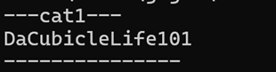

The password is **DaCubicleLife101**

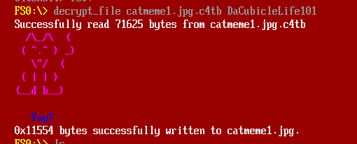
## Cat 2

The second image is slightly more complicated

```
Loads the Key "59a0 4d6a 23de c024 e264 b159 0772 5c7f"
Generate a keystream using an algorithm
The keystream is xored with our input password
The result is compared against the Key
```

This was also fairly straightforward to solve  
I just need to generate the same keystream and xor with the key to get our password

```python
def getXorStream():
    cur = 0x1337
    xorstream = [0] * 16
    
    for i in range(16):
        cur = ((cur * 0x343fd) + 0x269ec3) % 0x80000000
        tmp = cur
        tmp = cur >> (i%4)*8
        tmp = tmp & 0xff
        xorstream[i] = tmp

    return xorstream

def solve2():
    print("---cat2---")
    enc = bytes.fromhex("59a0 4d6a 23de c024 e264 b159 0772 5c7f")
    xorstream = getXorStream()
    print("Keystream: %s" % xorstream)
    pw = ""

    for i in range(len(enc)):
        tmp = enc[i] ^ xorstream[i]
        pw += chr(tmp)
    print(pw)
```

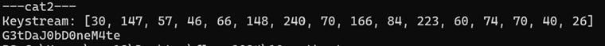

The password is **G3tDaJ0bD0neM4te**

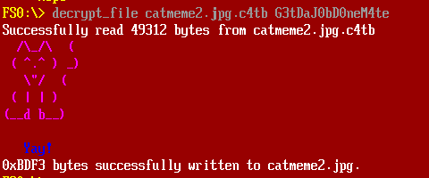
## Cat3

The third image though was a beast  
Programmatically, it was quite simple but getting the password was not easy

```
Loads our password (16 bytes)
Pass the first 4 bytes into a hashing function (hash1) and match against a target hash
Pass the next 4 bytes into another hashing function (hash2) and match against a target hash
Pass the next 8 bytes into yet another hashing function (hash3) and match against a target hash
Pass the entire 16 bytes into another hashing function (hash4) and match against a target hash

Only if all 4 matched, is the password valid
```

This took the longest time as it requires a certain amount of brute-forcing as we are dealing with one-way hashing functions

Brute-forcing hash functions is quite easy to write in python using Generators

```python
import itertools

def get_generator(bytesize):
    res = itertools.product(range(33,127) ,repeat=bytesize)
    for guess in res:
        yield guess

def get_alphanumeric_generator(bytesize):
    alphanumeric = '0123456789' + 'abcdefghijklmnopqrstuvwxyz' + 'ABCDEFGHIJKLMNOPQRSTUVWXYZ'
    alphanumeric = [ord(x) for x in alphanumeric]
    res = itertools.product(alphanumeric ,repeat=bytesize)
    for guess in res:
        yield guess
        
def brute(targetNum, hashfunc, bytesize):
    # guess_generator = get_generator(bytesize)
    guess_generator = get_alphanumeric_generator(bytesize)
    correct = []

    for guess in guess_generator:
        cur = hashfunc(guess)
        
        if cur == targetNum:
            # print("Hash Matched: %s 0x%x " % (guess, cur))
            gg = "".join([chr(g) for g in guess])
            correct.append(gg)
            # break

    return correct
```
### hash1 and hash2

**hash1** and **hash2** is fairly straight forward to brute force as they are only dealing with 4 bytes  
Their math is as follow

```python
def hash1(inputBytes):
    # run for 4 bytes (target 0x7c8df4cb)
    cur = 0x1505
    for x in inputBytes:
        tmp = cur
        cur = (cur << 5) + tmp + x
    return cur & 0xffffffff

def hash2(inputBytes):
    # run for 4 byytes (target 0x8b681d82)
    cur = 0
    for x in inputBytes:
        cur = ror32(cur, 0xd)
        cur = cur + x
    return cur

pw1 = brute(0x7c8df4cb, hash1, 4)
print("\nHash1 candidates: %s \n" % pw1)

pw2 = brute(0x8b681d82, hash2, 4)
print("\nHash2 candidates: %s \n" % pw2)
```

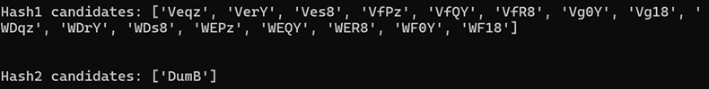

There were multiple valid candidates for hash1 but only 1 for hash2
### hash3

This is the most difficult to crack as it is run over 8 bytes  

```python
def hash3(inputBytes):
    # run for 8 bytes (target 0x0f910374)
    x = 1
    y = 0
    for z in inputBytes:
        x = (x + z) % 0xfff1
        y = (y + x) % 0xfff1
    return ((y << 0x10) | x) & 0xffffffff
```

Brute-forcing over 8 bytes is too large a search space and it would take a very long time  
Even searching only alphanumeric characters, the search space ($62^8$ ) is way too large  
There must be a better way

When I was running the cracking script for this hash, I stumbled onto the correct password  
If we look at the candidates of the previous 2 hashes, there is 1 combination that says "VerYDumB"  
I just randomly tried "password" as the password and it worked -.-

But anyway, the password can still be computed in fairly reasonable time  
Let's dig into the Math
### Yay Math!

Let's investigate the Math of the function  
According to the hash function above, the value of each X and Y at each character position n can be summarized as the following equations (Ignore the modulo for now), with Z being our input byte

$$\Large
X_n = Z_n + X_{n-1}
$$
$$\Large
Y_n = X_n + Y_{n-1}
$$

Based on the initialization values, $X_0$, $Y_0$, $X_1$, $Y_1$ can be defined as follow


$$\Large
X_0 = 1 , Y_0 = 0
$$
$$\Large
X_1 = Z_1 + 1 , Y_1 = Y_0 + X_1
$$

As $Y_0$ = 0, we can simplify $Y_1$ to 

$$\Large
Y_1 = X_1
$$

In fact, we can generalize $Y_n$ as a summation of all $X_{n..1}$ values 

$$\Large
Y_n = \sum_{i=1}^{n} X_i
$$

Similarly, the X number only depends on Z and does not cross reference with Y

$$\Large
X_1 = Z_1 + 1
$$
$$\Large
X_2 = Z_2 + X_1
$$
$$\Large
X_n = \sum_{i=1}^{n} Z_i + 1
$$

As the main operator here is an addition, for a 8 character ASCII input, there is no way that the above summation can exceed the modulo value of 0xfff1 (65521)  
Hence, we can safely ignore the modulo in our calculations  

```
For example, the value of the maximum ASCII character is 127
Maximum of X8 = (127 * 8) + 1 = 1017
Maximum of Y8 = (127 * 8) + (127 * 7)  + ... + (127 * 1) + 1 = 4572
```

Things would have been more difficult if the operator was a multiplication

With this knowledge, we can define the maximum and minimum value of (X, Y) at each character position n  
Based on the passwords of the previous images, I decided to focus on just the alphanumeric character set  
You should be able to run the same algorithm over the full printable ASCII range, albeit taking a little more time

```python
def sumY(xlist, numchars):
    sum = 0
    for i in range(numchars+1):
        sum += xlist[i]
    return sum

maxAscii = 122  # 'z'
minAscii = 48   # '0'

maxX = [1, (maxAscii*1)+1, (maxAscii*2)+1, (maxAscii*3)+1, (maxAscii*4)+1, (maxAscii*5)+1, (maxAscii*6)+1, (maxAscii*7)+1, (maxAscii*8)+1]
maxY = [0, sumY(maxX, 1), sumY(maxX, 2), sumY(maxX, 3), sumY(maxX, 4), sumY(maxX, 5), sumY(maxX, 6), sumY(maxX, 7),sumY(maxX, 8)]
minX = [1, (minAscii*1)+1, (minAscii*2)+1, (minAscii*3)+1, (minAscii*4)+1, (minAscii*5)+1, (minAscii*6)+1, (minAscii*7)+1, (minAscii*8)+1]
minY = [0, sumY(minX, 1), sumY(minX, 2), sumY(minX, 3), sumY(minX, 4), sumY(minX, 5), sumY(minX, 6), sumY(minX, 7), sumY(minX, 8)]
```

Setting these boundaries is important in reducing the search space  
I wrote a recursive search that would iterate over the possible combinations  
Using the boundaries, the algorithm will prune away search trees that cannot be satisfied

```python
minZ = 48 # '0'
maxZ = 123 # 'z'
alphanumeric = 'ABCDEFGHIJKLMNOPQRSTUVWXYZ' + 'abcdefghijklmnopqrstuvwxyz' +'0123456789'
alphanumeric = [ord(x) for x in alphanumeric]
recurseCounter = 0
matchCount = 0

def recurseSearch(X, Y, level, guess, f):
    global recurseCounter, matchCount

    # print("X: %d Y: %d CurGuess %s Level : %d" % (X, Y, guess, level))
    recurseCounter += 1
    if recurseCounter % 1000000 == 0:
        print("Iterations : %d million (Current %d matches)" % ((recurseCounter // 1000000), matchCount))

    if level == 1:
        # Leaf node
        if X != Y or X < minZ or X > maxZ:
            return False # Nope, not possible
        else:
            candidate = guess + [X-1]
            possible_pw = "".join([chr(a) for a in candidate][::-1])
            f.write(possible_pw+"\n")
            matchCount += 1
            return True
    else:
        # Check Min/Max Numbers
        if X > maxX[level] or X < minX[level] or Y > maxY[level] or Y < minY[level]:
            return False # prune the tree
            
        prevY = Y-X
        if prevY < minZ:
            return False # prune the tree

        for Z in alphanumeric:
            nextguess = guess + [Z]
            prevX = X-Z
            if prevX < minZ:
                continue # prune the tree
            res = recurseSearch(prevX, prevY, level-1, nextguess, f)

with open("pw3.txt", "w") as outfile:
        recurseSearch(0x374, 0xf91, 8, [], outfile) # 0x0f910374
```

I ran the script over lunch and it was done when I returned  
It took less than 2 hours which is a much better improvement than a naive brute force  
It reduced the search space to about 0.01% of the full 8 byte naive search space (about $\frac{25 billion}{62^8}$)

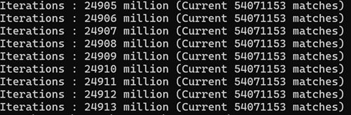
### hash4

Now we have the 3 parts of the password, the third part having about 54 million candidates  
It's time to combine them all and find the correct combination

```python
def hash4(inputBytes):
    # run for 16 bytes (target 31f009d2)
    cur = 0x811c9dc5
    for x in inputBytes:
        cur = (cur * 0x1000193) % 0x100000000
        cur = cur ^ x
    return cur & 0xffffffff

def brute_pw4(pw1, pw2, pw3):
    counter = 0
    for p1 in pw1:
        for p2 in pw2:
            for p3 in pw3:
                counter += 1
                if counter % 1000000 == 0:
                    print("Brute4 Iterations: %d million" % (counter // 1000000))
                curpw  = p1 + p2 + p3
                # print(curpw)
                tmp = hash4([ord(x) for x in curpw])
                if tmp == 0x31f009d2:
                    print("Match Found: %s" % curpw)
                    return
```

This took awhile but not as long as hash3's recursive search

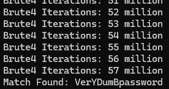

The password is **VerYDumBpassword**  
With that, the last image can be decrypted!
## Getting the flag

Here are all 3 decrypted images


But, the flag seems incomplete

There is actually more code in the **decrypt_file** handler fuction

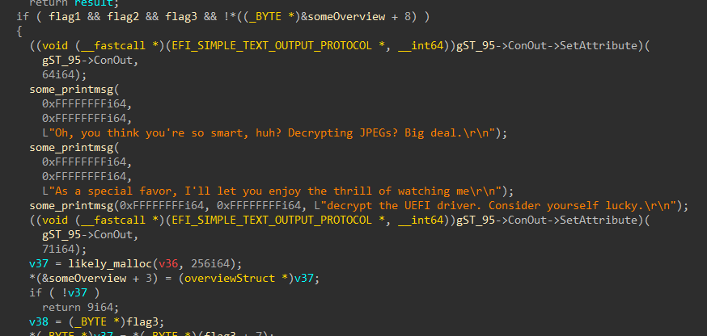

It checks for 3 flags and then will try to decrypt the encrypted UEFI drive on the disk  
In the end, I realized that I had to decrypt all 3 files on the same session  

I reloaded the disk.img from the zip file and decrypted the 3 images on the same session

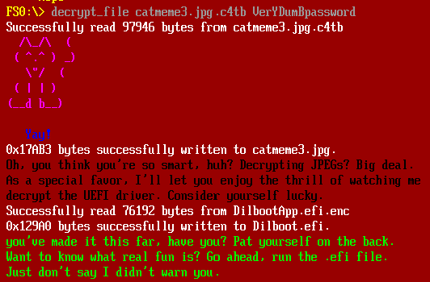

Well, it told me to run the efi file, what could go wrong?

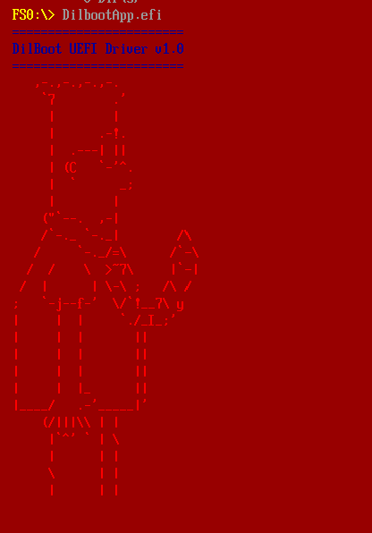
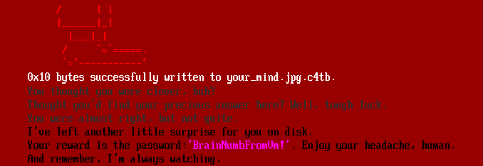

OMG, another image!!

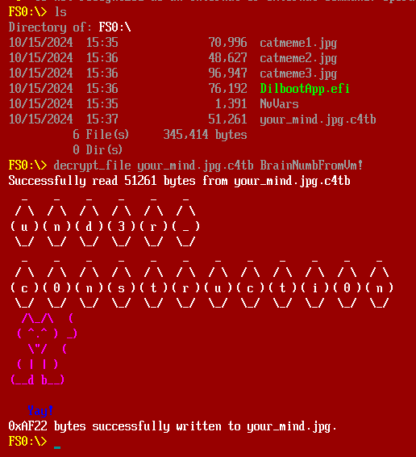


Combining all these gives us the flag  
The flag is **th3_ro4d_t0_succ3ss_1s_alw4ys_und3r_c0nstructi0n@flare-on.com**
